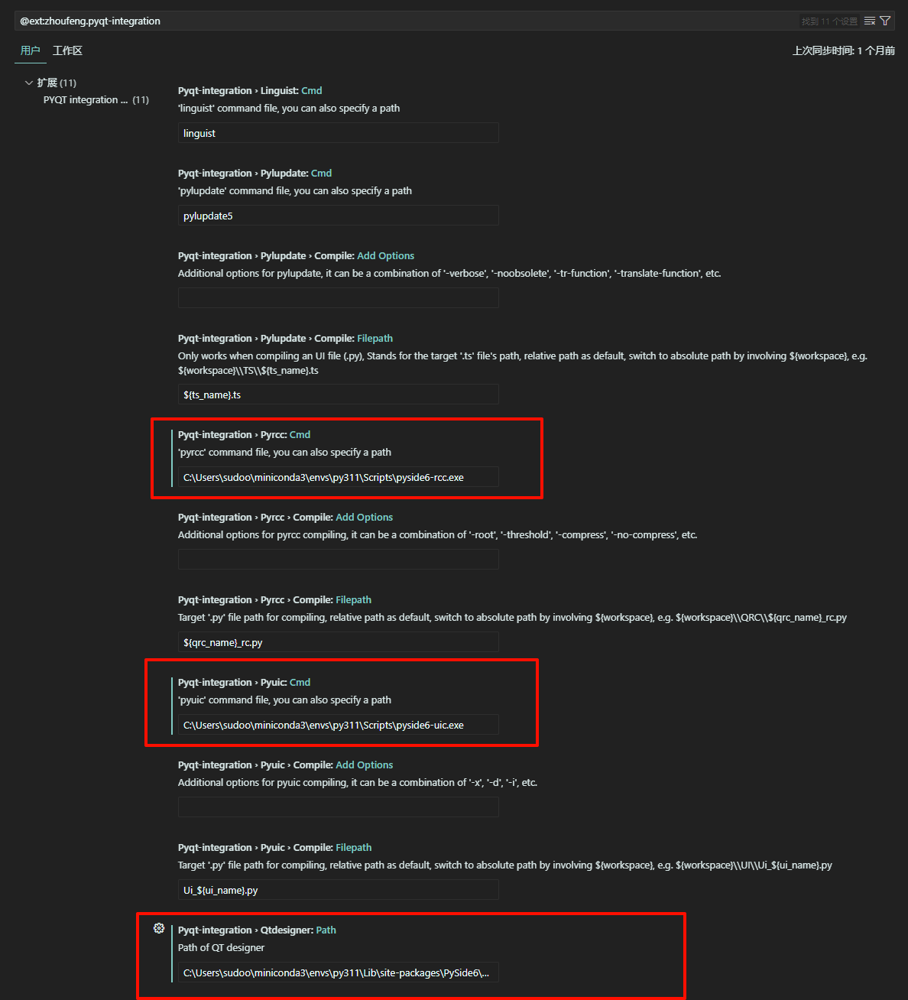
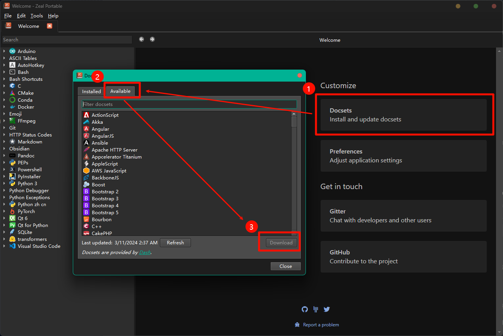
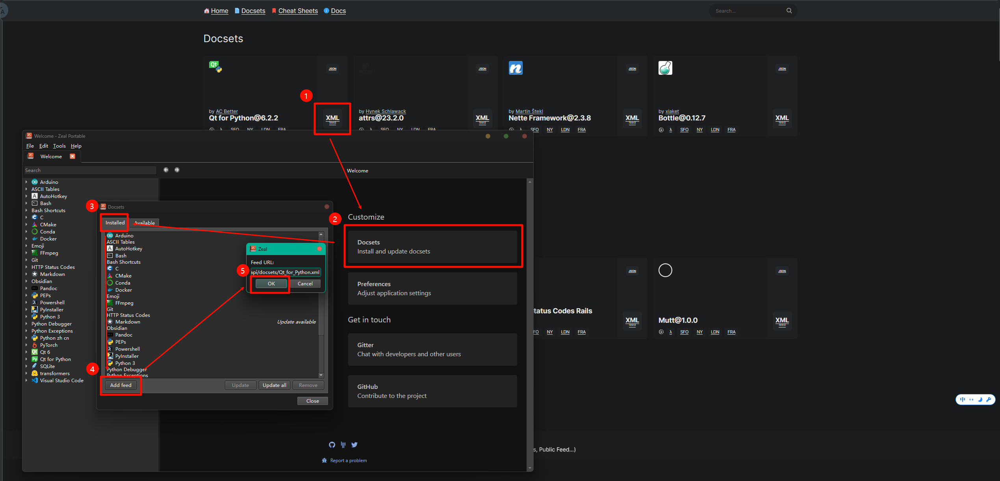
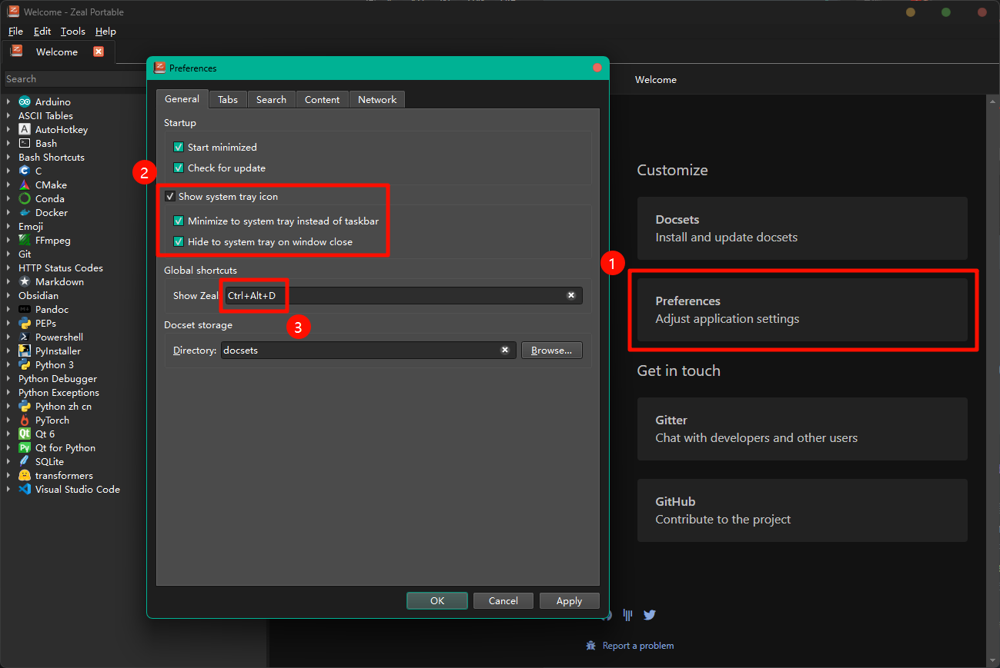

# PySide6 基础

## GUI 编程学什么

- 大致了解你所选择的 GUI 库
- 基本的程序的结构：使用这个 GUI 库来运行你的 GUI 程序
- 各种部件的特性和如何使用
- 部件的样式
- 资源的加载
- 部件的布局
- 事件和信号
- 动画特效
- 界面跳转
- 设计工具的使用

## PySide6 是什么

Qt 是一个跨平台的 C++库，用于开发具有图形用户界面的应用程序，支持多种操作系统和编程范式。
PySide6 是 Qt 6 的 Python 版本，它提供了与 Qt 6 相同的功能和模块，但可以通过 Python 语言来编程和交互。

## PySide6 的优势

1. 官方支持：作为 Qt 6 的官方 Python 绑定，PySide6 由 Qt 公司直接维护和支持，确保了与 Qt 框架的兼容性和稳定性。
2. 跨平台性：继承了 Qt 6 的跨平台特性，使用 PySide6 开发的应用程序可以在 Windows、Mac OS、Linux、iOS 和 Android 等多个操作系统上运行，无需修改代码。
3. 强大的 GUI 功能：PySide6 提供了丰富的 GUI 组件和工具，支持创建复杂和现代化的用户界面，包括 2D/3D 图形、动画、样式定制等。
4. 声明式 UI 开发：通过 QML 和 JavaScript，PySide6 支持声明式编程，使得用户界面的设计和实现更加直观和高效。
5. 良好的性能：Qt 6 框架经过优化，提供了良好的性能，PySide6 作为其 Python 绑定，也继承了这一特性。
6. 丰富的模块：PySide6 提供了包括网络、数据库、多媒体、并发编程等在内的多个模块，满足不同类型应用程序的开发需求。
7. 开源和免费：PySide6 在 LGPLv3 许可下发布，允许开发者免费使用，包括在商业项目中，这为开源和商业软件开发提供了便利。
8. 社区和文档：Qt 拥有一个庞大而活跃的开发者社区，提供了大量的教程、文档和示例，有助于新用户学习和解决开发过程中的问题。
9. 集成开发：PySide6 可以与 Python 的其他库和框架集成，如 NumPy、SciPy、Pandas 等，这使得 PySide6 非常适合用于科学计算、数据分析等领域的应用程序开发。
10. 向后兼容性：虽然 PySide6 与 PySide（Qt 5 的 Python 绑定）不完全兼容，但 Qt 公司提供了一些工具和指南来帮助开发者迁移他们的应用程序到新版本。

## PyQt6 与 PySide6 区别

1. 维护者：

- PyQt6 由 Riverbank Computing 维护，这是一家私营公司，专门提供 Python 绑定技术。
- PySide6 由 The Qt Company 维护，这是 Qt 框架的原始开发者。

2. 许可：

- PyQt6 在 GPL 和商业许可下可用。在 GPL 许可下使用时，整个应用程序必须开源。
- PySide6 在 LGPLv3 许可下发布，这意味着它可以用于开源和商业项目，而不会强制要求应用程序的开源。

3. 兼容性：

- PyQt6 通常与以前的 PyQt 版本（针对 Qt 5）保持较好的兼容性，但 PyQt6 引入了一些变化以适应 Qt 6。
- PySide6 也引入了与 Qt 6 的变化，但与 PySide（Qt 5 的 Python 绑定）相比，可能需要一些代码更改以迁移到新版本。

4. 社区和文档：

- PyQt6 拥有一个长期建立的社区，提供了大量的文档和教程。
- PySide6 由于是 Qt 官方支持的，因此也受益于 Qt 社区和文档。

5. 性能：

- 两者的性能在大多数情况下是相似的，因为它们都是建立在相同的 Qt 框架之上。

6. 集成：

- PyQt6 提供了一些额外的特性，如对 PyQt5 的兼容层和对某些 Qt 模块的额外绑定。
- PySide6 更紧密地遵循 Qt 6 的设计和命名约定。

## 开发环境的安装

### Python 3.11

#### 下载并安装 [Miniconda](https://repo.anaconda.com/miniconda/Miniconda3-latest-Windows-x86_64.exe)

建议安装 [Powershell 7](https://github.com/PowerShell/PowerShell/releases) 并配置 [oh-my-posh](https://github.com/JanDeDobbeleer/oh-my-posh/releases) 和 [PSFzf](https://github.com/kelleyma49/PSFzf/releases) ，参考配置文件 `.\代码\99.其他\Microsoft.PowerShell_profile.ps1`

#### 初始化 Powershell Conda 环境

打开 `Anaconda Powershell Prompt (miniconda3)`

```powershell
conda init powershell
```

#### 安装 PySide6 库

打开 `Powershell 7`

创建虚拟环境

```powershell
conda create -n py311 python=3.11
```

激活虚拟环境

```powershell
conda activate py311
```

安装 PySide6 库

```powershell
pip install PySide6
```

### VS Code

#### 下载并安装 [VS Code](https://code.visualstudio.com/Download)

建议选择 [Visual Studio Code Insiders](https://code.visualstudio.com/insiders/#) .zip x64

#### 安装插件

建议安装中文语言包 [Chinese (Simplified) (简体中文) Language Pack for Visual Studio Code](https://marketplace.visualstudio.com/items?itemName=MS-CEINTL.vscode-language-pack-zh-hans)

安装 Python 插件 [Python](https://marketplace.visualstudio.com/items?itemName=ms-python.python)

安装 Python Debugger 插件 [Python Debugger](https://marketplace.visualstudio.com/items?itemName=ms-python.debugpy)

安装 PYQT Integration 插件 [PYQT Integration](https://marketplace.visualstudio.com/items?itemName=zhoufeng.pyqt-integration)

安装 Qt for Python 插件 [Qt for Python](https://marketplace.visualstudio.com/items?itemName=seanwu.vscode-qt-for-python)

#### 配置 PYQT Integration 插件

1. pyrcc

   这是 PySide6 的资源编译器（Resource Compiler），它用于将.qrc 文件（Qt 资源文件）编译为 Python 模块。资源文件通常包含应用程序中使用的图像、样式表和其他二进制数据。配置 pyrcc 的路径意味着告诉开发环境在哪里可以找到这个工具。

> pyqt-integration.pyrcc.cmd
>
> > C:\Users\UserName\miniconda3\envs\py311\Scripts\pyside6-rcc.exe

2. pyuic

   这是 PySide6 的用户界面编译器（User Interface Compiler），它用于将.ui 文件（由 Qt Designer 创建的用户界面文件）转换为 Python 代码。这样，您就可以在 Python 应用程序中使用这些界面。配置 pyuic 的路径是为了让开发环境知道如何调用这个工具。

> pyqt-integration.pyuic.cmd
>
> > C:\Users\UserName\miniconda3\envs\py311\Scripts\pyside6-uic.exe

3. Path of QT designer

   这是 Qt Designer 的可执行文件的路径。Qt Designer 是一个图形工具，允许您以所见即所得的方式设计 GUI 界面。配置 Qt Designer 的路径是为了让开发环境能够启动这个工具，以便您可以在一个直观的环境中设计界面。另，建议顺便手动在桌面添加 `designer.exe` 的快捷方式 `py311 Pyside6 Qt designer` ，以便后续快速查看部件属性名称。

> pyqt-integration.qtdesigner.path
>
> > C:\Users\UserName\miniconda3\envs\py311\Lib\site-packages\PySide6\designer.exe

示例图：

> 

#### 使用 VSCode 打开这个项目文件夹，打开 `.\代码\1.PySide6基础\第一个Pyside6桌面应用.py` 文件，并选择 Python 解释器

> 

## 第一个 Pyside6 桌面应用

代码：

```py
# 从PySide6.QtWidgets模块导入QApplication, QLabel类
from PySide6.QtWidgets import QApplication, QLabel

# 创建QApplication类的实例， QApplication管理GUI应用程序的控制流和主要设置
app = QApplication([])
# 创建一个QLabel部件， QLabel是用来显示文本或图像的部件
label = QLabel("Hello World!")
# 显示标签，使它成为可见的
label.show()
# 启动应用程序的事件循环
app.exec()
```

`F5` 运行后效果图：

> 

## 建议 安装 Zeal

[Zeal](https://github.com/zealdocs/zeal)是一款免费的离线文档软件，能够让开发者更加便捷地查阅 api 文档。目前该软件有 windows、mac 以及 linux 版本，内部有超过 200 个文档，涵盖了几乎所有程序开发用到的库、框架以及语言，是一款十分实用的软件。

#### 下载并安装 [Zeal](https://zealdocs.org/download.html#windows)

建议安装 `64-bit 7Z` 便携版

#### 添加 `Qt 6` 离线文档

Docsets -> Available -> 搜索并选中 Qt 6 -> Download

> 

#### 添加 `Qt for Python` 离线文档

访问 https://zealusercontributions.vercel.app/search?q=Qt -> 复制 Qt for Python XML 网址 -> Docsets -> Installed -> Add feed -> 粘贴 Qt for Python XML 网址 -> OK

> 

#### 设置 Zeal 快捷键

Zeal 能够设置打开的快捷键，设置了之后就能快速打开 Zeal 查阅文档。

Preferences -> General -> 具体设置如下图

> 

#### 注意事项

下载好自己需要的 Docsets 之后，日常就可以在工作中使用离线文档进行工作了。日常使用过程中，有几点需要注意：

> - Zeal 原理是打开 html 的页面，所以它相当于一个浏览器，尽量养成定时关闭不用文档的习惯
> - Zeal 左上角具备搜索功能，在前面输入“文档名称:内容”就可以对指定的文档进行搜索

## 关于 `Qt Unified Installer`

### 是什么

Qt Unified Installer 是由 Qt 官方提供的安装程序，用于在开发机上安装 Qt 框架。它允许开发者选择安装不同版本的 Qt 库、工具、示例和文档。通过这个安装程序，你可以安装 Qt 的各个模块，如 Qt Widgets、Qt Quick、Qt for WebAssembly 等，以及相应的开发工具，如 Qt Creator 集成开发环境（IDE）、qmake 构建工具等。安装 Qt 后，你可以使用 C++、Qt Quick（QML）或其他与 Qt 兼容的语言来开发应用程序。Qt Unified Installer 是跨平台的，适用于 Windows、macOS 和 Linux 操作系统。

### 不需要安装

如果你是一名 Python 开发者，并且想要使用 Qt 来创建 GUI 应用程序，你可以通过 pip 安装 PySide6 **不需要** 使用 Qt Unified Installer。

### 如何安装

这并不在本教程的讨论范围之内，这里只是简单提一句。

如果你是 C++开发者或者需要 Qt 的其他组件（如 Qt Creator），那么你需要使用 Qt Unified Installer 来安装完整的 Qt 开发环境。

访问 https://download.qt.io/official_releases/online_installers/qt-unified-windows-x64-online.exe.mirrorlist

下载并启动 `qt-unified-windows-x64-x.x.x-online.exe` （需要注册 `Qt 账号`）

#### Qt Creator

Qt Creator 是 Qt 官方提供的一个跨平台的集成开发环境，主要用于 C++和 Qt Quick（QML）应用程序的开发。Qt Creator 提供了以下主要功能：

> - 代码编辑器：支持 C++、QML 和 JavaScript 等语言的代码高亮、代码补全、语法检查和重构功能。
>
> - 界面设计器：集成了 Qt Designer，允许开发者以所见即所得的方式设计用户界面。
>
> - 项目管理：支持项目文件的创建和管理，以及与 qmake、CMake 等构建系统的集成。
>
> - 调试工具：提供了图形化的调试器，支持断点、步进、查看变量等功能。
>
> - 模拟器：集成了多种 Qt 平台模拟器，如 Qt for Android、Qt for iOS 等，可以在桌面环境下模拟和测试移动设备上的应用程序。
>
> - 版本控制：支持与 Git、SVN 等版本控制系统的集成。
>
> - 工具链管理：可以配置和管理不同的编译器、调试器和 Qt 版本。

Qt Creator 是一个功能全面的 IDE，适合于从简单的 Qt Widgets 应用程序到复杂的 Qt Quick 应用程序的开发。

#### Qt Design Studio

Qt Design Studio 是一个专注于设计和原型制作的工具，它提供了一个可视化的设计环境，允许设计师创建高性能的交互式用户界面。Qt Design Studio 主要特点包括：

> - 高级可视化设计：提供了一个直观的设计界面，支持多种控件和组件的拖放操作。
>
> - 实时预览：设计更改可以实时预览，设计师可以即时看到界面的变化。
>
> - 动画和时间线编辑：支持创建复杂的动画和时间线，以增强用户界面的交互性和视觉效果。
>
> - 主题和样式：允许设计师为应用程序创建和自定义主题和样式。
>
> - 组件库：支持创建和重用自定义组件库，以便在不同的项目中共享设计元素。
>
> - 与 Qt Creator 集成：设计完成后，可以与 Qt Creator 无缝集成，以便开发者进一步开发和完善应用程序。

Qt Design Studio 适合于设计师和用户体验专家，他们可以使用这个工具来创建现代、响应式的用户界面，而不需要深入掌握编程知识。
