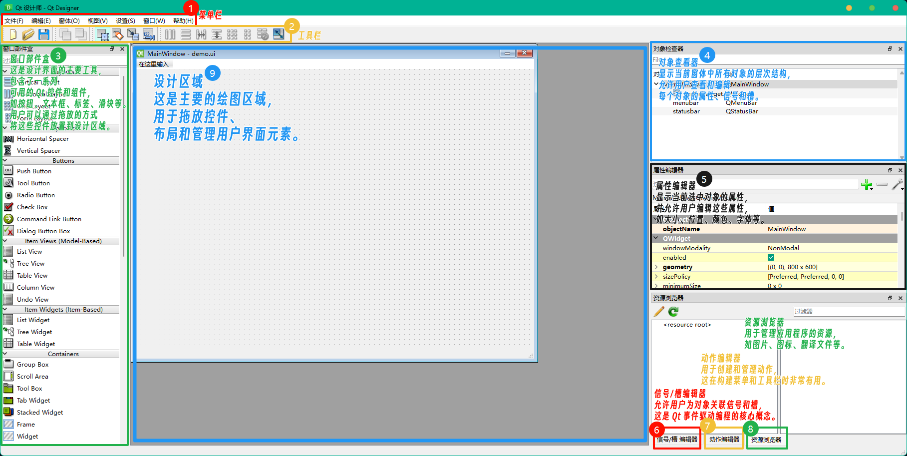

# Qt Designer

## Qt Designer 简介

Qt Designer 是一个集成开发环境(IDE)中的工具，用于设计和构建图形用户界面(GUI)。

它允许开发者在不需要编写大量代码的情况下，通过拖放部件和组件来创建用户界面。

它可以产生 XML 格式的界面描述文件，这些文件可以被 Qt 应用程序直接使用，或者被转换为 C++ 或 Python 代码，以便进一步开发。

Qt Designer 还支持国际化和本地化，使得应用程序可以轻松地适应不同的语言和地区。

此外，Qt Designer 还提供了许多高级功能，如信号和槽的编辑器，以及自定义组件的创建，这使得它成为一个非常强大和灵活的工具，适合各种类型的 GUI 开发项目。

## 快速入门

### 打开 `.\代码\2.QtDesigner\第一个ui\demo.ui`

通过配置好的 `PYQT Integration` 插件（参考 第一章 配置 PYQT Integration 插件） 直接打开 `Qt Designer`：

> 

### Qt Designer 界面简介：

1. 菜单栏：包含文件、编辑、窗体、视图、设置、窗口和帮助等菜单。
2. 工具栏：提供快速访问常用功能的按钮，如新建、打开、保存界面文件；放到后面、放到前面、编辑窗口部件、编辑伙伴、编辑信号/槽、编辑 Tab 顺序；水平布局、垂直布局、使用拆分器水平布局、使用拆分器垂直布局、栅格布局、在窗体布局中布局、分拆布局、调整大小等。
3. 窗口部件盒：这是设计界面的主要工具，包含了一系列可用的 Qt 部件和组件，如按钮、文本框、标签、滑块等。用户可以通过拖放的方式将这些部件放置到设计区域。
4. 对象查看器：显示当前窗体中所有对象的层次结构，允许用户查看和编辑每个对象的属性、信号和槽。
5. 属性编辑器：显示当前选中对象的属性，并允许用户编辑这些属性，如大小、位置、颜色、字体等。
6. 信号/槽编辑器：允许用户为对象关联信号和槽，这是 Qt 事件驱动编程的核心概念。
7. 动作编辑器：用于创建和管理动作，这在构建菜单和工具栏时非常有用。
8. 资源浏览器：用于管理应用程序的资源，如图片、图标、翻译文件等。
9. 设计区域：这是主要的绘图区域，用于拖放部件、布局和管理用户界面元素。

界面图：

> 

### Qt Designer 常用快捷键

- Ctrl + R：预览

- Ctrl + S：保存
- Ctrl + Z：撤销
- Ctrl + Y：重做
- Ctrl + X：剪切
- Ctrl + C：复制
- Ctrl + V：粘贴
- Ctrl + A：全选
- Del：删除

### 将 .ui 文件转换成 .py 文件

`demo.ui` 是一个 Qt designer 保存的空白的 `Main Window` 窗体。

#### PYQT: Compile Form

通过配置好的 `PYQT Integration` 插件（参考 第一章 配置 PYQT Integration 插件） 直接将 .ui 文件转换成 .py 文件：

> 

转换之后，在 `demo.ui` 同目录下会生成 `Ui_demo.py` 文件。

#### 编写 `第一个QtDesigner生成的桌面应用.py` 调用 `Ui_demo.py`

```python
import Ui_demo  # 导入设计的GUI界面类，通常这个文件是由Qt Designer设计并使用pyuic工具转换成Python代码生成的。
from PySide6.QtWidgets import QApplication, QMainWindow  # 从PySide6模块中导入QApplication和QMainWindow类。
import sys  # 导入sys模块，它提供了一些变量和函数，用来操纵Python运行时环境。

if __name__ == '__main__':  # 这个条件判断确保了当该脚本被当作主程序运行时，下面的代码块将被执行。
    app = QApplication(sys.argv)  # 创建一个QApplication实例，它是每个Qt GUI应用程序的核心，sys.argv参数是一个来自命令行的参数列表，用于应用程序初始化。
    mainWindow = QMainWindow()  # 创建一个QMainWindow类的实例，它是应用程序的主窗口框架。
    ui = Ui_demo.Ui_MainWindow()  # 创建一个设计的GUI界面类的实例。
    ui.setupUi(mainWindow)  # 调用setupUi方法来设置主窗口的界面，这个方法通常是由Ui_MainWindow类自动生成的。
    mainWindow.show()  # 调用show()方法来显示主窗口。
    sys.exit(app.exec_())  # 进入主事件循环，等待用户操作，exec_()方法开始处理事件，直到调用exit()或主窗口被销毁时结束。
```

> `PySide6.QtWidgets` 是什么：
>
> > PySide6.QtWidgets 是 PySide6 框架的一部分，它包含了 Qt 框架的 GUI 应用程序开发相关的类。这些类提供了用于创建和定制用户界面（UI）的工具和组件，包括窗口、按钮、文本框、菜单、工具栏等。
> >
> > PySide6.QtWidgets 模块中的类允许开发者使用 Python 语言来创建丰富的桌面应用程序。这些类继承自 Qt 框架的基类，如 QWidget、QApplication 和 QMainWindow 等，并提供了用于处理用户交互、事件和布局的接口。

> `QApplication` 是什么
>
> > - QApplication 是每个 Qt GUI 应用程序的入口点。
> > - 它负责管理应用程序的控制流、事件循环、国际化、应用程序的参数等。
> > - 每个应用程序只能有一个 QApplication 实例。
> > - 它提供了一个单一的全局实例，该实例在整个应用程序中都是可用的。
> > - QApplication 处理从操作系统接收的输入，如键盘和鼠标事件，并将其转发到适当的槽函数。

> `QMainWindow` 是什么
>
> > QMainWindow、QWidget 和 QDialog 是PySide6中**三个核心的窗口类**，它们在应用程序的架构中扮演着不同的角色。

#### 三个核心的窗口类

> QMainWindow
>
> > - QMainWindow 是应用程序的主要窗口框架。
> > - 它通常包含菜单栏、工具栏、状态栏、中心小部件（如 QWidget 或 QDockWidget）等。
> > - 它提供了一个容器，用于容纳应用程序的用户界面。
> > - 它定义了应用程序窗口的布局和外观。
> > - 通常，应用程序的主窗口是 QMainWindow 的一个实例。

> QWidget
>
> > - QWidget 是所有用户界面对象的基类。
> > - 它可以是一个独立的窗口，也可以是其他窗口（如 QMainWindow）的子窗口。
> > - 它负责绘制自己及其子控件的内容。
> > - 它提供了许多自定义选项，因为它是更基础的窗口类。
> > - 每个窗口小部件都必须有一个父窗口小部件。

> QDialog
>
> > - QDialog 用于模态对话框。它在用户与之交互时会阻塞与其关联的父窗口。直到对话框被关闭，用户将无法与父窗口进行交互。
> > - 适合用于需要用户输入或确认的场景。
> > - 它可以独立于父窗口的上下文运行。
> > - 它可以包含任何类型的用户界面，包括 QWidget、QMainWindow 或 QML 视图。
> > - 它提供了许多自定义选项，如设置标题、图标、大小、位置等。

#### 运行 `第一个QtDesigner生成的桌面应用.py`

`demo.ui` Ctrl + R 预览效果 与 `第一个QtDesigner生成的桌面应用.py` F5 运行效果：

> 

## 水平布局（Horizontal Layout）

水平布局是将所有部件放置在单行中，部件从左到右依次排列。这种布局适合于创建具有多个选项或动作的行，例如工具栏或具有多个按钮的行。在水平布局中，部件通常只占用自己的空间，不会与其他部件共享行或列。

### 使用水平布局的方式在 Qt Designer 中 **添加所有按钮部件**

如下图所示：

> 

### 编写 `Run_MainWinHorizontalLayout.py` 调用 `Ui_MainWinHorizontalLayout.py`

将 `MainWinHorizontalLayout.ui` 文件转换成 `Ui_MainWinHorizontalLayout.py` 文件后，新建 **`Run_MainWinHorizontalLayout.py`** 文件，用来运行转换之后的 `.py` 文件

```python
# 导入设计的GUI界面类，通常这个文件是由Qt Designer设计并使用pyuic工具转换成Python代码生成的。
import Ui_MainWinHorizontalLayout
# 从PySide6模块中导入QApplication和QMainWindow类。
from PySide6.QtWidgets import QApplication, QMainWindow

# 这个条件判断确保了当该脚本被当作主程序运行时，下面的代码块将被执行。
if __name__ == '__main__':
    # 使用空列表 [] 创建 QApplication 实例，用于应用程序初始化。
    app = QApplication([])
    # 创建一个QMainWindow类的实例，它是应用程序的主窗口框架。
    mainWindow = QMainWindow()
    # 创建一个设计的GUI界面类的实例。
    ui = Ui_MainWinHorizontalLayout.Ui_MainWindow()
    # 调用setupUi方法来设置主窗口的界面，这个方法通常是由Ui_MainWindow类自动生成的。
    ui.setupUi(mainWindow)
    # 调用show()方法来显示主窗口。
    mainWindow.show()
    # 进入主事件循环，等待用户操作，exec_()方法开始处理事件，直到调用exit()或主窗口被销毁时结束。
    app.exec()
```

### `app = QApplication(sys.argv)` 与 `app = QApplication([])` 区别

> 主要区别在于传递给 QApplication 构造函数的参数，使用 sys.argv 参数创建 QApplication 实例时，应用程序可以接收和处理命令行参数；使用空列表 [] 创建 QApplication 实例时，应用程序不会接收命令行参数，这在某些测试或模拟场景中很有用。

### `app.exec_()` 与 `app.exec()` 区别

> `app.exec()` 这是正确的方法名称，它启动应用程序的主事件循环，等待用户操作，并处理所有的事件。这是 Qt 应用程序的标准做法，直到应用程序关闭之前，它会一直阻塞。
>
> `app.exec_()` 是重载版本，它以 `exec_()` 的形式提供，以满足 Python 的命名约定。这个方法的功能和 `exec()` 完全相同，只是名字有所不同。

在大多数情况下，你可以使用 `exec()` 或 `exec_()` 中的任何一个，它们的效果是相同的。选择哪个方法主要取决于你的代码风格和个人偏好。在实际的编程实践中，两者都是可接受的，并且会以相同的方式工作。

### 运行 `Run_MainWinHorizontalLayout.py`

运行这个 Python 文件得到：

> 

#### 按钮（Buttons）

这些按钮从左到右依次分别是 `Push Button` 、 `Tool Button` 、 `Radio Button` 、 `Check Box` 、 `Command Link Button` 、 `Dialog Button Box` 。

> 1. Push Button：`QPushButton()`
>
> > - 这是最基本的按钮类型，用于触发一个事件或操作。
> > - 当用户点击按钮时，通常会调用一个槽函数。
> > - 它通常用于启动任务或操作，如“确定”、“取消”等。
>
> 2. Tool Button：`QToolButton()`
>
> > - 这是一个特殊类型的按钮，通常用于工具栏。
> > - 它可以具有图标和文本，并且可以显示为扁平或具有边框。
> > - 它通常用于快速访问常见的操作或功能。
>
> 3. Radio Button：`QRadioButton()`
>
> > - 单选按钮，用于让用户在多个选项中选择一个。
> > - 当选中一个单选按钮时，其他单选按钮会自动取消选中。
> > - 它通常用于创建一组互斥的选项。
>
> 4. Check Box：`QCheckBox()`
>
> > - 复选框，允许用户选择多个选项。
> > - 用户可以勾选或取消勾选复选框，以表示是否选中。
> > - 它通常用于表示用户的偏好或设置。
>
> 5. Command Link Button：`QCommandLinkButton()`
>
> > - 这是 Qt 4.0 引入的一种按钮类型，它看起来像一个链接。
> > - 它通常用于表示一个命令或动作，如“Next”或“Previous”。
> > - 它与传统的按钮相似，但在视觉上更类似于链接。
>
> 6. Dialog Button Box：`QDialogButtonBox()`
>
> > - 这是一个包含常用按钮（如“确定”、“取消”等）的容器。
> > - 它通常用于对话框或窗口的底部，提供一组标准的按钮。
> > - 它简化了对话框按钮的布局和设计。

## 垂直布局（Vertical Layout）

垂直布局将部件从上到下依次排列，部件占据整个布局的宽度。这种布局适合于创建具有多个步骤或选项的列表，例如菜单、设置页面的侧边栏等。在垂直布局中，每个部件都占据一行，但它们共享布局的宽度。

### 使用垂直布局的方式在 Qt Designer 中 **添加部分输入部件**

如下图所示：

> 

### 编写 `Run_MainWinVerticalLayout.py` 调用 `Ui_MainWinHorizontalLayout.py`

将 `MainWinVerticalLayout.ui` 文件转换成 `Ui_MainWinVerticalLayout.py` 文件后，新建 **`Run_MainWinVerticalLayout.py`** 文件，用来运行转换之后的 `.py` 文件

```python
# 导入设计的GUI界面类，通常这个文件是由Qt Designer设计并使用pyuic工具转换成Python代码生成的。
import Ui_MainWinVerticalLayout
# 从PySide6模块中导入QApplication和QMainWindow类。
from PySide6.QtWidgets import QApplication, QMainWindow

# 这个条件判断确保了当该脚本被当作主程序运行时，下面的代码块将被执行。
if __name__ == '__main__':
    # 使用空列表 [] 创建 QApplication 实例，用于应用程序初始化。
    app = QApplication([])
    # 创建一个QMainWindow类的实例，它是应用程序的主窗口框架。
    mainWindow = QMainWindow()
    # 创建一个设计的GUI界面类的实例。
    ui = Ui_MainWinVerticalLayout.Ui_MainWindow()
    # 调用setupUi方法来设置主窗口的界面，这个方法通常是由Ui_MainWindow类自动生成的。
    ui.setupUi(mainWindow)
    # 调用show()方法来显示主窗口。
    mainWindow.show()
    # 进入主事件循环，等待用户操作，exec_()方法开始处理事件，直到调用exit()或主窗口被销毁时结束。
    app.exec()
```

发现了吗，代码只是**导入设计的 GUI 界面类**变不同了。

### 运行 `Run_MainWinHorizontalLayout.py`

运行这个 Python 文件得到：

> 

#### 输入部件（Input Widgets）

这些输入部件从上到下依次分别是 `Combo Box` 、 `Font Combo Box` 、 `Line Edit` 、 `Text Edit` 、 `Plain Text Edit` 、 `Spin Box` 、 `Double Spin Box` 、 `Time Edit` 、 `Date Edit` 、 `Date/Time Edit` 、 `Dial` 、 `Horizontal Scroll Bar` 、 `Horizontal Slider` 、 `Key Sequence Edit` 。

> 1. Combo Box：`QComboBox()`
>
> > - 下拉列表，允许用户从预定义的选项中选择一个值。
> > - 当用户点击下拉箭头时，会显示一个选项列表供选择。
> > - 它通常用于提供一个有限范围的选项。
>
> 2. Font Combo Box：`QFontComboBox()`
>
> > - 特殊类型的下拉列表，用于选择字体。
> > - 它提供了字体列表，允许用户选择不同的字体。
> > - 它通常用于文本编辑或字体选择场景。
>
> 3. Line Edit：`QLineEdit()`
>
> > - 单行文本输入控件，允许用户输入和编辑文本。
> > - 它通常用于输入简短的文本，如用户名或密码。
>
> 4. Text Edit：`QTextEdit()`
>
> > - 多行文本编辑控件，允许用户输入和编辑大量文本。
> > - 它提供了更多的文本编辑功能，如字体、颜色、格式化等。
> > - 它可以接受 Markdown 和 Html 。
>
> 5. Plain Text Edit：`QPlainTextEdit()`
>
> > - 这是一个特殊类型的 Text Edit，仅允许纯文本输入。
> > - 它不支持富文本格式，只接受纯文本内容。
>
> 6. Spin Box：`QSpinBox()`
>
> > - 数字输入控件，允许用户通过向上或向下的箭头来选择数值。
> > - 它通常用于提供一个数值范围内的选择。
>
> 7. Double Spin Box：`QDoubleSpinBox()`
>
> > - 类似于 Spin Box，但它接受双精度浮点数。
> > - 它通常用于需要高精度数值输入的场景。
>
> 8. Time Edit：`QTimeEdit()`
>
> > - 时间输入控件，允许用户选择小时、分钟和秒。
> > - 它通常用于时间选择场景，如设置闹钟或会议时间。
>
> 9. Date Edit：`QDateEdit()`
>
> > - 日期输入控件，允许用户选择年、月和日。
> > - 它通常用于日期选择场景，如设置生日或旅行日期。
>
> 10. Date/Time Edit：`QDateTimeEdit()`
>
> > - 日期和时间输入控件，允许用户同时选择日期和时间。
> > - 它通常用于需要同时选择日期和时间的场景。
>
> 11. Dial：`QDial()`
>
> > - 圆形旋钮控件，用于模拟物理旋钮的操作。
> > - 用户可以通过旋转旋钮来选择数值。
>
> 12. Horizontal Scroll Bar：`QHorizontalScrollBar()`
>
> > - 水平滚动条，允许用户通过拖动滑块或点击箭头来滚动内容。
> > - 它通常用于提供水平滚动的功能。
>
> 13. Horizontal Slider：`QHorizontalSlider()`
>
> > - 水平滑块控件，允许用户通过拖动滑块来选择数值。
> > - 它通常用于提供连续数值选择的场景。
>
> 14. Key Sequence Edit：`QKeySequenceEdit()`
>
> > - 键盘按键序列输入控件，允许用户输入键盘快捷键。
> > - 它通常用于设置或显示键盘快捷键。

## 同时使用水平布局和垂直布局

### 新建 登录窗口 `MainWinVHLayout.ui`

做一个简单的图形化登录窗口界面，“用户名”和“密码”两行都使用水平布局，“欢迎+确定”和它们一起使用垂直布局：

> 

> 中央窗口部件 `centralWidget` 是一个窗口部件（QWidget）的角色，它通常用于放置在主窗口（QMainWindow）的中心区域，使用垂直布局 `QVBoxLayout` 。

### 编写 `Run_MainWinVHLayout.py` 调用 `Ui_MainWinVHLayout.py`

将 `MainWinVHLayout.ui` 文件转换成 `Ui_MainWinVHLayout.py` 文件后，新建 **`Run_MainWinVHLayout.py`** 文件，用来运行转换之后的 `.py` 文件：

```python
# 导入设计的GUI界面类，通常这个文件是由Qt Designer设计并使用pyuic工具转换成Python代码生成的。
import Ui_MainWinVHLayout
# 从PySide6模块中导入QApplication和QMainWindow类。
from PySide6.QtWidgets import QApplication, QMainWindow

# 这个条件判断确保了当该脚本被当作主程序运行时，下面的代码块将被执行。
if __name__ == '__main__':
    # 使用空列表 [] 创建 QApplication 实例，用于应用程序初始化。
    app = QApplication([])
    # 创建一个QMainWindow类的实例，它是应用程序的主窗口框架。
    mainWindow = QMainWindow()
    # 创建一个设计的GUI界面类的实例。
    ui = Ui_MainWinVHLayout.Ui_MainWindow()
    # 调用setupUi方法来设置主窗口的界面，这个方法通常是由Ui_MainWindow类自动生成的。
    ui.setupUi(mainWindow)
    # 调用show()方法来显示主窗口。
    mainWindow.show()
    # 进入主事件循环，等待用户操作，exec_()方法开始处理事件，直到调用exit()或主窗口被销毁时结束。
    app.exec()
```

### 运行 `Run_MainWinVHLayout.py`

运行这个 Python 文件得到：

> 

> 目前，它只是一个非常简陋的、没有任何实际功能的界面，我们将本章结束时优化它的界面。然后，在下一章结束时，使它能真正能用于登录。

## 栅格布局（Grid Layout）

栅格布局将部件放置在一个二维网格中，部件可以占据一个单元格、一行、一列或多个单元格。这种布局适合于创建复杂的表单或需要精确控制部件位置的界面。在栅格布局中，你可以指定每个部件在网格中的位置和跨度。

### 新建 数字键盘窗口 `MainWinGridLayout.ui`

下面是使用栅格布局设计的数字键盘窗口：

> 

### 编写 `Run_MainWinGridLayout.py` 调用 `Ui_MainWinGridLayout.py`

将 `MainWinGridLayout.ui` 文件转换成 `Ui_MainWinGridLayout.py` 文件后，新建 **`Run_MainWinGridLayout.py`** 文件，用来运行转换之后的 `.py` 文件：

```python
# 导入设计的GUI界面类，通常这个文件是由Qt Designer设计并使用pyuic工具转换成Python代码生成的。
import Ui_MainWinGridLayout
# 从PySide6模块中导入QApplication和QMainWindow类。
from PySide6.QtWidgets import QApplication, QMainWindow

# 这个条件判断确保了当该脚本被当作主程序运行时，下面的代码块将被执行。
if __name__ == '__main__':
    # 使用空列表 [] 创建 QApplication 实例，用于应用程序初始化。
    app = QApplication([])
    # 创建一个QMainWindow类的实例，它是应用程序的主窗口框架。
    mainWindow = QMainWindow()
    # 创建一个设计的GUI界面类的实例。
    ui = Ui_MainWinGridLayout.Ui_MainWindow()
    # 调用setupUi方法来设置主窗口的界面，这个方法通常是由Ui_MainWindow类自动生成的。
    ui.setupUi(mainWindow)
    # 调用show()方法来显示主窗口。
    mainWindow.show()
    # 进入主事件循环，等待用户操作，exec_()方法开始处理事件，直到调用exit()或主窗口被销毁时结束。
    app.exec()
```

### 运行 `Run_MainWinGridLayout.py`

运行这个 Python 文件得到：

> 

## 表单布局（Form Layout）

表单布局通常用于创建类似于纸张表单的用户界面，其中部件被安排成两列：标签和输入字段。第一列通常包含描述性文本（标签），用于指示第二列中的输入部件（如文本框、下拉列表等）应该输入什么内容。这种布局非常适合于数据输入界面，因为它清晰地关联了每个输入字段的目的。

### 新建 表单窗口 `MainWinFormLayout.ui`

下面是使用表单布局设计的：

> 

### 编写 `Run_MainWinFormLayout.py` 调用 `Ui_MainWinFormLayout.py`

将 `MainWinFormLayout.ui` 文件转换成 `Ui_MainWinFormLayout.py` 文件后，新建 **`Run_MainWinFormLayout.py`** 文件，用来运行转换之后的 `.py` 文件：

```python
# 导入设计的GUI界面类，通常这个文件是由Qt Designer设计并使用pyuic工具转换成Python代码生成的。
import Ui_MainWinFormLayout
# 从PySide6模块中导入QApplication和QMainWindow类。
from PySide6.QtWidgets import QApplication, QMainWindow

# 这个条件判断确保了当该脚本被当作主程序运行时，下面的代码块将被执行。
if __name__ == '__main__':
    # 使用空列表 [] 创建 QApplication 实例，用于应用程序初始化。
    app = QApplication([])
    # 创建一个QMainWindow类的实例，它是应用程序的主窗口框架。
    mainWindow = QMainWindow()
    # 创建一个设计的GUI界面类的实例。
    ui = Ui_MainWinFormLayout.Ui_MainWindow()
    # 调用setupUi方法来设置主窗口的界面，这个方法通常是由Ui_MainWindow类自动生成的。
    ui.setupUi(mainWindow)
    # 调用show()方法来显示主窗口。
    mainWindow.show()
    # 进入主事件循环，等待用户操作，exec_()方法开始处理事件，直到调用exit()或主窗口被销毁时结束。
    app.exec()
```

### 运行 `Run_MainWinFormLayout.py`

运行这个 Python 文件得到：

> 

## 容器与布局（Containers and Layouts）

### 容器（Containers）

容器是指可以包含其他部件或布局的部件。它们为部件提供了额外的布局和样式选项。Qt 提供了多种容器部件，每种容器都有其特定的用途和特点。以下是一些常见的 Qt 容器及其区别：

> 1. GroupBox：`QGroupBox()`
>
> > - 用于将相关的部件分组在一起。
> > - 通常包含一个标题栏，可以通过 setTitle 方法设置标题。
> > - 可以包含任何类型的部件或布局，并且可以提供边框和背景。
>
> 2. Scroll Area：`QScrollArea()`
>
> > - 用于显示比可用显示区域更大的内容。
> > - 提供了滚动条，允许用户滚动查看内容。
> > - 可以包含任何类型的部件或布局，并且可以用来实现自定义的滚动行为。
>
> 3. Tool Box：`QToolBox()`
>
> > - 提供了一组可折叠的页面，每个页面都有一个可见的标题。
> > - 用户可以选择一个页面来显示其内容。
> > - 通常用于提供一组相关的工具或选项，如设置或工具面板。
>
> 4. Tab Widget：`QTabWidget()`
>
> > - 提供了多个标签页，每个标签页可以包含不同的部件或布局。
> > - 用户可以通过点击不同的标签来切换显示的内容。
> > - 通常用于提供分页的用户界面，如文档编辑器或配置选项。
>
> 5. Stacked Widget：`QStackedWidget()`
>
> > - 允许同时包含多个部件（页面），但一次只显示一个页面。
> > - 通过编程方式或使用其他部件（如 QComboBox 或 QTabBar）可以切换显示的页面。
> > - 通常用于实现多页面的用户界面，如向导或具有多个视图的应用程序。
>
> 6. Frame：`QFrame()`
>
> > - 是一个基础的容器部件，可以提供边框和背景。
> > - 通常用于为其他部件提供视觉分组或框架。
> > - 可以通过设置不同的 frameStyle 来改变边框的样式和形状。
>
> 7. Widget：`QWidget()`
>
> > - 是所有用户界面对象的基类，它本身也可以作为一个通用容器。
> > - 可以包含其他部件或布局，并且可以设置样式和边框。
> > - 是创建自定义部件或窗口的基础。
>
> 8. MDI Area：`QMdiArea()`
>
> > - 提供了一个多文档界面（MDI）的容器。
> > - 可以包含多个子窗口（QMdiSubWindow），每个子窗口都可以有自己的部件和布局。
> > - 通常用于实现多文档界面应用程序，如文本编辑器或图形应用程序。
>
> 9. Dock Widget：`QDockWidget()`
>
> > - 是一个可以停靠在主窗口上的容器。
> > - 通常用于提供可移动的面板，如工具箱、属性编辑器等。
> > - 可以浮动或嵌入到主窗口的边缘。
>
> 10. QAxWidget：`QAxWidget()`
>
> > - 是一个用于承载 ActiveX 部件或 COM 对象的容器。
> > - 允许 Qt 应用程序集成和使用 ActiveX 部件。
> > - 通常用于在 Qt 应用程序中嵌入现有的 ActiveX 部件或与 COM 组件交互。

### 相互转换

容器（如 QFrame）和布局（如 栅格布局 QGridLayout）通常是相互配合使用的。容器可以包含布局，而布局则负责在容器内排列部件。我们可以创建一个布局并将它设置为一个容器的布局，或者我们可以将一个容器添加到另一个布局中。

下面是如何 **将 `QFrame` 设置为包含 `QGridLayout`** 和 **将 `QGridLayout `变型为 `QFrame`** 的演示：

> 

### 编写 `Run_MainWinContainerLayout.py` 调用 `Ui_MainWinContainerLayout.py`

将 `MainWinContainerLayout.ui` 文件转换成 `Ui_MainWinContainerLayout.py` 文件后，新建 **`Run_MainWinContainerLayout.py`** 文件，用来运行转换之后的 `.py` 文件：

```python
# 导入设计的GUI界面类，通常这个文件是由Qt Designer设计并使用pyuic工具转换成Python代码生成的。
import Ui_MainWinContainerLayout
# 从PySide6模块中导入QApplication和QMainWindow类。
from PySide6.QtWidgets import QApplication, QMainWindow

# 这个条件判断确保了当该脚本被当作主程序运行时，下面的代码块将被执行。
if __name__ == '__main__':
    # 使用空列表 [] 创建 QApplication 实例，用于应用程序初始化。
    app = QApplication([])
    # 创建一个QMainWindow类的实例，它是应用程序的主窗口框架。
    mainWindow = QMainWindow()
    # 创建一个设计的GUI界面类的实例。
    ui = Ui_MainWinContainerLayout.Ui_MainWindow()
    # 调用setupUi方法来设置主窗口的界面，这个方法通常是由Ui_MainWindow类自动生成的。
    ui.setupUi(mainWindow)
    # 调用show()方法来显示主窗口。
    mainWindow.show()
    # 进入主事件循环，等待用户操作，exec_()方法开始处理事件，直到调用exit()或主窗口被销毁时结束。
    app.exec()
```

### 运行 `Run_MainWinContainerLayout.py`

运行这个 Python 文件得到：

> 

## 绝对布局（Absolute Layout）

直接从**窗口部件盒**拖出来的部件，其所在位置就是绝对布局位置，也称为固定布局位置，绝对布局允许开发者精确地指定每个部件的位置和大小。在绝对布局中，每个部件都有一个固定的坐标和尺寸，通常以**像素**为单位。这种布局不依赖于任何布局管理器来自动调整部件的位置，因此开发者需要手动处理部件之间的间距和对齐。使用绝对布局位置的部件不适应窗口大小的变化，因此在创建响应式用户界面方面有限制。

### 新建 绝对布局窗口 `MainWinAbsoluteLayout.ui`

从窗口部件盒拖一些**显示控件（Display Widgets）**到主窗口：

> 

### 编写 `Run_MainWinAbsoluteLayout.py` 调用 `Ui_MainWinAbsoluteLayout.py`

将 `MainWinAbsoluteLayout.ui` 文件转换成 `Ui_MainWinAbsoluteLayout.py` 文件后，新建 **`Run_MainWinAbsoluteLayout.py`** 文件，用来运行转换之后的 `.py` 文件：

```python
# 导入设计的GUI界面类，通常这个文件是由Qt Designer设计并使用pyuic工具转换成Python代码生成的。
import Ui_MainWinAbsoluteLayout
# 从PySide6模块中导入QApplication和QMainWindow类。
from PySide6.QtWidgets import QApplication, QMainWindow

# 这个条件判断确保了当该脚本被当作主程序运行时，下面的代码块将被执行。
if __name__ == '__main__':
    # 使用空列表 [] 创建 QApplication 实例，用于应用程序初始化。
    app = QApplication([])
    # 创建一个QMainWindow类的实例，它是应用程序的主窗口框架。
    mainWindow = QMainWindow()
    # 创建一个设计的GUI界面类的实例。
    ui = Ui_MainWinAbsoluteLayout.Ui_MainWindow()
    # 调用setupUi方法来设置主窗口的界面，这个方法通常是由Ui_MainWindow类自动生成的。
    ui.setupUi(mainWindow)
    # 调用show()方法来显示主窗口。
    mainWindow.show()
    # 进入主事件循环，等待用户操作，exec_()方法开始处理事件，直到调用exit()或主窗口被销毁时结束。
    app.exec()
```

### 运行 `Run_MainWinAbsoluteLayout.py`

运行这个 Python 文件得到：

> 

这些显示控件从上到下从左到右依次分别是 `Text Browser` 、 `Graphics View` 、 `Calendar Widget` 、 `LCD Number` 、 `Progress Bar` 、 `Horizontal Line` 、 `Vertical Line` 。

> 1. Text Browser：`QTextBrowser()`
>
> > - 文本浏览器控件，允许用户查看和导航 HTML 内容。
> > - 它支持基本的 HTML 格式，如超链接、图片、样式等。
> > - 它通常用于显示网页内容或包含链接和图片的文档。
>
> 2. Graphics View：`QGraphicsView()`
>
> > - 图形视图框架，用于显示和管理自定义绘图小部件。
> > - 它允许用户使用鼠标和键盘与绘图进行交互。
> > - 它通常用于图形设计、游戏开发或任何需要复杂绘图的场景。
>
> 3. Calendar Widget：`QCalendarWidget()`
>
> > - 日历控件，显示一个日历视图，允许用户选择日期。
> > - 它通常包括年、月、周、日、小时和分钟的选择器。
> > - 它通常用于日期选择场景，如设置会议或事件的日期。
>
> 4. LCD Number：`QLCDNumber()`
>
> > - 液晶数字显示控件，用于显示数字和简单的文本信息。
> > - 它通常用于模拟物理仪表或显示简单的计数器。
>
> 5. Progress Bar：`QProgressBar()`
>
> > - 进度条控件，显示任务的进度或完成情况。
> > - 它可以是水平或垂直的，并且可以设置不同的进度值。
> > - 它通常用于显示下载进度、任务进度或其他任何需要进度指示的场景。
>
> 6. Horizontal Line：
>
> > - 水平线控件，用于在界面中创建水平分隔线。
> > - 它可以用来分隔不同的区域或组件。
>
> 7. Vertical Line：
>
> > - 垂直线控件，用于在界面中创建垂直分隔线。
> > - 它可以用来分隔不同的区域或组件。

## 布局中的间隔和分割线（Spacers and Line）

### 间隔（Spacers）

> 间隔是指布局中部件之间的空间。合理的间隔可以提高用户界面的可读性，避免部件之间过于拥挤或过于分散。
>
> 间隔分为水平间隔（`Horizontal Spacer`）和垂直间隔（`Vertical Spacer`）。

### 分割线（Display Widgets （Line））

> 分割线用于在布局中创建明显的分界，通常用于视觉上分隔不同的功能区域或部件组。
>
> 分割线分为水平分割线（`Horizontal Line`）和垂直分割线（`Vertical Line`）

### 示例

通过合理地使用间隔和分割线，可以创建更加整洁和直观的用户界面。在布局设计时，应该考虑部件的重要性、功能相似性以及用户的操作习惯，来决定间隔的大小和分割线的位置。

> 

```python
# 导入设计的GUI界面类，通常这个文件是由Qt Designer设计并使用pyuic工具转换成Python代码生成的。
import Ui_MainWinSpcerLineLayout
# 从PySide6模块中导入QApplication和QMainWindow类。
from PySide6.QtWidgets import QApplication, QMainWindow

# 这个条件判断确保了当该脚本被当作主程序运行时，下面的代码块将被执行。
if __name__ == '__main__':
    # 使用空列表 [] 创建 QApplication 实例，用于应用程序初始化。
    app = QApplication([])
    # 创建一个QMainWindow类的实例，它是应用程序的主窗口框架。
    mainWindow = QMainWindow()
    # 创建一个设计的GUI界面类的实例。
    ui = Ui_MainWinSpcerLineLayout.Ui_MainWindow()
    # 调用setupUi方法来设置主窗口的界面，这个方法通常是由Ui_MainWindow类自动生成的。
    ui.setupUi(mainWindow)
    # 调用show()方法来显示主窗口。
    mainWindow.show()
    # 进入主事件循环，等待用户操作，exec_()方法开始处理事件，直到调用exit()或主窗口被销毁时结束。
    app.exec()
```

> 

## 部件最大尺寸和最小尺寸（maximumSize and minimumSize）

部件的最大尺寸和最小尺寸是部件可以调整大小的边界。这些属性可以帮助保持用户界面的稳定性，确保部件在给定的范围内进行缩放，同时不会变得过于拥挤或过于空旷。

部件的 `minimumSize` 属性是部件可以缩小到的最小尺寸。在这个尺寸下，部件仍然能够正常显示其内容，但不能再缩小。

部件的 `maximumSize` 属性是部件可以放大到的最大尺寸。在这个尺寸下，部件的内容可能会占据更多的空间，但不会超过这个限制。

> 

## 尺寸策略（sizePolicy）

除了设置具体的尺寸限制外，Qt 还提供了尺寸策略（QSizePolicy），它允许开发者指定部件在布局中的大小调整行为。尺寸策略影响部件如何响应其父布局的要求，以及如何与其他部件竞争可用空间。通过设置合适的尺寸策略，可以创建出既灵活又直观的用户界面。

> 水平策略/垂直策略
>
> - Fixed：部件的大小是固定的，不会随着布局的变化而变化。
> - Minimum：部件的大小至少是最小尺寸，但如果布局允许，它可以变得更大。
> - Maximum：部件的大小至多是最大尺寸，但如果布局需要，它可以变得更小。
> - Preferred：部件的大小通常是它的首选大小，但如果布局需要，它可以被调整。
> - MinimumExpanding：部件至少是最小尺寸，但如果布局允许，它可以扩展以填充额外的空间。
> - Expanding：部件可以自由地扩展以填充额外的空间。

> 水平伸展/垂直伸展
>
> - 权重数值：在被压缩时，`Expanding 2` 比 `Expanding 1` 后被压缩

> 

> 

## 设置部件之间的伙伴关系

把 `QLabel` 和 `QLineEdit 或 QTextEdit` 关联到一起，通过其中一个部件控制另外一个部件。使用 `表单布局（Form Layout）`在里面添加 Label 和 Line Edit 空间，然后点击`标题栏`中的`编辑(E) -> 编辑伙伴`，按住鼠标左键，拖动部件之间的关系即可。例如：`姓名(&A)` 标签，它与输入部件 `lineEdit` 相关联，这里的 **&A** 是一个快捷键，它表示当用户按下 Alt 键和 A 键的组合时，将自动聚焦 `lineEdit` 文本框 。同理，ALT +B 鼠标会定位到年龄的文本框中。这种快捷键的使用是为了提高用户界面的可用性和效率，尤其是在需要频繁填写相同信息的情况下。

> 

## 修改部件的 Tab 顺序

Tab 顺序决定了当用户在键盘上按下 Tab 键时，焦点将在部件之间如何转移，默认是按照部件添加顺序。

点击`标题栏`中的`编辑(E) -> 编辑Tab顺序`，双击序号可切换序号，也可以选中序号，右键选择”制表符顺序列表“来调整顺序。按 ESC 键退出编辑。

> 

## 信号与槽的设置（signals and slots）

信号与槽是 Qt 中实现事件驱动编程的关键概念，它们允许部件在特定事件发生时发出信号，而其他对象可以连接这些信号并执行相应的槽函数。

例如，点击按钮 `关闭窗口`，关闭窗口：

> 

例如，控制文本框的显示/隐藏、可用/不可用：

> 

## 添加菜单和工具栏

这部分主要探讨如何在窗口中创建菜单和工具栏以及分别向菜单栏、工具栏中添加菜单项、按钮。使用 QtDesigner 创建一个主窗口时，默认会在主窗口的上方添加一行菜单栏，在最下方添加一行状态栏。

默认菜单已经创建，所以只需要为菜单添加菜单项：

> 

如果我们需要添加工具栏，则需要单击右键选择 `添加工具栏`：

> 

## 优化 登录窗口

还记得我们在 **同时使用水平布局和垂直布局** 小节 建立的 **登录窗口** 吗？复制  `MainWinVHLayout.ui` 到 `.\代码\2.QtDesigner\优化登录窗口\` 并重命名为 `MainWinLogin.ui` 。现在我们利用所学知识，对它进行优化。

> - 添加了《协议》的链接按钮和复选框
> - 添加了清空、注册、忘记密码、登录按钮，并在属性编辑器中为这些按钮设置了字体、绑定了快捷键
> - 添加了间隔和分隔线，使界面更加整洁
> - 设置了用户名和密码与他们对应输入框的伙伴关系，使 Alt+N 快捷键可以快速定位到用户名输入框，使 Alt+P 快捷键可以快速定位到密码输入框
> - 绑定了清空按钮的信号/槽，使它可以用于清空用户名和密码输入框中的内容

登录窗口优化后，效果如图：

> 

运行 `Run_MainWinLogin.py` 文件得到：

> 

> 目前只有清空按钮有实际功能，我们将在下一章结束时，使它能真正能用于登录。
