# PySide6 核心 API 的使用

## Qt Designer 的局限性

当涉及到 Qt 应用程序的用户界面设计时，Qt Designer 是一个非常有用的工具，因为它提供了一个直观的界面来创建和布局用户界面。然而，尽管它功能强大，但在某些情况下，你可能需要通过编程来实现特定的需求。以下是一些详细的情况，Qt Designer 可能无法满足你的需求，而必须通过编程来实现：

> - 自定义控件：
>
> > Qt Designer 允许你使用现有的控件来设计界面，但它不支持创建自定义控件。如果你需要一个独特的控件，具有特定的外观和行为，你需要使用 C++ 或 Python 编程来实现它。
>
> - 动态加载和卸载界面：
>
> > 在 Qt Designer 中，你可以在设计时创建和布局界面。但是，如果你需要在运行时动态地加载或卸载界面，或者根据用户的行为或应用程序的状态动态地修改界面，你需要使用编程来实现。
>
> - 复杂的交互和动画：
>
> > Qt Designer 支持一些基本的动画和交互效果，但对于更复杂的交互和动画，如平滑的滚动、动态效果等，你可能需要使用编程来实现。
>
> - 自定义事件处理：
>
> > 在 Qt Designer 中，你可以为控件设置事件处理函数，但这些函数是在设计时定义的。如果你需要实现自定义的事件处理逻辑，或者需要在运行时动态地添加或修改事件处理函数，你需要使用编程来实现。
>
> - 数据绑定：
>
> > Qt Designer 支持一些基本的数据绑定，如将控件的属性绑定到模型。但是，如果你需要实现更复杂的数据绑定，如将多个控件绑定到同一个模型，或者实现自定义的数据绑定逻辑，你需要使用编程来实现。
>
> - 多文档界面（MDI）：
>
> > Qt Designer 不支持 MDI 界面设计。如果你需要在应用程序中实现 MDI 功能，你需要使用编程来实现。
>
> - 国际化：
>
> > Qt Designer 支持国际化，但如果你需要实现特定的国际化逻辑，如动态地根据用户的语言和地区设置来更改界面，你需要使用编程来实现。
>
> - 自定义绘图：
>
> > Qt Designer 允许你使用 QPainter 进行基本的绘图，但对于更复杂的自定义绘图，如绘制复杂的图形、图像处理等，你需要使用编程来实现。
>
> - 高级自定义样式：
>
> > Qt Designer 支持样式表，但如果你需要实现特定的样式或主题，或者需要在运行时动态地更改样式，你可能需要使用编程来实现。
>
> - 与后端逻辑的集成：
>
> > 在 Qt Designer 中设计的界面需要通过编程来与应用程序的后端逻辑集成。这意味着你需要编写槽函数和事件处理代码，以便在用户与界面交互时执行相应的操作。

总的来说，Qt Designer 是一个非常有用的工具，但它在某些情况下可能无法满足你的需求。在这些情况下，你可能需要使用编程来实现特定的功能。

## 模块 API 分类

### 基本模块

#### [`QtCore`](https://doc.qt.io/qtforpython-6/PySide6/QtCore/index.html#module-PySide6.QtCore)

> 提供核心非 GUI 功能，如信号和插槽、属性、项模型的基类、序列化等。

#### [`QtGui`](https://doc.qt.io/qtforpython-6/PySide6/QtGui/index.html#module-PySide6.QtGui)

> 扩展 QtCore 的 GUI 功能：事件、窗口和屏幕、OpenGL 和基于光栅的 2D 绘画，以及图像。

#### [`QtWidgets`](https://doc.qt.io/qtforpython-6/PySide6/QtWidgets/index.html#module-PySide6.QtWidgets)

> 为您的应用程序提供随时可用的小部件，包括 UI 的图形元素。

### QML 和 Qt Quick

#### [`QtQml`](https://doc.qt.io/qtforpython-6/PySide6/QtQml/index.html#module-PySide6.QtQml)

> 与模块交互的基本 Python API。

#### [`QtQuick`](https://doc.qt.io/qtforpython-6/PySide6/QtQuick/index.html#module-PySide6.QtQuick)

> 提供类以在 Qt 应用程序中嵌入 Qt Quick。

#### [`QtQuickWidgets`](https://doc.qt.io/qtforpython-6/PySide6/QtQuickWidgets/index.html#module-PySide6.QtQuickWidgets)

> 提供 QQuickWidget 类以将 Qt Quick 嵌入到基于小部件的应用程序中。

### 所有模块

#### [Qt Modules Supported by Qt for Python](https://doc.qt.io/qtforpython-6/modules.html)

## QWidget 和 QML

### 简介

- widget 属于传统界面开发，和 VB/VC/Delphi 等拖曳控件开发类似，走 CPU 绘制，能最大化的兼容现有的硬件和过去的相对偏低性能的硬件。
- 在 Qt 4.7 发布时，引入了 QML，用于移动开发，其全面支持触摸操作、流畅的动画效果等。但在 Qt 5 中，QML 已经不再局限于移动开发，也可用于开发传统的桌面程序。硬件性能越好，GPU 越是强劲，QML 的综合性能越是完爆 QWidget，反之对比也是指数级的。除了极其省成本的嵌入式硬件领域或者国产 CPU 等，其他领域的硬件性能都是暴增。
- QWidget 主要集中在金融、军工、安防、航天、船舶、教育等领域，QML 主要集中在汽车仪表、车机、直播等领域。

### 优劣对比

> QWidget
> 优势：
>
> > - 灵活性：QWidget 提供了更多的灵活性，允许开发者通过直接操作像素来创建复杂的界面。
> > - 性能：对于需要高性能界面的应用程序，QWidget 通常比 QML 更优。
> > - 控件丰富：QWidget 提供了广泛的控件，包括自定义控件。
> > - 事件处理：QWidget 提供了详细的事件处理机制，使得复杂的交互和事件逻辑更容易实现。
>
> 劣势：
>
> > - 学习曲线：对于没有图形界面编程经验的开发者来说，QWidget 的学习曲线可能较陡峭。
> > - 可维护性：QWidget 的代码可能变得冗长和难以维护，特别是当涉及到复杂的布局和样式时。
> > - 跨平台一致性：QWidget 的外观和行为在不同的操作系统上可能有所不同，这可能需要额外的适配工作。

> QML
> 优势：
>
> > - 声明式编程：QML 使用 JSON 风格的声明式语法，这使得创建和维护界面更加直观和简洁。
> > - 易于学习：对于有 HTML/CSS 背景的开发者来说，QML 相对容易上手。
> > - 组件化：QML 鼓励使用组件，这有助于重用代码和提高开发效率。
> > - 集成：QML 可以与 Python 和 JavaScript 集成，允许在同一应用程序中使用多种编程语言。
> > - 跨平台：QML 支持跨平台开发，这意味着同一个应用程序可以在多个操作系统上运行。
>
> 劣势：
>
> > - 学习曲线：对于没有前端开发经验的开发者来说，QML 可能需要时间来适应。
> > - 性能：与纯 Python 相比，QML 在某些性能敏感的应用程序中可能不够高效。
> > - 依赖 Qt Quick：QML 依赖于 Qt Quick，这可能限制了自定义控件的能力。

### 总结

- 对于传统的桌面程序来说，应优先考虑使用 Qt Widgets，若要开发更现代的 UI 与高级应用，建议使用 Qt Quick。

- 对于移动端开发来说，建议使用 Qt Quick，协同 JavaScript，简单快捷、渲染效果更佳、界面更炫酷。不建议使用 Qt Widgets，其显示效果、适应性都不好。

## 创建窗口

### 核心窗口

第二章中，我们有介绍到 PySide6 中 **三个核心的窗口类**：QMainWindow 、QWidget 和 QDialog ，其中 QMainWindow 和 QDialog 从 QWidget 类继承而来。要创建和显示窗口, 需要用这 3 个类中的任意一个类实例化对象, 并让窗口对象显示并运行起来。下面我们看看分别如何用它们创建窗口。

#### QMainWindow

> QMainWindow 是应用程序的主要窗口框架，通常包含菜单栏、工具栏、状态栏和中心小部件。

```python
from PySide6.QtWidgets import (QApplication, QMainWindow,
                               QMenuBar, QToolBar, QTextEdit)
from PySide6.QtGui import QAction

# 创建应用程序实例
app = QApplication([])
# 创建主窗口实例
main_window = QMainWindow()
# 调整窗口大小
main_window.resize(400, 100)
# 设置窗口标题
main_window.setWindowTitle('QMainWindow Example')

# 设置菜单栏
# 创建一个菜单栏
menu_bar = QMenuBar()
# 创建一个菜单
this_menu = menu_bar.addMenu("这是菜单")
# 创建一个动作（菜单项）
exit_action = QAction("退出", main_window)
# 将动作连接到关闭窗口的槽函数
exit_action.triggered.connect(main_window.close)
# 将动作添加到菜单中
this_menu.addAction(exit_action)
# 将菜单栏添加到主窗口中
main_window.setMenuBar(menu_bar)

# 设置工具栏
# 创建一个工具栏
tool_bar = QToolBar("主工具栏")
# 创建一个动作（工具按钮）
tool_bar_action = QAction("这是工具栏里的按钮", main_window)
# 将动作添加到工具栏中
tool_bar.addAction(tool_bar_action)
# 将工具栏添加到主窗口中
main_window.addToolBar(tool_bar)

# 设置状态栏，5秒后消失
main_window.statusBar().showMessage("这是状态栏，它会在5秒后消失", 5000)

# 设置中心小部件
# 创建一个中心小部件
# 中心小部件通常使用垂直布局
central_widget = QTextEdit()
central_widget.setPlainText("这是中心小部件的内容。")
# 将中心小部件添加到窗口中
main_window.setCentralWidget(central_widget)

# 显示主窗口
main_window.show()
# 启动应用程序的事件循环
app.exec()
```

> 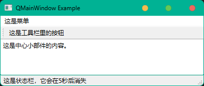

#### QWidget

> QWidget 是所有用户界面对象的基类，它可以是独立的窗口或 QMainWindow 的子窗口。虽然 QWidget 本身不是专门用于创建主窗口的类，但它可以作为主窗口的基类或中心小部件。

```python
from PySide6.QtWidgets import (QApplication, QWidget,
                               QTextEdit, QPushButton, QVBoxLayout)

# 创建应用程序实例
app = QApplication([])
# 创建主窗口实例
main_window = QWidget()
main_window.setWindowTitle('QWidget Example')

# 创建一个文本框
text_box = QTextEdit(main_window)
text_box.setPlainText('这是文本框中的内容')

# 创建一个按钮，点击时会关闭主窗口
close_button = QPushButton('退出', main_window)
# 将按钮的点击信号连接到事件处理函数
# 使用 lambda 函数来传递参数，确保在事件循环中调用 quit() 时，app 实例仍然有效
close_button.clicked.connect(lambda: app.quit())

# 创建一个垂直布局，并添加按钮
layout = QVBoxLayout(main_window)
layout.addWidget(text_box)
layout.addWidget(close_button)
# 设置widget的布局
main_window.setLayout(layout)

# 显示主窗口
main_window.show()
# 启动应用程序的事件循环
app.exec()
```

> 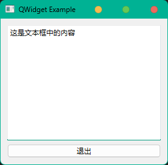

#### QDialog

> QDialog 是一个模态对话框，它通常用于请求用户输入或显示有关应用程序的额外信息。

```python
from PySide6.QtWidgets import (QApplication, QDialog,
                               QPushButton, QLabel, QVBoxLayout)
from PySide6.QtCore import Qt

# 创建应用程序实例
app = QApplication([])
# 创建模态对话框实例
dialog = QDialog()
# 设置对话框的标题
dialog.setWindowTitle('QDialog Example')
# 设置窗口大小
dialog.resize(400, 100)

# 设置对话框的模态级别
dialog.setWindowModality(Qt.ApplicationModal)

# 创建一个标签
dialog_label = QLabel('这是一个模态对话框里的标签', dialog)

# 创建一个按钮，用于关闭对话框
close_button = QPushButton('退出', dialog)
# 将按钮的点击信号连接到close方法
close_button.clicked.connect(dialog.close)

# 创建一个垂直布局
layout = QVBoxLayout()
# 将 QLabel 添加到布局
layout.addWidget(dialog_label)
# 将按钮添加到布局
layout.addWidget(close_button)
# 设置对话框的布局
dialog.setLayout(layout)

# 显示对话框
dialog.show()
# 启动应用程序的事件循环，等待用户操作
app.exec()
```

> 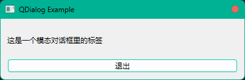

#### 混合在一起

下面是一个简单的代码文件示例，展示了如何使用 QMainWindow、QWidget 和 QDialog 创建主窗口、独立子窗口、非独立子窗口和对话框。

独立子窗口是指主窗口关闭后，独立子窗口将继续保持运行状态。

非独立子窗口，是指主窗口关闭后，非独立子窗口会随之一起关闭，通过重写主窗口的 closeEvent 方法来实现。

```python
import sys
from PySide6.QtWidgets import (QApplication, QMainWindow, QWidget, QDialog,
                               QMenuBar, QToolBar, QVBoxLayout,
                               QTextEdit, QPushButton, QLabel)
from PySide6.QtGui import QAction
from PySide6.QtCore import Qt

# 主窗口类
class MainWindow(QMainWindow):
    def __init__(self):
        super().__init__()  # 调用父类QMainWindow的构造函数
        self.setWindowTitle('QMainWindow Example')
        self.resize(400, 100)

        # 设置菜单栏
        menu_bar = QMenuBar()  # 创建一个菜单栏
        this_menu = menu_bar.addMenu("这是菜单")  # 创建一个菜单
        exit_action = QAction("退出", self)  # 创建一个动作（菜单项）
        exit_action.triggered.connect(self.close)  # 将动作连接到关闭窗口的槽函数
        this_menu.addAction(exit_action)  # 将动作添加到菜单中
        self.setMenuBar(menu_bar)  # 将菜单栏添加到主窗口中

        # 设置工具栏
        tool_bar = QToolBar("主工具栏")  # 创建一个工具栏
        tool_bar_action = QAction("这是工具栏里的按钮", self)  # 创建一个动作（工具按钮）
        tool_bar.addAction(tool_bar_action)  # 将动作添加到工具栏中
        self.addToolBar(tool_bar)  # 将工具栏添加到主窗口中

        # 设置状态栏，5秒后消失
        self.statusBar().showMessage("这是状态栏，它会在5秒后消失", 5000)

        # 创建一个文本框
        text_box = QTextEdit()
        text_box.setPlainText('这是文本框中的内容')

        # 创建按钮，用于显示子窗口
        show_dialog_button = QPushButton('Show Dialog')
        show_independent_widget_button = QPushButton('Show Independent QWidget')
        show_nonindependent_widget_button = QPushButton('Show Non-Independent QWidget')
        show_dialog_button.clicked.connect(self.show_dialog)
        show_independent_widget_button.clicked.connect(self.show_independent_widget)
        show_nonindependent_widget_button.clicked.connect(self.show_nonindependent_widget)

        # 创建一个垂直布局
        layout = QVBoxLayout()
        layout.addWidget(text_box)
        layout.addWidget(show_dialog_button)
        layout.addWidget(show_independent_widget_button)
        layout.addWidget(show_nonindependent_widget_button)

        # 设置中心小部件
        central_widget = QWidget()  # 创建一个中心小部件
        central_widget.setLayout(layout)  # 设置中心小部件布局
        self.setCentralWidget(central_widget)  # 设置中心小部件

    def show_dialog(self):
        self.dialog = DialogWindow(self)  # 创建一个对话框实例
        self.dialog.exec()  # 显示对话框并阻塞主窗口

    def show_independent_widget(self):
        self.independentsubwindow = IndependentSubWindow()  # 创建一个独立的QWidget子窗口实例
        self.independentsubwindow.show()  # 显示子窗口

    def show_nonindependent_widget(self):
        self.nonindependentsubwindow = NonIndependentSubWindow()
        self.nonindependentsubwindow.show()

    def closeEvent(self, event):
        # 在主窗口关闭时，首先关闭非独立的子窗口
        if hasattr(self, 'nonindependentsubwindow') and self.nonindependentsubwindow:
            # 这里使用hasattr函数来检查child_window属性是否存在，
            # 这是因为子窗口可能在没有被打开的情况下，
            # 主窗口就被关闭了（例如，用户直接点击窗口的关闭按钮）。
            # 如果直接尝试访问不存在的属性，会导致错误。通过使用hasattr，
            # 我们可以安全地检查属性是否存在。
            self.nonindependentsubwindow.close()
        # 继续关闭主窗口
        super().closeEvent(event)

# 对话框类
class DialogWindow(QDialog):
    def __init__(self, parent=None):
        super().__init__(parent)  # 调用父类QDialog的构造函数
        self.setWindowTitle('QDialog Example')
        self.resize(400, 100)

        # 设置对话框的模态级别
        self.setWindowModality(Qt.ApplicationModal)

        # 创建一个标签
        dialog_label = QLabel('这是一个模态对话框里的标签，在关闭这个窗口之前，你无法操作其他窗口')

        # 创建一个按钮，用于关闭对话框
        close_button = QPushButton('Close Dialog')
        close_button.clicked.connect(self.close)

        # 创建一个垂直布局
        layout = QVBoxLayout()
        layout.addWidget(dialog_label)
        layout.addWidget(close_button)
        self.setLayout(layout)

# 独立的QWidget子窗口类
class IndependentSubWindow(QWidget):
    def __init__(self):
        super().__init__()  # 调用父类QWidget的构造函数
        self.setWindowTitle('Independent QWidget Sub Window')
        self.resize(400, 100)

        # 创建一个标签
        widget_label = QLabel('你可以继续操作主窗口')

        # 创建一个按钮，用于关闭子窗口
        close_button = QPushButton('Close Sub Window')
        close_button.clicked.connect(self.close)

        # 创建一个垂直布局
        layout = QVBoxLayout()
        layout.addWidget(widget_label)
        layout.addWidget(close_button)
        self.setLayout(layout)

class NonIndependentSubWindow(QWidget):
    def __init__(self):
        super().__init__()  # 调用父类QWidget的构造函数
        self.setWindowTitle('Non-independent QWidget Sub Window')
        self.resize(400, 100)

        # 创建一个标签
        widget_label = QLabel('你可以继续操作主窗口')

        # 创建一个按钮，用于关闭子窗口
        close_button = QPushButton('Close Sub Window')
        close_button.clicked.connect(self.close)

        # 创建一个垂直布局
        layout = QVBoxLayout()
        layout.addWidget(widget_label)
        layout.addWidget(close_button)
        self.setLayout(layout)
# 应用程序入口点
if __name__ == '__main__':
    app = QApplication(sys.argv)  # 创建一个QApplication实例
    main_window = MainWindow()  # 创建一个主窗口实例
    main_window.show()  # 显示主窗口
    sys.exit(app.exec())  # 进入应用程序的主循环，并通过返回值退出程序
```

> 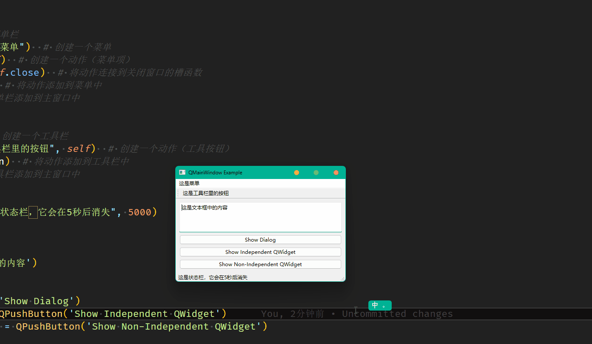

#### 详解

##### QAction

QAction 类为用户命令提供了一个抽象概念，这些命令可添加到不同的用户界面组件中。

> `from PySide6.QtGui import QAction`
>
> ...
>
> `exit_action = QAction("退出", self)`
>
> `exit_action.triggered.connect(self.close)`

如果你在第一章时遵循，建议安装并配置了 Zeal ，那么现在可以方便快速的使用 Zeal 离线查看官方文档，详细了解 QAction 的方法、槽、信号和使用方法。

> 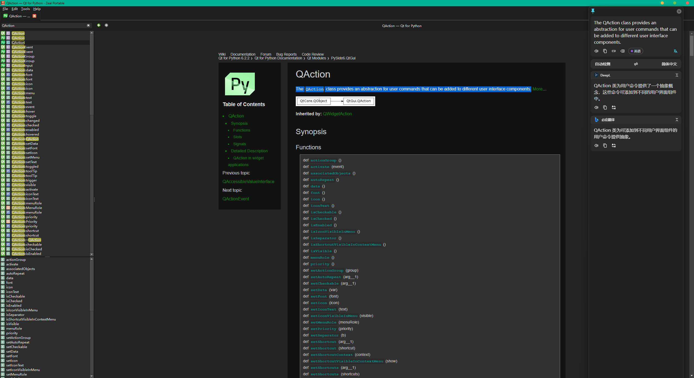

##### Qt

Qt 命名空间包含整个 Qt 库中使用的各种标识符。

> `from PySide6.QtCore import Qt`
>
> ...
>
> `self.setWindowModality(Qt.ApplicationModal)`

`Qt.ApplicationModal` 是一个枚举值，用于指定对话框的模态类型，这是 Qt 中提供的几种模态类型之一：

- Qt.NonModal：对话框是非模态的，用户可以同时与对话框和其他窗口进行交互。
- Qt.WindowModal：对话框是窗口模态的，它只阻止与父窗口的交互，但用户仍然可以与同一应用程序中的其他窗口进行交互。
- Qt.ApplicationModal：对话框是应用程序模态的，阻止与整个应用程序的所有窗口进行交互。

##### init()

`__init__` 方法是一个特殊的方法，它是类的构造器，当创建类的新实例时会被自动调用。这个方法用于初始化新创建的对象的状态。

> `def __init__(self)` 基本的构造器
>
> > 这是最简单的构造器形式，它定义了一个不接受任何额外参数的构造器。self 参数是对新创建对象的引用，它是所有实例方法的第一个参数。在这个构造器中，你可以设置对象的初始属性，但是它不提供设置父对象的机会。

> `def __init__(self, parent=None)` 考虑到了父对象的可选参数的构造器
>
> > 这个构造器接受一个可选的参数 parent。在 Qt 应用程序中，parent 参数通常用于指定一个窗口或控件的父窗口。如果提供了 parent，则新创建的窗口或控件将成为 parent 的子窗口或子控件。这有助于管理和组织窗口层次结构。如果调用时没有提供 parent，则默认为 None，表示新创建的对象没有父对象。

> `super().__init__()` 在构造器中调用父类构造器
>
> > super() 函数是 Python 中的一个内置函数，用于在继承体系中调用父类的方法。`super().__init__()` 的调用意味着在当前类的构造器中，首先调用父类的构造器进行初始化。这在面向对象编程中是非常常见的，特别是在使用继承时，确保父类的初始化逻辑被执行。在 Qt 中，这通常用于确保父类的构造器被正确调用，特别是当父类负责管理对象的生命周期和资源时。

##### connect()

connect 是一个用于建立信号（Signal）和槽（slot）之间连接的函数。

> `exit_action.triggered.connect(self.close)`

> `close_button.clicked.connect(lambda: app.quit())`

> triggered
>
> > - triggered 信号通常与 QAction 对象相关联。
> > - 这个信号在多种情况下被触发，不仅包括用户点击与该动作关联的菜单项或工具栏按钮，还包括用户使用与该动作关联的快捷键。
> > - triggered 信号是一个布尔参数的信号，它指示动作是被触发还是被取消。在大多数情况下，这个参数为 True，表示动作被正常触发。

> clicked
>
> > - clicked 信号通常与按钮类控件相关联，如 QPushButton、QToolButton 等。
> > - 这个信号在用户点击按钮时被触发。
> > - clicked 信号没有参数，它只是简单地表示按钮被点击了。

> close()
>
> > - close() 方法是 QWidget 类的一个成员函数，它用于关闭一个窗口或对话框。
> > - 当调用 close() 时，Qt 会发出 closeEvent() 信号，允许应用程序处理关闭事件，例如确认是否真的要关闭窗口。
> > - 如果窗口有父窗口并且父窗口设置了 Qt.WindowModal 或 Qt.ApplicationModal 模态，那么在关闭窗口之前，必须先关闭模态窗口。
> > - close() 方法不会终止整个应用程序，它只关闭调用该方法的窗口。

> quit()
>
> > - quit() 方法是 QCoreApplication 类的一个静态成员函数，它用于终止整个应用程序。
> > - 当调用 quit() 时，它向应用程序发送一个退出信号，请求应用程序结束执行。
> > - 调用 quit() 会导致主事件循环结束，所有的顶层窗口会被关闭，然后应用程序会退出。
> > - quit() 不会立即终止应用程序，而是在当前的事件处理完成后退出。

> exit():
>
> > - exit() 也是 QCoreApplication 类的一个静态成员函数。
> > - 当调用 exit() 时，它会导致主事件循环立即终止，应用程序随即退出。
> > - exit() 可以接受一个整数参数，这个参数用作应用程序的退出状态码，默认为 0（表示正常退出）。
> > - 与 quit() 不同，exit() 会导致事件循环**立即**结束，任何当前正在处理的事件都会被中断。

> lambda:
>
> 在 Qt 应用程序中，使用 lambda 函数来传递参数的情况通常发生在以下几种情况：
>
> 1. **需要传递额外数据**： 当你需要将一些额外数据传递给槽函数时，可以使用 lambda 函数。例如，你可能想要在按钮点击事件中传递按钮的文本或者其他与按钮相关的数据。
>
>    > ```python
>    > button.clicked.connect(lambda checked, button=button: handle_click(checked, button.text()))
>    > ```
>
> 2. **保持局部变量的引用**： 如果你在某个函数内部创建了一个按钮，并希望在该函数返回后仍然能够访问函数内部的局部变量，可以使用 lambda 函数来捕获这些变量。
>
>    > ```python
>    > def create_button():
>    >     text = "Click me"
>    >     button = QPushButton(text)
>    >     button.clicked.connect(lambda: handle_click(text))
>    >     return button
>    > ```
>
> 3. **修改信号参数**： 有时你可能需要修改信号发出的参数，或者选择性地传递部分参数给槽函数。在这种情况下，lambda 函数可以用来处理信号参数。
>
>    > ```python
>    > slider.valueChanged.connect(lambda value: update_label(value * 2))
>    > ```
>
> 4. **实现简单的条件逻辑**： 如果你需要在连接信号和槽时实现简单的条件逻辑，可以使用 lambda 函数来包含这个逻辑。
>
>    > ```python
>    > button.clicked.connect(lambda: do_something() if condition() else do_something_else())
>    > ```
>
> 5. **连接多个信号到同一个槽**： 当你想要将多个信号连接到同一个槽，并且每个信号需要传递不同的数据时，可以使用 lambda 函数来区分这些数据。
>
>    > ```python
>    > button1.clicked.connect(lambda: handle_click("Button 1"))
>    > button2.clicked.connect(lambda: handle_click("Button 2"))
>    > ```
>
> 在这些情况下，lambda 函数提供了一种便捷的方式来处理信号和槽之间的参数传递和数据处理。然而，需要注意的是，过度使用 lambda 函数可能会导致代码的**可读性降低**，特别是在复杂的逻辑或者需要传递多个参数时。在这种情况下，考虑**定义一个单独的函数**作为槽可能是一个更好的选择。

##### exec()

exec() 是 QApplication 类的一个成员函数，它在应用程序中启动主事件循环。一旦调用了 app.exec()，程序将进入一个循环，不断地处理事件，直到调用 exit() 函数或主窗口被关闭，从而导致事件循环结束。

主事件循环是 GUI 应用程序的核心部分，它负责处理用户的输入（如鼠标点击和键盘按键）、更新屏幕、以及执行其他需要在事件驱动的环境中进行的任务。在事件循环中，Qt 会等待事件发生，然后将这些事件分发给相应的对象处理。

需要注意的是，exec() 函数是阻塞的，也就是说，在调用 exec() 之后，程序会一直停留在那里，直到事件循环结束。因此，通常 app.exec() 是应用程序中的最后一个调用的函数，它应该在程序的主要设置和工作完成后调用。

> ...
>
> `app.exec()`

> ...
>
> `self.dialog.exec()`

##### show()

show() 是 QWidget 及其子类（如 QMainWindow, QDialog 等）的一个成员函数，用于将窗口或控件显示在屏幕上。当你创建一个窗口或控件时，默认情况下它是**不可见**的。调用 show() 函数会使窗口或控件变得可见，并按照其布局和样式进行绘制。

show() 函数的调用通常发生在应用程序设置和控件创建之后，但在启动主事件循环（通过调用 QApplication 实例的 exec() 函数）之前。这是因为一旦进入主事件循环，Qt 会开始处理事件，包括绘制窗口和响应用户输入。

> `main_window.show()`

> `self.independentsubwindow.show()`

### 非核心窗口

#### QMessageBox

QMessageBox 是 Qt 框架中的一个类，专门用于显示标准消息对话框的快捷方式，而 QDialog 是一个更通用的高级对话框类，用于创建自定义对话框。根据您的需求，您可以选择使用 QMessageBox 来快速显示简单的消息，或者使用 QDialog 来创建更复杂的自定义对话框。

> QMessageBox 通常用于以下情况：
>
> - 通知用户：显示一些不需要用户交互的信息。
> - 警告用户：提示用户注意某些可能的问题或错误。
> - 获取确认：在执行某些操作之前，询问用户是否确定要继续。
> - 获取选择：提供多个选项供用户选择。

下面是一个使用 PySide6 的示例脚本，它创建了四个按钮，每个按钮点击时会弹出不同类型的 QMessageBox。这个脚本展示了 QMessageBox 的四种基本类型：信息框、警告框、错误框和询问框。

```python
from PySide6.QtWidgets import (QApplication, QMainWindow, QWidget,
                                QMessageBox, QPushButton, QVBoxLayout)

class MainWindow(QMainWindow):
    def __init__(self):
        super().__init__()

        self.setWindowTitle("MessageBox Example")
        self.resize(400, 100)

        # 创建一个垂直布局
        layout = QVBoxLayout()

        # 创建四个按钮，每个按钮对应一种 QMessageBox 类型
        self.info_button = QPushButton("信息框")
        self.info_button.clicked.connect(self.show_info_message)
        layout.addWidget(self.info_button)

        self.warning_button = QPushButton("警告框")
        self.warning_button.clicked.connect(self.show_warning_message)
        layout.addWidget(self.warning_button)

        self.critical_button = QPushButton("错误框")
        self.critical_button.clicked.connect(self.show_critical_message)
        layout.addWidget(self.critical_button)

        self.question_button = QPushButton("询问框")
        self.question_button.clicked.connect(self.show_question_message)
        layout.addWidget(self.question_button)

        # 创建一个中央小部件并设置布局
        central_widget = QWidget()
        central_widget.setLayout(layout)
        self.setCentralWidget(central_widget)

    def show_info_message(self):
        info_box = QMessageBox()
        reply = info_box.information(self, "信息", "这是一个信息框。", QMessageBox.Ok)
        info_box.setDetailedText("这是详细信息。")
        if reply == QMessageBox.Ok:
            self.on_info_accepted()
        elif reply == QMessageBox.Cancel:
            self.on_info_rejected()

    def show_warning_message(self):
        warning_box = QMessageBox()
        reply = warning_box.warning(self, "警告", "这是一个警告框。", QMessageBox.Ok)
        warning_box.setDetailedText("这是详细信息。")
        if reply == QMessageBox.Ok:
            self.on_warning_accepted()
        elif reply == QMessageBox.Cancel:
            self.on_warning_rejected()

    def show_critical_message(self):
        critical_box = QMessageBox()
        reply = critical_box.critical(self, "错误", "这是一个错误框。", QMessageBox.Ok)
        critical_box.setDetailedText("这是详细信息。")
        if reply == QMessageBox.Ok:
            self.on_critical_accepted()
        elif reply == QMessageBox.Cancel:
            self.on_critical_rejected()

    def show_question_message(self):
        question_box = QMessageBox()
        reply = question_box.question(self, "询问", "这是一个询问框。", QMessageBox.Ok | QMessageBox.Cancel)
        question_box.setDetailedText("这是详细信息。")
        question_box.setDefaultButton(QMessageBox.Ok)
        question_box.setEscapeButton(QMessageBox.Cancel)
        if reply == QMessageBox.Ok:
            self.on_question_accepted()
        elif reply == QMessageBox.Cancel:
            self.on_question_rejected()

    def on_info_accepted(self):
        print("信息框的确定按钮被点击")

    def on_info_rejected(self):
        print("信息框的取消按钮被点击")

    def on_warning_accepted(self):
        print("警告框的确定按钮被点击")

    def on_warning_rejected(self):
        print("警告框的取消按钮被点击")

    def on_critical_accepted(self):
        print("错误框的确定按钮被点击")
    
    def on_critical_rejected(self):
        print("错误框的取消按钮被点击")

    def on_question_accepted(self):
        print("询问框的确定按钮被点击")
        
    def on_question_rejected(self):
        print("询问框的取消按钮被点击")

if __name__ == "__main__":
    app = QApplication([])
    window = MainWindow()
    window.show()
    app.exec()
```

> 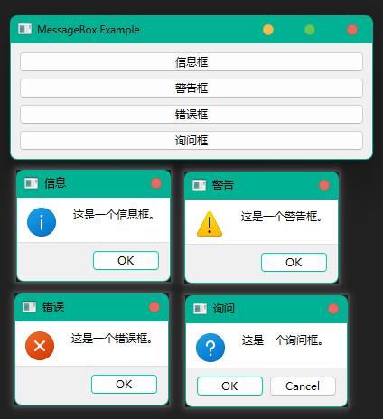

#### QErrorMessage、QProgressDialog、QWizard

`QErrorMessage` 是一个用于显示错误消息的对话框，它继承自 `QDialog`。与 `QMessageBox` 不同，`QErrorMessage` 通常用于显示应用程序运行时发生的错误信息，并且它提供了一个复选框，让用户选择是否再次显示同类错误信息。

`QProgressDialog` 是一个用于显示进度的对话框。当应用程序执行一个耗时的任务时，可以使用这个对话框来显示任务的进度，这样用户就可以看到任务正在执行中，并且可以估计完成所需的时间。

`QWizard` 是一个用于引导用户完成一系列步骤的对话框。它通常用于安装程序、配置向导或其他需要用户进行多步骤操作的场景。

下面是一个使用 `QErrorMessage`、`QProgressDialog`、`QWizard` 的简单示例。

```python
from PySide6.QtWidgets import (QApplication, QMainWindow, QWidget,
                               QPushButton, QLabel, QVBoxLayout,
                               QErrorMessage, QProgressDialog, QWizard, QWizardPage)
from PySide6.QtCore import Qt, QTimer

# 定义主窗口类 MainWindow
class MainWindow(QMainWindow):
    def __init__(self):
        super().__init__()
        self.setWindowTitle("对话框示例")
        self.resize(400, 100)

        # 创建一个垂直布局
        layout = QVBoxLayout()
        
        self.error_button = QPushButton("显示错误消息", self)
        self.error_button.clicked.connect(self.show_error_message)
        layout.addWidget(self.error_button)

        self.progress_button = QPushButton("显示进度对话框", self)
        self.progress_button.clicked.connect(self.show_progress_dialog)
        layout.addWidget(self.progress_button)

        self.wizard_button = QPushButton("显示向导对话框", self)
        self.wizard_button.clicked.connect(self.show_wizard)
        layout.addWidget(self.wizard_button)

        # 创建一个中央小部件并设置布局
        central_widget = QWidget()
        central_widget.setLayout(layout)
        self.setCentralWidget(central_widget)

    # 定义错误消息对话框
    def show_error_message(self):
        error_dialog = QErrorMessage(self)
        error_dialog.showMessage("这是一个错误消息。你可以选择不再显示此类消息。")

    # 定义进度条对话框
    def show_progress_dialog(self):
        self.progress_dialog = QProgressDialog("处理中...", "取消", 0, 100, self)
        self.progress_dialog.setWindowTitle("进度对话框")
        self.progress_dialog.setWindowModality(Qt.WindowModal)  # 设置进度对话框为模态对话框，阻止用户与其他窗口交互
        
        self.progress_dialog.canceled.connect(self.cancel_progress)
        
        # 创建一个定时器，模拟执行任务
        self.timer = QTimer(self)
        self.timer.setInterval(50)
        self.timer.timeout.connect(self.update_progress)
        self.timer.start()
        self.steps = 0  # 初始化步数

    # 定义更新进度的函数
    def update_progress(self):
        self.progress_dialog.setValue(self.steps)  # 更新步数
        self.steps += 1  # 增加步数
        if self.steps > self.progress_dialog.maximum():  # 如果步数超过最大值
            self.timer.stop()  # 停止定时器
    
    # 定义取消进度的函数
    def cancel_progress(self):
        self.timer.stop()  # 停止定时器
        self.progress_dialog.close()  # 关闭进度对话框

    # 定义向导对话框
    def show_wizard(self):
        wizard_dialog = QWizard(self)  # 创建一个向导对话框
        wizard_dialog.setWindowTitle("向导对话框")
        wizard_dialog.addPage(Page1())  # 添加页
        wizard_dialog.addPage(Page2())

        wizard_dialog.exec()  # 执行向导对话框

# 定义向导对话框的第一页
class Page1(QWizardPage):
    def __init__(self):
        super().__init__()

        self.setTitle("第一页")  # 设置页面标题
        label = QLabel("这是第一页")  # 创建标签
        layout = QVBoxLayout()
        layout.addWidget(label)
        self.setLayout(layout)

# 定义向导对话框的第二页
class Page2(QWizardPage):
    def __init__(self):
        super().__init__()

        self.setTitle("第二页")  # 设置页面标题
        label = QLabel("这是第二页")  # 创建标签
        layout = QVBoxLayout()
        layout.addWidget(label)
        self.setLayout(layout)


if __name__ == "__main__":
    app = QApplication([])
    window = MainWindow()
    window.show()
    app.exec()
```

> 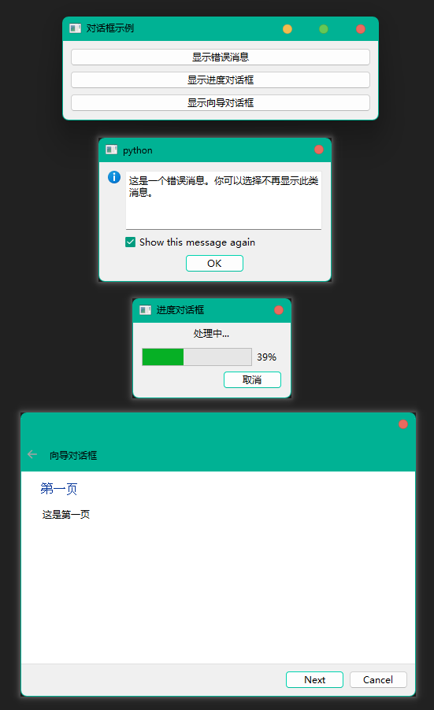

## 自定义信号（Signal）

自定义信号用于通知其他对象某些重要事件的发生，当一个对象发生特定事件时，它可以发出信号，其他对象可以监听这个信号并做出相应的反应。自定义信号的使用不仅使得代码更加模块化和可维护，而且还提供了一种清晰的方式来管理和响应不同的事件和状态变化。通过合理地使用自定义信号，可以有效地提高应用程序的整体架构质量和用户体验。通常用于以下场景：

> - 用户界面事件：当用户与界面元素（如按钮、滑块、文本框等）交互时，可以发出自定义信号来通知其他对象。例如，一个自定义的文本编辑控件可能会在文本发生变化时发出一个信号。
>
> - 数据模型变化：在模型-视图编程中，当数据模型的内容发生变化时（如添加、删除或更新条目），模型可以发出信号来通知视图更新显示。
>
> - 异步操作完成：当长时间运行的操作（如网络请求、文件读写等）完成时，可 以发出信号来通知主线程或其他对象操作已完成，并可以处理结果。
>
> - 状态变化：当一个对象的状态发生变化时，可以发出信号来通知其他对象。例如，一个下载管理器可能会在下载进度更新时发出信号。
>
> - 自定义通信：在复杂的系统中，不同的组件可能需要相互通信。自定义信号可以作为一种灵活的通信机制，允许组件在不直接依赖的情况下进行交互。
>
> - 多线程应用：在多线程应用程序中，自定义信号可以安全地在不同线程之间传递消息，因为Qt的信号和槽机制是线程安全的。
>
> - 事件传递：在游戏或图形应用程序中，自定义信号可以用于传递事件，如角色移动、碰撞检测等。
>
> - 插件架构：在允许插件扩展的应用程序中，插件可以通过自定义信号与主应用程序通信，而无需知道主应用程序的具体实现细节。
>
> - 自定义控件：当创建新的用户界面控件时，自定义信号可以用于提供与控件特定行为相关的事件通知。
>
> - 跨平台通知：在需要在不同操作系统上提供一致的通知机制时，自定义信号可以作为一种统一的跨平台解决方案。

```python
from PySide6.QtCore import Signal
...
customSignal = Signal()  # 定义一个自定义信号
customSignal.connect(...)  # 连接自定义信号 到 其他窗口 的槽
...
customSignal.emit()  # 在某个条件下发射信号
```

```python
from PySide6.QtWidgets import ( QApplication, QMainWindow, QWidget,
                                QTextEdit, QPushButton, QVBoxLayout)
from PySide6.QtCore import Signal

class MainWindow(QMainWindow):
    sendSignal = Signal(str)  # 自定义信号
    def __init__(self):
        super().__init__()
        self.setWindowTitle('主窗口')
        self.resize(400, 100)
        # 创建一个文本框
        self.text_box = QTextEdit()
        # 创建按钮，用于发送数据到子窗口
        send_button = QPushButton('发送数据到子窗口')
        # 创建一个垂直布局
        layout = QVBoxLayout()
        layout.addWidget(self.text_box)
        layout.addWidget(send_button)
        # 设置中心小部件
        central_widget = QWidget()
        central_widget.setLayout(layout)
        self.setCentralWidget(central_widget)
        # 显示子窗口
        self.SubWindow = SubWindow(self)  # 传递 self 为 子窗口的 parent
        self.SubWindow.show()

        # 连接自定义信号 到子窗口文本更新 槽
        self.sendSignal.connect(self.SubWindow.receiveValue)
        # 连接按钮 到 发送信号 方法
        send_button.clicked.connect(self.sendValue)

    def sendValue(self):
        text = self.text_box.toPlainText()
        self.sendSignal.emit(text)

    def receiveValue(self, text):
        self.text_box.setText(text)

    def closeEvent(self, event):
        # 在主窗口关闭时，关闭子窗口
        if hasattr(self, 'SubWindow') and self.SubWindow:
            self.SubWindow.close()
        # 继续关闭主窗口
        super().closeEvent(event)

class SubWindow(QWidget):
    sendSignal = Signal(str)  # 自定义信号
    def __init__(self, parent=None):
        super().__init__()
        self.setWindowTitle('子窗口')
        self.resize(400, 100)
        # 创建一个文本框
        self.text_box = QTextEdit()
        # 创建按钮，用于发送数据到子窗口
        send_button = QPushButton('发送数据到主窗口')
        # 创建一个垂直布局
        layout = QVBoxLayout()
        layout.addWidget(self.text_box)
        layout.addWidget(send_button)
        # 设置布局
        self.setLayout(layout)

        # 连接自定义信号 到主窗口文本更新 槽
        self.sendSignal.connect(parent.receiveValue)
        # 连接按钮 到 发送信号 方法
        send_button.clicked.connect(self.sendValue)

    def sendValue(self):
        text = self.text_box.toPlainText()
        self.sendSignal.emit(text)

    def receiveValue(self, text):
        self.text_box.setText(text)

if __name__ == '__main__':
    app = QApplication([])
    main_window = MainWindow()
    main_window.show()
    app.exec()
```

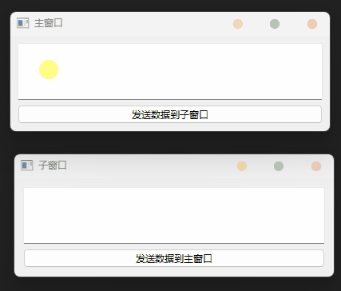

## 设置窗口的样式和行为（setWindowFlags()）

### setWindowFlags()

`setWindowFlags()` 是一个非常重要的函数，它用于设置窗口的样式和行为。通过这个函数，可以控制窗口的边框、标题栏、状态栏等元素，以及窗口的交互方式，比如是否可以调整大小、是否总是置顶等。

> setWindowFlags() 函数接受一个 Qt.WindowFlags 类型的参数，这个参数是一个枚举值，可以通过位或操作（|）来组合多个标志。以下是一些常用的 Qt.WindowFlags 常量。
>
> 窗口类型Qt.WindowsFlaga
>
> | Qt.WindowFlags的取值 | 说明                                                         |
> | -------------------- | ------------------------------------------------------------ |
> | Qt.Widget            | 这是默认值,如果QWidget有父容器或窗口,它成为一个控件；如果没有, 则它会成为独立的窗口 |
> | Qt.Window            | 不管QWidget是否有父容器或窗口,它都将成为一个有窗口框架和标题栏 的窗口 |
> | Qt.Dialog            | QWidget将成为一个对话框窗口(QDialog)。对话框窗口在标题栏上通常 没有最大化按钮和最小化按钮,如果是从其他窗口中弹出了对话框窗口,可 以通过 setWindowModality()方法将其设置成模式窗口。在关闭模式窗口之前,不允许对其他窗口进行操作 |
> | Qt.Sheet             | 在 Mac系统中,QWidget 将是一个表单(sheet)                    |
> | Qt.Drawer            | 在 Mac 系统中,QWidget 将是一个抽屉(drawer)                  |
> | Qt.Popup             | QWidget是弹出式顶层窗口,这个窗口是带模式的,常用来做弹出式菜单 |
> | Qt.Tool              | QWidget 是一个工具窗,工具窗通常有比正常窗口小的标题栏,可以在其上 面放置按钮。如果QWidget 有父窗口,则QWidget 始终在父窗口的顶层 |
> | Qt.ToolTip           | QWidget是一个提示窗,没有标题栏和边框                        |
> | Qt.SplashScreen      | QWidget是一个欢迎窗,这是 QSplashScreen的默认值              |
> | Qt.Desktop           | QWidget是个桌面,这是QDesktopWidget的默认值                  |
> | Qt.SubWindow         | QWidget 是子窗口,例如QMidSubWidow窗口                       |
> | Qt.ForeignWindow     | QWidget是其他程序创建的句柄窗口                              |
> | Qt.CoverWindow       | QWidget是一个封面窗口,当程序最小化时显示该窗口              |
>
> 影响窗口外观的Qt.WindowFlags的取值
>
> | Qt.WindowFlags的取值                   | 说 明                                                        |
> | -------------------------------------- | ------------------------------------------------------------ |
> | Qt.MSWindowsFixedSizeDialogHint        | 对于不可调整尺寸的对话框Qdialog添加窄的边框                  |
> | Qt.MSWindowsOwnDC                      | 为Windows 系统的窗口添加上下文菜单                           |
> | Qt.BypassWindowManagerHint             | 窗口不受窗口管理协议的约束,与具体的操作系统有关             |
> | Qt.X11BypassWindowManagerHint          | 无边框窗口,不受任务管理器的管理。如果不是用activateWindow()方法激活,不接受键盘输人 |
> | Qt.FramelessWindowHint                 | 无边框和标题栏窗口,无法移动和改变窗口的尺寸                 |
> | Qt.NoDropShadowWindowHint              | 不支持拖放操作的窗口                                         |
> | Qt.CustomizeWindowHint                 | 自定义窗口标题栏,不显示窗口的默认提示信息,以下6 个可选值可配合该值一起使用|
> | Qt.WindowTitleHint                     | 有标题栏的窗口                                               |
> | Qt.WindowSystemMenuHint                | 有系统菜单的窗口                                             |
> | Qt.WindowMinimizeButtonHint            | 有最小化按钮的窗口                                           |
> | Qt.WindowMaximizeButtonHint            | 有最大化按钮的窗口                                           |
> | Qt.WindowMinMaxButtonsHint             | 有最小化和最大化按钮的窗口                                   |
> | Qt.WindowCloseButtonHint               | 有关闭按钮的窗口                                             |
> | Qt.WindowContextHelpButtonHint         | 有帮助按钮的窗口                                             |
> | Qt.MacWindowToolBarButtonHint          | 在 Mac 系统中,添加工具栏按钮                                |
> | Qt.WindowFullscreenButtonHint          | 有全屏按钮的窗口                                             |
> | Qt.WindowShadeButtonHint               | 在最小化按钮处添加背景按钮                                   |
> | Qt.WindowStaysOnTopHint                | 始终在最前面的窗口                                           |
> | Qt.WindowStaysOnBottomHint             | 始终在最后面的窗口                                           |
> | Qt.WindowTransparentForInput           | 只用于输出,不能用于输入的窗口                               |
> | Qt.WindowDoesNotAcceptFocus            | 不接受输入焦点的窗口                                         |
> | Qt.MaximizeUsingFullscreenGeometryHint | 窗口最大化时,最大化地占据屏幕                               |

这些标志可以组合使用，以实现不同的窗口效果。例如，如果你想要一个无边框窗口，但仍然希望显示标题栏，你可以这样设置：

> self.setWindowFlags(Qt.FramelessWindowHint | Qt.WindowTitleHint)

如果你想要一个总是置顶的无边框窗口，你可以这样设置：

> self.setWindowFlags(Qt.FramelessWindowHint | Qt.WindowStaysOnTopHint)

请注意，一旦设置了 Qt.FramelessWindowHint，窗口将不再具有标准的窗口装饰，这意味着用户不能通过标准的窗口装饰来移动、调整大小或关闭窗口。因此，如果你创建了一个无边框窗口，你可能需要自己实现这些功能，例如通过编写事件过滤器或重写鼠标事件处理函数来实现窗口的拖动功能。

### 无边框、置顶、无任务栏图标

下面是一个使用 QDialog 创建的无边框、置顶且在任务栏上不显示图标的对话框示例。这个对话框将不会有标题栏，也不会在任务栏上显示图标，并且会始终保持在其他窗口之上。

```python
import sys
from PySide6.QtWidgets import QApplication, QDialog, QVBoxLayout, QPushButton
from PySide6.QtCore import Qt

class CustomDialog(QDialog):
    def __init__(self):
        super().__init__()
        self.initUI()

    def initUI(self):
        # 设置窗口标志
        self.setWindowFlags(
            self.windowFlags()
            | Qt.FramelessWindowHint  # 隐藏标题栏
            | Qt.Tool  # 隐藏Windows任务栏上的图标
            | Qt.WindowStaysOnTopHint  # 置顶
        )
        # 设置窗口布局
        layout = QVBoxLayout()
        # 添加一个按钮，用于关闭对话框
        close_button = QPushButton("关闭")
        close_button.clicked.connect(self.close)
        layout.addWidget(close_button)
        # 设置对话框的布局
        self.setLayout(layout)
        # 设置对话框的几何位置和大小
        self.resize(500, 500)

if __name__ == '__main__':
    app = QApplication(sys.argv)
    dialog = CustomDialog()
    dialog.show()
    sys.exit(app.exec_())
```

> 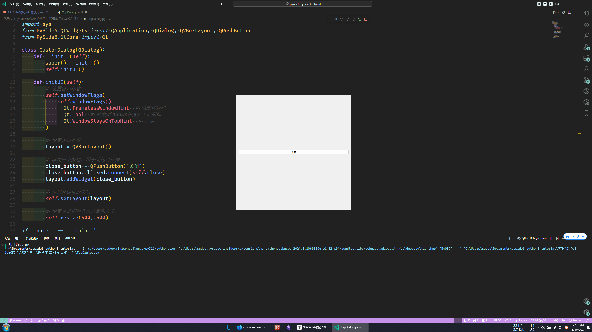

### 拖动、放缩（QMouseEvent、QSizeGrip）

继须优化这个脚本，通过重写鼠标事件处理函数来实现窗口的拖动功能，通过添加角部小部件实现窗口放大缩小。

```python
from PySide6.QtWidgets import (QApplication, QDialog,
                               QVBoxLayout, QHBoxLayout,
                               QPushButton, QSizeGrip)
from PySide6.QtCore import Qt
from PySide6.QtGui import QMouseEvent

class CustomDialog(QDialog):
    def __init__(self):
        super().__init__()
        self.initUI()

    def initUI(self):
        self.resize(500, 500)
        # 设置窗口标志
        self.setWindowFlags(
            self.windowFlags()
            | Qt.FramelessWindowHint  # 隐藏标题栏
            | Qt.Tool  # 隐藏Windows任务栏上的图标
            | Qt.WindowStaysOnTopHint  # 置顶
        )
        # 添加一个按钮，用于关闭对话框
        close_button = QPushButton("关闭")
        close_button.clicked.connect(lambda: app.quit())
        # 添加可调整大小的角落小部件
        self.size_grip_top_left = QSizeGrip(self)
        self.size_grip_top_right = QSizeGrip(self)
        self.size_grip_bottom_left = QSizeGrip(self)
        self.size_grip_bottom_right = QSizeGrip(self)
        # 设置窗口布局
        layout_top = QHBoxLayout()
        layout_middle = QVBoxLayout()
        layout_bottom = QHBoxLayout()
        layout_top.addWidget(self.size_grip_top_left, 0, Qt.AlignTop | Qt.AlignLeft)
        layout_top.addWidget(self.size_grip_top_right, 0, Qt.AlignTop | Qt.AlignRight)
        layout_middle.addWidget(close_button, 0, Qt.AlignCenter)
        layout_bottom.addWidget(self.size_grip_bottom_left, 0, Qt.AlignBottom | Qt.AlignLeft)
        layout_bottom.addWidget(self.size_grip_bottom_right, 0, Qt.AlignBottom | Qt.AlignRight)
        layout_main = QVBoxLayout()
        layout_main.addLayout(layout_top)
        layout_main.addLayout(layout_middle)
        layout_main.addLayout(layout_bottom)
        self.setLayout(layout_main)

    # 实现窗口的拖动功能
    def mousePressEvent(self, event: QMouseEvent):
        if event.button() == Qt.LeftButton:
            self.draggable = True
            self.offset = event.position().toPoint()

    def mouseMoveEvent(self, event: QMouseEvent):
        if self.draggable:
            self.move(event.globalPosition().toPoint() - self.offset)

    def mouseReleaseEvent(self, event: QMouseEvent):
        if event.button() == Qt.LeftButton:
            self.draggable = False

    # 失去焦点时隐藏角部小部件
    def enterEvent(self, event):
        super().enterEvent(event)
        self.size_grip_top_left.show()
        self.size_grip_top_right.show()
        self.size_grip_bottom_left.show()
        self.size_grip_bottom_right.show()

    def leaveEvent(self, event):
        super().leaveEvent(event)
        self.size_grip_top_left.hide()
        self.size_grip_top_right.hide()
        self.size_grip_bottom_left.hide()
        self.size_grip_bottom_right.hide()

if __name__ == '__main__':
    app = QApplication([])
    dialog = CustomDialog()
    dialog.show()
    app.exec()
```

> 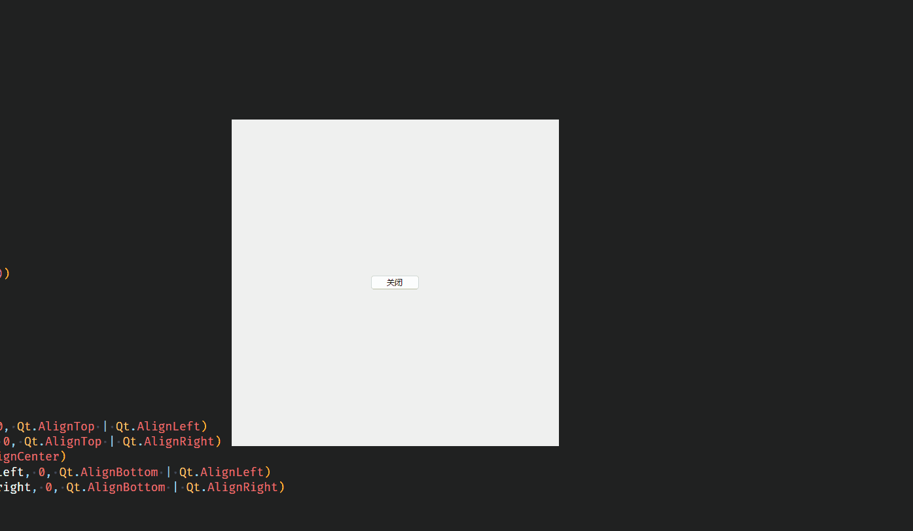

## 屏幕坐标系（geometry()）

屏幕坐标系：原点（0,0）位于屏幕的左上角，x 轴水平向右增加，y 轴垂直向下增加。

窗口的位置：通过窗口的左上角的坐标来描述，这个坐标就是相对于屏幕坐标系。

### geometry()

`geometry()` 函数是 QWidget 类的一个成员函数，它用于获取窗口小部件（widget）的几何形状。几何形状通常指的是窗口小部件在屏幕上的位置和大小。geometry()函数返回一个 QRect 对象，这个对象包含了窗口小部件的左上角坐标（x, y）以及它的宽度和高度。QRect 是一个矩形类，它有四个属性：x()（矩形左上角的 x 坐标），y()（矩形左上角的 y 坐标），width()（矩形的宽度），和 height()（矩形的高度）。

下面这个示例用于单击按钮打印 **窗口坐标** 和 **窗口大小** 。

```python
from PySide6.QtWidgets import (QApplication, QMainWindow, QWidget,
                               QVBoxLayout, QPushButton, QTextEdit)

class MainWindow(QMainWindow):
    def __init__(self):
        super().__init__()
        self.setWindowTitle("Print Window Geometry Example")
        self.resize(425, 425)

        button = QPushButton('打印窗口坐标和大小')
        button.clicked.connect(self.print_window_geometry)
        self.text_box = QTextEdit()
        self.text_box.setReadOnly(True)

        # 创建垂直布局
        layout = QVBoxLayout()
        layout.addWidget(button)
        layout.addWidget(self.text_box)
        # 创建中央小部件
        central_widget = QWidget()
        central_widget.setLayout(layout)
        self.setCentralWidget(central_widget)

    # 打印窗口坐标和窗口大小
    def print_window_geometry(self):
        geometry = self.geometry()
        x, y, width, height = geometry.getRect()
        info = f"窗口坐标: ({x}, {y})\n窗口大小: 宽度 {width}, 高度 {height}"
        self.text_box.append(info)
        self.text_box.append("\n")

if __name__ == "__main__":
    app = QApplication([])
    main_window = MainWindow()
    main_window.show()
    app.exec()
```

运行效果如图：

> 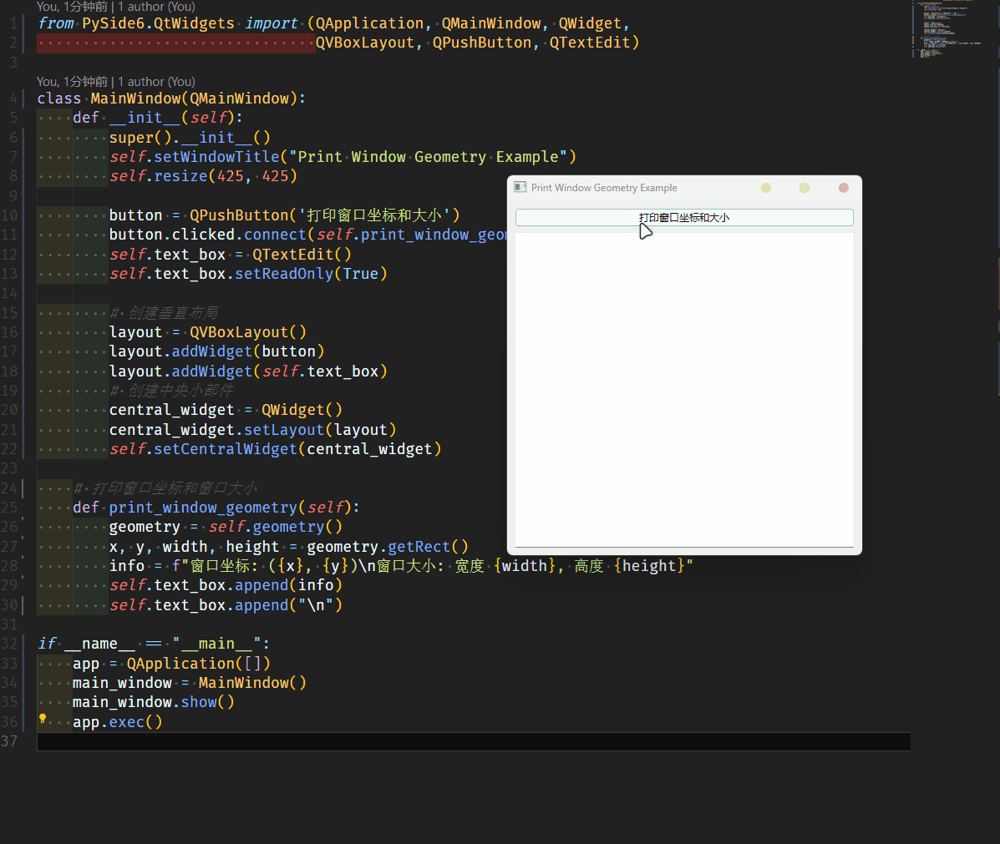

### 拖动、放缩（QMouseEvent）

通过重写鼠标事件处理函数来实现窗口的拖动功能和窗口放大缩小。

```python
from PySide6.QtWidgets import (QApplication, QDialog,
                               QVBoxLayout, QPushButton)
from PySide6.QtCore import Qt
from PySide6.QtGui import QMouseEvent

class CustomDialog(QDialog):
    def __init__(self):
        super().__init__()
        self.initUI()

    def initUI(self):
        self.resize(500, 500)
        # 设置窗口标志
        self.setWindowFlags(
            self.windowFlags()
            | Qt.FramelessWindowHint  # 隐藏标题栏
            | Qt.Tool  # 隐藏Windows任务栏上的图标
            | Qt.WindowStaysOnTopHint  # 置顶
        )

        self.margin = 10  # 确定鼠标位置是否在边缘或角落
        self.mouse_pressed = False  # 鼠标按下标志
        self.draggable = False  # 窗口可拖动标志

        # 添加一个按钮，用于关闭对话框
        close_button = QPushButton("关闭")
        close_button.clicked.connect(lambda: app.quit())
        # 设置窗口布局
        layout_main = QVBoxLayout()
        layout_main.addWidget(close_button, 0, Qt.AlignCenter)
        self.setLayout(layout_main)

    # 重写鼠标按下事件，处理窗口拖动和边缘调整
    def mousePressEvent(self, event: QMouseEvent):
        if event.button() == Qt.LeftButton:
                    self.mouse_pressed = True  # 设置鼠标按下标志
                    self.offset = event.globalPosition() - self.frameGeometry().topLeft()
                    self.edge = self.get_resize_edge(event.position())  # 获取调整边缘
                    if self.edge is not None:
                        self.setCursor(self.get_resize_cursor(self.edge))  # 设置鼠标光标形状
                    else:
                        self.draggable = True  # 设置窗口可拖动标志
                        self.offset = event.position().toPoint()  # 更新偏移量

    # 重写鼠标移动事件，处理窗口拖动或调整窗口大小
    def mouseMoveEvent(self, event: QMouseEvent):
        if self.draggable:
            self.move(event.globalPosition().toPoint() - self.offset)    # 移动窗口
        if self.mouse_pressed and self.edge is not None:
            self.resize_window(event)    # 调整窗口大小

    # 重写鼠标释放事件，处理拖动结束
    def mouseReleaseEvent(self, event: QMouseEvent):
        if event.button() == Qt.LeftButton:
            self.draggable = False  # 清除窗口可拖动标志
            self.mouse_pressed = False  # 清除鼠标按下标志
            self.edge = None  # 清除调整边缘
            self.setCursor(Qt.ArrowCursor)  # 恢复鼠标光标形状

    # 获取鼠标位置对应的调整边缘
    def get_resize_edge(self, pos):
        width = self.frameGeometry().width()
        height = self.frameGeometry().height()

        if pos.x() < self.margin and pos.y() < self.margin:
            return 'top_left'
        elif pos.x() > width - self.margin and pos.y() < self.margin:
            return 'top_right'
        elif pos.x() < self.margin and pos.y() > height - self.margin:
            return 'bottom_left'
        elif pos.x() > width - self.margin and pos.y() > height - self.margin:
            return 'bottom_right'
        elif pos.x() < self.margin:
            return 'left'
        elif pos.x() > width - self.margin:
            return 'right'
        elif pos.y() < self.margin:
            return 'top'
        elif pos.y() > height - self.margin:
            return 'bottom'
        else:
            return None

    # 设置适当的鼠标光标
    def get_resize_cursor(self, edge):
        if edge in ('top', 'bottom'):
            return Qt.SizeVerCursor
        elif edge in ('left', 'right'):
            return Qt.SizeHorCursor
        elif edge in ('top_left', 'bottom_right'):
            return Qt.SizeFDiagCursor
        elif edge in ('top_right', 'bottom_left'):
            return Qt.SizeBDiagCursor
        else:
            return Qt.ArrowCursor

    def resize_window(self, event):
        if self.edge is not None:
            global_pos = event.globalPosition()  # 全局鼠标位置
            local_pos = event.position()  # 局部（窗口内）鼠标位置
            x, y, w, h = self.x(), self.y(), self.width(), self.height()  # 当前窗口的位置和尺寸

            # 根据不同的边缘调整窗口的尺寸
            if self.edge in ('top', 'top_left', 'top_right'):
                delta_y = local_pos.y() - self.offset.y()
                y += delta_y
                h -= delta_y
            if self.edge in ('bottom', 'bottom_left', 'bottom_right'):
                h = global_pos.y() - y
            if self.edge in ('left', 'top_left', 'bottom_left'):
                delta_x = local_pos.x() - self.offset.x()
                x += delta_x
                w -= delta_x
            if self.edge in ('right', 'top_right', 'bottom_right'):
                w = global_pos.x() - x
            # 设置窗口的新位置和尺寸
            self.setGeometry(x, y, w, h)

if __name__ == '__main__':
    app = QApplication([])
    dialog = CustomDialog()
    dialog.show()
    app.exec()
```

### 窗口内鼠标位置（mouseMoveEvent）

```python
from PySide6.QtWidgets import QApplication, QMainWindow

class MainWindow(QMainWindow):
    def __init__(self):
        super().__init__()
        self.setWindowTitle("鼠标移动跟踪示例")
        self.setGeometry(100, 100, 800, 600)

    def mouseMoveEvent(self, event):
        # 获取鼠标当前位置
        x = event.position().x()
        y = event.position().y()
        print(f"鼠标当前位置：X = {x}, Y = {y}")

if __name__ == "__main__":
    app = QApplication([])
    window = MainWindow()
    window.show()
    app.exec()
```

### 全局鼠标位置（pywin32）

```python
pip install pywin32
```

```python
x, y = win32api.GetCursorPos()
```

```python
import win32api
import win32con
import win32gui
import win32print
from PySide6.QtWidgets import QApplication, QLabel
from PySide6.QtCore import Qt, QTimer
from PySide6.QtGui import QPalette, QFont, QColor, QScreen

class Cursor_Position(QLabel):
    def __init__(self):
        super().__init__()
        self.Print_Screen_Scale_Use_QScreen()  # QScreen 无法直接获取屏幕未缩放前的屏幕尺寸
                                                # 但是可以获取缩放后的逻辑尺寸和屏幕缩放比例，计算出未缩放前的屏幕尺寸

        self.setWindowFlags(Qt.ToolTip | Qt.FramelessWindowHint)
        self.resize(150, 20)
        font = QFont("Segoe MDL2 Assets", 14)
        self.setFont(font)
        palette = self.palette()
        palette.setColor(QPalette.Window, QColor("#212121"))  # 设置背景颜色
        palette.setColor(QPalette.WindowText, QColor("#00B294"))  # 设置文本颜色
        self.setPalette(palette)

        # 创建一个定时器来定期更新鼠标位置
        self.timer = QTimer(self)
        self.timer.timeout.connect(self.update_tooltip_position)
        self.timer.start(100)  # 每100毫秒更新一次

    def update_tooltip_position(self):
        # 使用pywin32获取全局鼠标位置
        x, y = win32api.GetCursorPos()

        # global scale_x, scale_y  # 获取屏幕缩放比例方法一
                                    # 在Pyside6 实例化 app 前，
                                    # 可以使用 Pywin32 计算屏幕缩放比例
                                    # 并设为全局变量

        # print(f"屏幕缩放比例: {scale_x}, {scale_y}")
        # x, y = x / scale_x, y / scale_y
        # print(x, y)
        # # 更新标签的位置和文本
        # self.move(x+(20/scale_x),y+(20/scale_y))

        print(f"QScreen 获取到的 屏幕缩放比例: {self.scale_factor}")  # 获取屏幕缩放比例方法二
                                                                    # 在Pyside6 实例化 app 后，
                                                                    # 可以使用 QScreen 获取屏幕缩放比例
        x, y = x / self.scale_factor, y / self.scale_factor
        print(x, y)
        self.move(x+(20/self.scale_factor),y+(20/self.scale_factor))

        self.setText(f"X: {int(x)}, Y: {int(y)}")
        self.setVisible(True)

    def Print_Screen_Scale_Use_QScreen(self):
        # 获取当前屏幕
        screen = QApplication.primaryScreen()
        # 获取屏幕的分辨率
        # resolution = screen.size()
        # logical_width = resolution.width()
        # logical_height = resolution.height()
        # print(f"QScreen 获取到的 逻辑尺寸: {logical_width}x{logical_height}")  # 2048x1152
        # 获取屏幕的缩放比例
        self.scale_factor = screen.devicePixelRatio()
        print(f"QScreen 获取到的 屏幕缩放比例: {self.scale_factor}")  # 1.25
        # # 计算原始屏幕尺寸
        # screen_width = logical_width * self.scale_factor
        # screen_height = logical_height * self.scale_factor
        # print(f"QScreen 获取到的 屏幕尺寸: {screen_width}x{screen_height}")  # 2560x1440


def Print_Screen_Scale():
    # 获取屏幕尺寸
    hDC = win32gui.GetDC(0)
    screen_width = win32print.GetDeviceCaps(hDC, win32con.DESKTOPHORZRES)
    screen_height = win32print.GetDeviceCaps(hDC, win32con.DESKTOPVERTRES)
    print(f"屏幕尺寸: {screen_width}x{screen_height}")  # 2560x1440
    # 获取屏幕逻辑尺寸
    logical_width = win32api.GetSystemMetrics(win32con.SM_CXVIRTUALSCREEN)
    logical_height = win32api.GetSystemMetrics(win32con.SM_CYVIRTUALSCREEN)
    print(f"逻辑尺寸: {logical_width}x{logical_height}")  # 2048x1152
    # 计算屏幕的缩放比例
    global scale_x, scale_y
    scale_x = screen_width / logical_width
    scale_y = screen_height / logical_height
    print(f"屏幕缩放比例: {scale_x}, {scale_y}")  # 1.25, 1.25

def Print_Screen_Scale_After_app_Set():
    # 获取屏幕尺寸
    hDC = win32gui.GetDC(0)
    screen_width = win32print.GetDeviceCaps(hDC, win32con.DESKTOPHORZRES)
    screen_height = win32print.GetDeviceCaps(hDC, win32con.DESKTOPVERTRES)
    print(f"实例化 app 后 获取到的 屏幕尺寸: {screen_width}x{screen_height}")  # 2560x1440
    # 获取屏幕逻辑尺寸
    logical_width = win32api.GetSystemMetrics(win32con.SM_CXVIRTUALSCREEN)
    logical_height = win32api.GetSystemMetrics(win32con.SM_CYVIRTUALSCREEN)
    print(f"实例化 app 后 获取到的 逻辑尺寸: {logical_width}x{logical_height}")  # 2560x1440
                                                                                # 与实例化 app 前 获取到的 2048x1152 不同，
                                                                                # 在实例化 app 后 获取到的 逻辑尺寸 不正确
    # 计算屏幕的缩放比例
    scale_x = screen_width / logical_width
    scale_y = screen_height / logical_height
    print(f"实例化 app 后 获取到的 屏幕缩放比例: {scale_x}, {scale_y}")  # 1.25, 1.25


if __name__ == "__main__":

    Print_Screen_Scale()  # 在Pyside6 实例化 app 前，
                            # 可以使用 Pywin32 计算屏幕缩放比例

    app = QApplication([])

    Print_Screen_Scale_After_app_Set()  # 在Pyside6 实例化 app 后 使用 Pywin32 计算屏幕缩放比例，
                                        # 与实例化 app 前 获取到的 2048x1152 不同，
                                        # 在实例化 app 后 获取到的 逻辑尺寸 不正确

    # Print_Screen_Scale_Use_QScreen()  # QScreen 无法直接获取屏幕未缩放前的屏幕尺寸
                                        # 但是可以获取缩放后的逻辑尺寸和屏幕缩放比例，计算出未缩放前的屏幕尺寸

    label = Cursor_Position()
    label.show()
    app.exec()
```

> 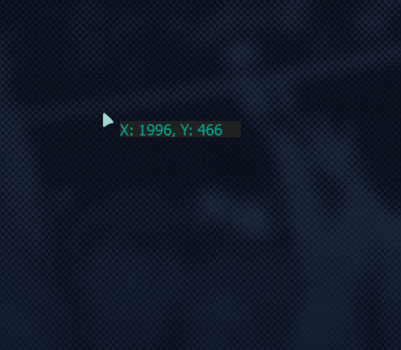

## 主窗口居中显示（move()）

在 PySide6（以及 Qt 框架）中，如果不进行任何设置，主窗口的默认显示位置是由窗口管理器（Window Manager）决定的，这通常取决于操作系统和桌面环境的行为。大多数情况下，窗口管理器会将新窗口放置在屏幕的某个“合理”位置，这可能是屏幕的中心、屏幕的左上角或其他位置。

这种行为并不是由 PySide6 或 Qt 控制的，而是由操作系统和窗口管理器的规则决定的。因此，如果你不调用任何方法来设置窗口的位置，你将得到默认的行为，这可能会因系统而异。

如果想确保窗口在特定位置显示，应该使用 move 方法来设置窗口的初始位置。

下面这个示例使用 QtGui 来获取主屏幕的可用区域，并据此计算窗口应该放置的位置，然后使主窗口居中显示。

```python
from PySide6 import QtGui
from PySide6.QtWidgets import QApplication, QMainWindow

class MainWindow(QMainWindow):
    def __init__(self):
        super().__init__()
        self.setWindowTitle('CenterWindow Example')
        self.resize(1000, 500)
        # 调用center方法将窗口移动到屏幕中央
        self.move_window_to_screen_center()

    # 将窗口移动到屏幕中央
    def move_window_to_screen_center(self):
        screen = QtGui.QGuiApplication.primaryScreen().availableGeometry()  # 获取主屏幕的可用区域  PySide6.QtCore.QRect(0, 0, 2560, 1400)
        size = self.geometry()  # 获取窗口的尺寸  PySide6.QtCore.QRect(0, 0, 1000, 500)
        self.move((screen.width() - size.width()) / 2, (screen.height() - size.height()) / 2)  # 移动窗口到屏幕中央

if __name__ == "__main__":
    app = QApplication([])
    main_window = MainWindow()
    main_window.show()
    app.exec()
```

## 最小化、最大化、退出

### 方法

> 最小化：`showMinimized()`
>
> > 这个方法用于将窗口最小化，即减小到任务栏中的图标形式。当调用这个方法时，窗口会从当前的活动状态变为最小化状态，并且用户无法与窗口交互，直到他们还原窗口。
>
> 最大化：`showMaximized()`
>
> > 这个方法用于将窗口最大化，即窗口会扩展到屏幕的可用工作区大小，覆盖其他窗口。在最大化状态下，窗口通常会占据整个屏幕，用户不能改变窗口的大小，但可以移动窗口。
>
> 普通化：`showNormal()`
>
> > 这个方法用于将窗口从最大化或最小化状态恢复到正常状态。如果窗口之前被最小化或最大化，调用这个方法会使窗口恢复到之前的大小和位置，用户可以正常地与窗口交互。
>
> 关闭：`close()`
>
> > 这个方法用于关闭窗口。当调用这个方法时，窗口会从屏幕上消失，并且通常情况下，应用程序的实例也会随之结束。在某些情况下，如果应用程序有其他打开的窗口，那么只有当前窗口会关闭，而应用程序仍然在运行。

### 自定义标题栏

下面这个示例演示了如何使用 PySide6 创建一个具有自定义标题栏的简单 Qt 应用程序。自定义标题栏包括最小化、最大化和关闭按钮，这些按钮可以控制主窗口的行为。

```python
from PySide6.QtWidgets import (QApplication, QMainWindow, QWidget,
                               QVBoxLayout, QHBoxLayout,
                               QPushButton, QLabel)
from PySide6.QtCore import Qt
class CustomTitleBar(QWidget):
    def __init__(self, parent=None):
        super().__init__(parent)
        customtitle = QLabel("Custom Title")
        self.minimize_button = QPushButton("-")
        self.minimize_button.setMaximumSize(25, 25)
        self.maximize_button = QPushButton("[]")
        self.maximize_button.setMaximumSize(25, 25)
        self.close_button = QPushButton("X")
        self.close_button.setMaximumSize(25, 25)
        # 创建水平布局
        layout = QHBoxLayout()
        layout.addWidget(customtitle)
        layout.addWidget(self.minimize_button)
        layout.addWidget(self.maximize_button)
        layout.addWidget(self.close_button)
        self.setLayout(layout)

class MainWindow(QMainWindow):
    def __init__(self):
        super().__init__()
        self.setWindowTitle("Custom Title Bar Example")
        self.resize(400, 100)
        # 创建自定义标题栏实例
        custom_title_bar = CustomTitleBar(self)
        # 连接按钮信号/槽
        custom_title_bar.minimize_button.clicked.connect(self.showMinimized)
        custom_title_bar.maximize_button.clicked.connect(self.toggle_maximize_window)
        custom_title_bar.close_button.clicked.connect(self.close)
        # 创建垂直布局
        layout = QVBoxLayout()
        layout.addWidget(custom_title_bar)
        # 创建中央小部件
        central_widget = QWidget()
        central_widget.setLayout(layout)
        self.setCentralWidget(central_widget)

    # 最大化窗口的槽函数
    def toggle_maximize_window(self):
        if self.windowState() & Qt.WindowMaximized:
            self.showNormal()
        else:
            self.showMaximized()

if __name__ == "__main__":
    app = QApplication([])
    main_window = MainWindow()
    main_window.show()
    app.exec()
```

> 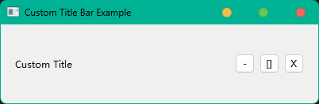

## 设置窗口和应用程序图标（QIcon）

### 普通标题栏（setWindowIcon()）

通过使用 `setWindowIcon()` ，你可以为你的 PySide6 应用程序添加一个个性化的图标，增强用户界面的专业性和识别度。用于设置窗口的图标。这个图标通常会显示在窗口的标题栏上，有时也会显示在任务栏或者当窗口最小化时的任务栏按钮上。

> 注意事项：
>
> > - 图标文件格式：通常支持 PNG、BMP、ICO 等格式。确保图标文件存在于指定的路径，并且应用程序有权限读取该文件。
> >
> > - 图标尺寸：根据不同的平台和显示需求，可能需要提供不同尺寸的图标。例如，Windows 系统可能需要 16x16、32x32、48x48 等尺寸的图标。
> >
> > - 图标主题：如果你的应用程序需要支持多种主题，你可能需要提供不同主题的图标文件。
> >
> > - 调用时机：通常在创建窗口对象后、显示窗口之前调用 setWindowIcon() 方法。

继续编辑 创建窗口 混合在一起 中使用的示例程序，为 QMainWindow 、QWidget 和 QDialog 添加图标

> ```python
> from PySide6.QtGui import QIcon
> 
> self.setWindowIcon(QIcon('.\\assets\\appicon.ico'))
> ```

```python
from PySide6.QtWidgets import (QApplication, QMainWindow, QWidget, QDialog,
                               QMenuBar, QToolBar, QVBoxLayout,
                               QTextEdit, QPushButton, QLabel)
from PySide6.QtGui import QAction, QIcon
from PySide6.QtCore import Qt

# 主窗口类
class MainWindow(QMainWindow):
    def __init__(self):
        super().__init__()
        self.setWindowTitle('QMainWindow Example')
        self.setWindowIcon(QIcon('.\\assets\\appicon.ico'))  # 设置图标
        self.resize(400, 100)

        # 设置菜单栏
        menu_bar = QMenuBar() 
        this_menu = menu_bar.addMenu("这是菜单")
        exit_action = QAction("退出", self)
        exit_action.triggered.connect(self.close)
        this_menu.addAction(exit_action)
        self.setMenuBar(menu_bar)

        # 设置工具栏
        tool_bar = QToolBar("主工具栏")
        tool_bar_action = QAction("这是工具栏里的按钮", self)
        tool_bar.addAction(tool_bar_action)
        self.addToolBar(tool_bar)

        # 设置状态栏，5秒后消失
        self.statusBar().showMessage("这是状态栏，它会在5秒后消失", 5000)

        # 创建一个文本框
        text_box = QTextEdit()
        text_box.setPlainText('这是文本框中的内容')

        # 创建按钮，用于显示子窗口
        show_dialog_button = QPushButton('Show Dialog')
        show_independent_widget_button = QPushButton('Show Independent QWidget')
        show_nonindependent_widget_button = QPushButton('Show Non-Independent QWidget')
        show_dialog_button.clicked.connect(self.show_dialog)
        show_independent_widget_button.clicked.connect(self.show_independent_widget)
        show_nonindependent_widget_button.clicked.connect(self.show_nonindependent_widget)

        # 创建一个垂直布局
        layout = QVBoxLayout()
        layout.addWidget(text_box)
        layout.addWidget(show_dialog_button)
        layout.addWidget(show_independent_widget_button)
        layout.addWidget(show_nonindependent_widget_button)

        # 设置中心小部件
        central_widget = QWidget()
        central_widget.setLayout(layout)
        self.setCentralWidget(central_widget)

    def show_dialog(self):
        self.dialog = DialogWindow(self)
        self.dialog.exec()

    def show_independent_widget(self):
        self.independentsubwindow = IndependentSubWindow()
        self.independentsubwindow.show()

    def show_nonindependent_widget(self):
        self.nonindependentsubwindow = NonIndependentSubWindow()
        self.nonindependentsubwindow.show()

    def closeEvent(self, event):
        # 在主窗口关闭时，首先关闭非独立的子窗口
        if hasattr(self, 'nonindependentsubwindow') and self.nonindependentsubwindow:
            # 这里使用hasattr函数来检查child_window属性是否存在，
            # 这是因为子窗口可能在没有被打开的情况下，
            # 主窗口就被关闭了（例如，用户直接点击窗口的关闭按钮）。
            # 如果直接尝试访问不存在的属性，会导致错误。通过使用hasattr，
            # 我们可以安全地检查属性是否存在。
            self.nonindependentsubwindow.close()
        # 继续关闭主窗口
        super().closeEvent(event)

# 对话框类
class DialogWindow(QDialog):
    def __init__(self, parent=None):
        super().__init__(parent)
        self.setWindowTitle('QDialog Example')
        self.setWindowIcon(QIcon('.\\assets\\appicon.ico'))  # 设置图标
        self.resize(400, 100)
        # 设置对话框的模态级别
        self.setWindowModality(Qt.ApplicationModal)

        # 创建一个标签
        dialog_label = QLabel('这是一个模态对话框里的标签，在关闭这个窗口之前，你无法操作其他窗口')

        # 创建一个按钮，用于关闭对话框
        close_button = QPushButton('Close Dialog')
        close_button.clicked.connect(self.close)
        
        # 创建一个垂直布局
        layout = QVBoxLayout()
        layout.addWidget(dialog_label)
        layout.addWidget(close_button)
        self.setLayout(layout)

# 独立的QWidget子窗口类
class IndependentSubWindow(QWidget):
    def __init__(self):
        super().__init__()
        self.setWindowTitle('Independent QWidget Sub Window')
        self.setWindowIcon(QIcon('.\\assets\\appicon.ico'))  # 设置图标
        self.resize(400, 100)
        # 创建一个标签
        widget_label = QLabel('你可以继续操作主窗口')

        # 创建一个按钮，用于关闭子窗口
        close_button = QPushButton('Close Sub Window')
        close_button.clicked.connect(self.close)

        # 创建一个垂直布局
        layout = QVBoxLayout()
        layout.addWidget(widget_label)
        layout.addWidget(close_button)
        self.setLayout(layout)

class NonIndependentSubWindow(QWidget):
    def __init__(self):
        super().__init__()
        self.setWindowTitle('Non-independent QWidget Sub Window')
        self.setWindowIcon(QIcon('.\\assets\\appicon.ico'))  # 设置图标
        self.resize(400, 100)
        # 创建一个标签
        widget_label = QLabel('你可以继续操作主窗口')

        # 创建一个按钮，用于关闭子窗口
        close_button = QPushButton('Close Sub Window')
        close_button.clicked.connect(self.close)

        # 创建一个垂直布局
        layout = QVBoxLayout()
        layout.addWidget(widget_label)
        layout.addWidget(close_button)
        self.setLayout(layout)
# 应用程序入口点
if __name__ == '__main__':
    app = QApplication([])
    main_window = MainWindow()
    main_window.show()
    app.exec()
```

> 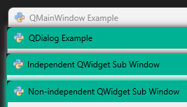

### 自定义标题栏（setPixmap()）

在本章 最小化、最大化、退出 小结，我们创建了一个自定义标题栏，如果想要在这个自定义标题栏中添加一个图标，可以在CustomTitleBar类中添加一个QLabel来显示图标，然后将这个QLabel加入到布局中。

> ```python
> from PySide6.QtGui import QIcon
> 
> icon_label.setPixmap(QIcon('.\\assets\\appicon.ico').pixmap(16, 16))
> ```

```python
from PySide6.QtWidgets import (QApplication, QMainWindow, QWidget,
                               QVBoxLayout, QHBoxLayout,
                               QPushButton, QLabel,
                               QSpacerItem, QSizePolicy)
from PySide6.QtGui import QIcon
from PySide6.QtCore import Qt
class CustomTitleBar(QWidget):
    def __init__(self, parent=None):
        super().__init__(parent)
        icon_label = QLabel()
        icon_label.setPixmap(QIcon('.\\assets\\appicon.ico').pixmap(16, 16))  # 设置图标
        customtitle = QLabel("Custom Title")
        self.minimize_button = QPushButton("-")
        self.minimize_button.setMaximumSize(25, 25)
        self.maximize_button = QPushButton("[]")
        self.maximize_button.setMaximumSize(25, 25)
        self.close_button = QPushButton("X")
        self.close_button.setMaximumSize(25, 25)
        # 创建水平布局
        layout = QHBoxLayout()
        layout.addWidget(icon_label, 0, Qt.AlignCenter | Qt.AlignLeft)
        layout.addWidget(customtitle, 0, Qt.AlignCenter | Qt.AlignLeft)
        layout.addSpacerItem(QSpacerItem(80, 0, QSizePolicy.Expanding, QSizePolicy.Minimum))  #  添加间隔
        layout.addWidget(self.minimize_button, 0, Qt.AlignCenter | Qt.AlignRight)
        layout.addWidget(self.maximize_button, 0, Qt.AlignCenter | Qt.AlignRight)
        layout.addWidget(self.close_button, 0, Qt.AlignCenter | Qt.AlignRight)
        self.setLayout(layout)

class MainWindow(QMainWindow):
    def __init__(self):
        super().__init__()
        self.setWindowTitle("Custom Title Bar Example")
        self.resize(400, 100)
        # 创建自定义标题栏实例
        custom_title_bar = CustomTitleBar(self)
        # 连接按钮信号/槽
        custom_title_bar.minimize_button.clicked.connect(self.showMinimized)
        custom_title_bar.maximize_button.clicked.connect(self.toggle_maximize_window)
        custom_title_bar.close_button.clicked.connect(self.close)
        # 创建垂直布局
        layout = QVBoxLayout()
        layout.addWidget(custom_title_bar)
        # 创建中央小部件
        central_widget = QWidget()
        central_widget.setLayout(layout)
        self.setCentralWidget(central_widget)

    # 最大化窗口的槽函数
    def toggle_maximize_window(self):
        if self.windowState() & Qt.WindowMaximized:
            self.showNormal()
        else:
            self.showMaximized()

if __name__ == "__main__":
    app = QApplication([])
    main_window = MainWindow()
    main_window.show()
    app.exec()
```

> 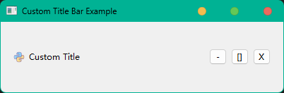

### 也可以通过Qt Designer 为 自定义标题栏 添加 自定义图标

#### 添加图标资源

> 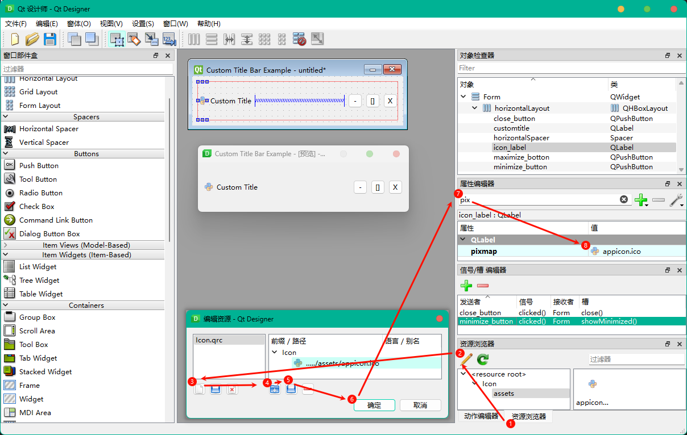


#### 调用 .ui

通过配置好的 `PYQT Integration` 插件（参考 第一章 配置 PYQT Integration 插件） 直接将 `.\代码\3.PySide6核心API的使用\设置窗口和应用程序图标\CustomTitleBarAndIcon_In_QtDesigner.ui` 文件转换成 `.\代码\3.PySide6核心API的使用\设置窗口和应用程序图标\Ui_CustomTitleBarAndIcon_In_QtDesigner.py` 文件

编写 `Run_CustomTitleBarAndIcon_In_QtDesigner.py` 调用 `Ui_CustomTitleBarAndIcon_In_QtDesigner.py`

编写 最大化窗口的槽函数，并连接 `self.ui.maximize_botton.clicked` 信号

```python
from Ui_CustomTitleBarAndIcon_In_QtDesigner import Ui_Form
from PySide6.QtWidgets import QApplication, QWidget
from PySide6.QtCore import Qt

class CustomDialog(QWidget):
    def __init__(self):
        super().__init__()
        self.ui = Ui_Form()
        self.ui.setupUi(self)
        self.ui.maximize_botton.clicked.connect(self.toggle_maximize_window)
    # 最大化窗口的槽函数
    def toggle_maximize_window(self):
        if self.windowState() & Qt.WindowMaximized:
            self.showNormal()
        else:
            self.showMaximized()

if __name__ == '__main__':
    app = QApplication([])
    mainWindow = CustomDialog()
    mainWindow.show()
    app.exec()
```

可见，Qt Designer 极大的简化了界面设计工作。

## 优化 小键盘（pywin32）

### 界面优化

还记得我们在 **第二章 栅格布局（Grid Layout）**  建立的 **数字键盘窗口 ** 吗？复制 `MainWinGridLayout.ui` 到 `.\代码\\3.PySide6核心API的使用\优化小键盘` `Numpad.ui`  。现在我们利用所学知识，再次对它进行优化。

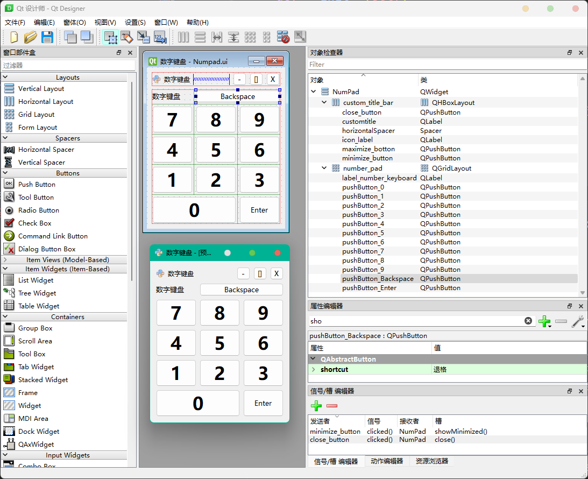

```python
from Ui_Numpad import Ui_NumPad
from PySide6.QtWidgets import (QApplication, QWidget,
                               QSystemTrayIcon, QMenu)
from PySide6.QtCore import Qt
from PySide6.QtGui import QMouseEvent, QIcon, QAction

class CustomDialog(QWidget):
    def __init__(self):
        super().__init__()
        # 设置窗口标志
        self.setWindowFlags(
            self.windowFlags()
            | Qt.FramelessWindowHint  # 隐藏标题栏
            | Qt.Tool  # 隐藏Windows任务栏上的图标
            | Qt.WindowStaysOnTopHint  # 置顶
        )
        self.margin = 10  # 确定鼠标位置是否在边缘或角落
        self.mouse_pressed = False  # 鼠标按下标志
        self.draggable = False  # 窗口可拖动标志

        self.ui = Ui_NumPad()
        self.ui.setupUi(self)
        self.ui.maximize_botton.clicked.connect(self.toggle_maximize_window)

        # 添加托盘图标
        tray_icon = QSystemTrayIcon(QIcon('.\\assets\\appicon.ico'), parent=self)
        tray_icon.activated.connect(self.handleTrayIconActivation)
        # 为托盘图标添加菜单
        menu = QMenu()
        quit_action = QAction('退出', self)
        quit_action.triggered.connect(lambda: app.quit())
        menu.addAction(quit_action)
        tray_icon.setContextMenu(menu)
        tray_icon.show()


    # 最大化窗口的槽函数
    def toggle_maximize_window(self):
        if self.windowState() & Qt.WindowMaximized:
            self.showNormal()
        else:
            self.showMaximized()


    # 单击托盘图标打开主窗口
    def handleTrayIconActivation(self, reason):
        if reason == QSystemTrayIcon.Trigger:
            self.showNormal()


    # 重写鼠标按下事件，处理窗口拖动和边缘调整
    def mousePressEvent(self, event: QMouseEvent):
        if event.button() == Qt.LeftButton:
                    self.mouse_pressed = True  # 设置鼠标按下标志
                    self.offset = event.globalPosition() - self.frameGeometry().topLeft()
                    self.edge = self.get_resize_edge(event.position())  # 获取调整边缘
                    if self.edge is not None:
                        self.setCursor(self.get_resize_cursor(self.edge))  # 设置鼠标光标形状
                    else:
                        self.draggable = True  # 设置窗口可拖动标志
                        self.offset = event.position().toPoint()  # 更新偏移量

    # 重写鼠标移动事件，处理窗口拖动或调整窗口大小
    def mouseMoveEvent(self, event: QMouseEvent):
        if self.draggable:
            self.move(event.globalPosition().toPoint() - self.offset)    # 移动窗口
        if self.mouse_pressed and self.edge is not None:
            self.resize_window(event)    # 调整窗口大小

    # 重写鼠标释放事件，处理拖动结束
    def mouseReleaseEvent(self, event: QMouseEvent):
        if event.button() == Qt.LeftButton:
            self.draggable = False  # 清除窗口可拖动标志
            self.mouse_pressed = False  # 清除鼠标按下标志
            self.edge = None  # 清除调整边缘
            self.setCursor(Qt.ArrowCursor)  # 恢复鼠标光标形状

    # 获取鼠标位置对应的调整边缘
    def get_resize_edge(self, pos):
        width = self.frameGeometry().width()
        height = self.frameGeometry().height()

        if pos.x() < self.margin and pos.y() < self.margin:
            return 'top_left'
        elif pos.x() > width - self.margin and pos.y() < self.margin:
            return 'top_right'
        elif pos.x() < self.margin and pos.y() > height - self.margin:
            return 'bottom_left'
        elif pos.x() > width - self.margin and pos.y() > height - self.margin:
            return 'bottom_right'
        elif pos.x() < self.margin:
            return 'left'
        elif pos.x() > width - self.margin:
            return 'right'
        elif pos.y() < self.margin:
            return 'top'
        elif pos.y() > height - self.margin:
            return 'bottom'
        else:
            return None

    # 设置适当的鼠标光标
    def get_resize_cursor(self, edge):
        if edge in ('top', 'bottom'):
            return Qt.SizeVerCursor
        elif edge in ('left', 'right'):
            return Qt.SizeHorCursor
        elif edge in ('top_left', 'bottom_right'):
            return Qt.SizeFDiagCursor
        elif edge in ('top_right', 'bottom_left'):
            return Qt.SizeBDiagCursor
        else:
            return Qt.ArrowCursor

    def resize_window(self, event):
        if self.edge is not None:
            global_pos = event.globalPosition()  # 全局鼠标位置
            local_pos = event.position()  # 局部（窗口内）鼠标位置
            x, y, w, h = self.x(), self.y(), self.width(), self.height()  # 当前窗口的位置和尺寸

            # 根据不同的边缘调整窗口的尺寸
            if self.edge in ('top', 'top_left', 'top_right'):
                delta_y = local_pos.y() - self.offset.y()
                y += delta_y
                h -= delta_y
            if self.edge in ('bottom', 'bottom_left', 'bottom_right'):
                h = global_pos.y() - y
            if self.edge in ('left', 'top_left', 'bottom_left'):
                delta_x = local_pos.x() - self.offset.x()
                x += delta_x
                w -= delta_x
            if self.edge in ('right', 'top_right', 'bottom_right'):
                w = global_pos.x() - x
            # 设置窗口的新位置和尺寸
            self.setGeometry(x, y, w, h)


if __name__ == '__main__':
    app = QApplication([])
    mainWindow = CustomDialog()
    mainWindow.show()
    app.exec()
```

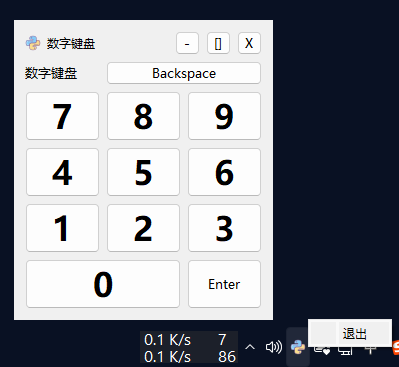

### 实现输入功能

在点击PySide6应用程序中的按钮时保持系统级焦点在另一个应用程序（如记事本notepad.exe），这实际上是一个相当复杂的请求，因为它涉及到跨应用程序的焦点管理和可能的窗口管理。

通常，操作系统允许用户通过点击窗口或使用键盘快捷键（如Alt+Tab）来切换活动窗口和焦点。因此，从一个应用程序内部控制另一个应用程序的焦点是非常受限的，并且通常不被操作系统支持。

但是，我们可以在鼠标进入窗口时记录之前活动窗口的句柄，然后在按钮点击事件中将焦点返回到之前记录的窗口。这在Windows操作系统中可以通过使用`pywin32`库来实现。

```powershell
pip install pywin32
```

> ```python
> import keyboard  # 模拟按键输入
> import win32gui  # 记录焦点之前所在窗口，在按下按钮后先切换回焦点之前所在窗口
> ...
>     # 重启鼠标进入事件，记录焦点之前所在窗口
>     def enterEvent(self, event):
>         super().enterEvent(event)
>         self.prev_window = win32gui.GetForegroundWindow()  # 记录活动窗口的句柄
> ...
>     def input_number_func(self, number):
>         win32gui.SetForegroundWindow(self.prev_window)  # 切换回焦点之前所在窗口
>         keyboard.send(number)  # 模拟按键输入
> ...
> ```

```python
from Ui_Numpad import Ui_NumPad
from PySide6.QtWidgets import (QApplication, QWidget,
                               QSystemTrayIcon, QMenu)
from PySide6.QtCore import Qt
from PySide6.QtGui import QMouseEvent, QIcon, QAction

import keyboard  # 模拟按键输入
import win32gui  # 记录焦点之前所在窗口，在按下按钮后先切换回焦点之前所在窗口


class Numpad(QWidget):
    def __init__(self):
        super().__init__()
        # 设置窗口标志
        self.setWindowFlags(
            self.windowFlags()
            | Qt.FramelessWindowHint  # 隐藏标题栏
            | Qt.Tool  # 隐藏Windows任务栏上的图标
            | Qt.WindowStaysOnTopHint  # 置顶
            | Qt.WindowDoesNotAcceptFocus
        )

        self.margin = 10  # 确定鼠标位置是否在边缘或角落
        self.mouse_pressed = False  # 鼠标按下标志
        self.draggable = False  # 窗口可拖动标志

        self.ui = Ui_NumPad()
        self.ui.setupUi(self)
        self.ui.maximize_botton.clicked.connect(self.toggle_maximize_window)
        self.setup_signals()

        # 添加托盘图标
        tray_icon = QSystemTrayIcon(QIcon('.\\assets\\appicon.ico'), parent=self)
        tray_icon.activated.connect(self.handleTrayIconActivation)
        # 为托盘图标添加菜单
        menu = QMenu()
        quit_action = QAction('退出', self)
        quit_action.triggered.connect(lambda: app.quit())
        menu.addAction(quit_action)
        tray_icon.setContextMenu(menu)
        tray_icon.show()

    def setup_signals(self):
        self.ui.pushButton_1.clicked.connect(lambda: self.input_number_func('1'))
        self.ui.pushButton_2.clicked.connect(lambda: self.input_number_func('2'))
        self.ui.pushButton_3.clicked.connect(lambda: self.input_number_func('3'))
        self.ui.pushButton_4.clicked.connect(lambda: self.input_number_func('4'))
        self.ui.pushButton_5.clicked.connect(lambda: self.input_number_func('5'))
        self.ui.pushButton_6.clicked.connect(lambda: self.input_number_func('6'))
        self.ui.pushButton_7.clicked.connect(lambda: self.input_number_func('7'))
        self.ui.pushButton_8.clicked.connect(lambda: self.input_number_func('8'))
        self.ui.pushButton_9.clicked.connect(lambda: self.input_number_func('9'))
        self.ui.pushButton_0.clicked.connect(lambda: self.input_number_func('0'))
        self.ui.pushButton_Backspace.clicked.connect(lambda: self.input_number_func('backspace'))
        self.ui.pushButton_Enter.clicked.connect(lambda: self.input_number_func('enter'))
    
    
    def input_number_func(self, number):
        print("Button clicked, inputting text:", number)
        self.ui.label_number_keyboard.setText(number)
        # 恢复之前的焦点窗口
        print("Previous window:", self.prev_window)
        win32gui.SetForegroundWindow(self.prev_window)
        keyboard.send(number)


    # 最大化窗口的槽函数
    def toggle_maximize_window(self):
        if self.windowState() & Qt.WindowMaximized:
            self.showNormal()
        else:
            self.showMaximized()


    # 单击托盘图标打开主窗口
    def handleTrayIconActivation(self, reason):
        if reason == QSystemTrayIcon.Trigger:
            self.showNormal()

    # 重启鼠标进入事件，记录焦点之前所在窗口
    def enterEvent(self, event):
        super().enterEvent(event)
        # 记录活动窗口的句柄
        self.prev_window = win32gui.GetForegroundWindow()


    # 重写鼠标按下事件，处理窗口拖动和边缘调整
    def mousePressEvent(self, event: QMouseEvent):
        if event.button() == Qt.LeftButton:
                    self.mouse_pressed = True  # 设置鼠标按下标志
                    self.offset = event.globalPosition() - self.frameGeometry().topLeft()
                    self.edge = self.get_resize_edge(event.position())  # 获取调整边缘
                    if self.edge is not None:
                        self.setCursor(self.get_resize_cursor(self.edge))  # 设置鼠标光标形状
                    else:
                        self.draggable = True  # 设置窗口可拖动标志
                        self.offset = event.position().toPoint()  # 更新偏移量

    # 重写鼠标移动事件，处理窗口拖动或调整窗口大小
    def mouseMoveEvent(self, event: QMouseEvent):
        if self.draggable:
            self.move(event.globalPosition().toPoint() - self.offset)    # 移动窗口
        if self.mouse_pressed and self.edge is not None:
            self.resize_window(event)    # 调整窗口大小

    # 重写鼠标释放事件，处理拖动结束
    def mouseReleaseEvent(self, event: QMouseEvent):
        if event.button() == Qt.LeftButton:
            self.draggable = False  # 清除窗口可拖动标志
            self.mouse_pressed = False  # 清除鼠标按下标志
            self.edge = None  # 清除调整边缘
            self.setCursor(Qt.ArrowCursor)  # 恢复鼠标光标形状

    # 获取鼠标位置对应的调整边缘
    def get_resize_edge(self, pos):
        width = self.frameGeometry().width()
        height = self.frameGeometry().height()

        if pos.x() < self.margin and pos.y() < self.margin:
            return 'top_left'
        elif pos.x() > width - self.margin and pos.y() < self.margin:
            return 'top_right'
        elif pos.x() < self.margin and pos.y() > height - self.margin:
            return 'bottom_left'
        elif pos.x() > width - self.margin and pos.y() > height - self.margin:
            return 'bottom_right'
        elif pos.x() < self.margin:
            return 'left'
        elif pos.x() > width - self.margin:
            return 'right'
        elif pos.y() < self.margin:
            return 'top'
        elif pos.y() > height - self.margin:
            return 'bottom'
        else:
            return None

    # 设置适当的鼠标光标
    def get_resize_cursor(self, edge):
        if edge in ('top', 'bottom'):
            return Qt.SizeVerCursor
        elif edge in ('left', 'right'):
            return Qt.SizeHorCursor
        elif edge in ('top_left', 'bottom_right'):
            return Qt.SizeFDiagCursor
        elif edge in ('top_right', 'bottom_left'):
            return Qt.SizeBDiagCursor
        else:
            return Qt.ArrowCursor

    def resize_window(self, event):
        if self.edge is not None:
            global_pos = event.globalPosition()  # 全局鼠标位置
            local_pos = event.position()  # 局部（窗口内）鼠标位置
            x, y, w, h = self.x(), self.y(), self.width(), self.height()  # 当前窗口的位置和尺寸

            # 根据不同的边缘调整窗口的尺寸
            if self.edge in ('top', 'top_left', 'top_right'):
                delta_y = local_pos.y() - self.offset.y()
                y += delta_y
                h -= delta_y
            if self.edge in ('bottom', 'bottom_left', 'bottom_right'):
                h = global_pos.y() - y
            if self.edge in ('left', 'top_left', 'bottom_left'):
                delta_x = local_pos.x() - self.offset.x()
                x += delta_x
                w -= delta_x
            if self.edge in ('right', 'top_right', 'bottom_right'):
                w = global_pos.x() - x
            # 设置窗口的新位置和尺寸
            self.setGeometry(x, y, w, h)


if __name__ == '__main__':
    app = QApplication([])
    mainWindow = Numpad()
    mainWindow.show()
    app.exec()
```

> 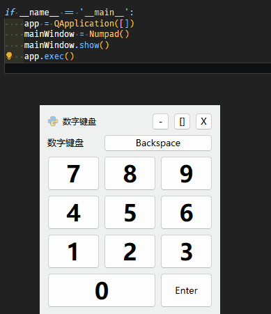

## 计算器（eval()）

### 设计界面

对数字键盘做简单修改，就可以得到一个简易的计算器。

> 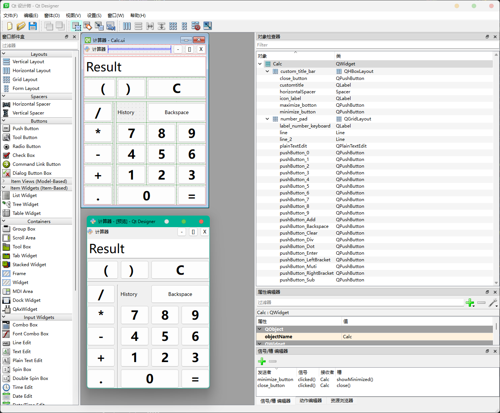

### 实现计算功能

使用`eval()`进行计算

> ```python
> calc_result = str(eval(self.text))
> ```

```python
from Ui_Calc import Ui_Calc
from PySide6.QtWidgets import (QApplication, QWidget,
                               QSystemTrayIcon, QMenu)
from PySide6.QtCore import Qt
from PySide6.QtGui import QMouseEvent, QIcon, QAction

class Calc(QWidget):
    def __init__(self):
        super().__init__()
        # 设置窗口标志
        self.setWindowFlags(
            self.windowFlags()
            | Qt.FramelessWindowHint  # 隐藏标题栏
            | Qt.Tool  # 隐藏Windows任务栏上的图标
            | Qt.WindowStaysOnTopHint  # 置顶
        )
        self.margin = 10  # 确定鼠标位置是否在边缘或角落
        self.mouse_pressed = False  # 鼠标按下标志
        self.draggable = False  # 窗口可拖动标志
        self.text = ""
        self.ui = Ui_Calc()
        self.ui.setupUi(self)
        self.ui.maximize_botton.clicked.connect(self.toggle_maximize_window)
        self.setup_signals()

        # 添加托盘图标
        tray_icon = QSystemTrayIcon(QIcon('.\\assets\\appicon.ico'), parent=self)
        tray_icon.activated.connect(self.handleTrayIconActivation)
        # 为托盘图标添加菜单
        menu = QMenu()
        quit_action = QAction('退出', self)
        quit_action.triggered.connect(lambda: app.quit())
        menu.addAction(quit_action)
        tray_icon.setContextMenu(menu)
        tray_icon.show()

    def setup_signals(self):
        self.ui.pushButton_1.clicked.connect(lambda: self.calc_func('1'))
        self.ui.pushButton_2.clicked.connect(lambda: self.calc_func('2'))
        self.ui.pushButton_3.clicked.connect(lambda: self.calc_func('3'))
        self.ui.pushButton_4.clicked.connect(lambda: self.calc_func('4'))
        self.ui.pushButton_5.clicked.connect(lambda: self.calc_func('5'))
        self.ui.pushButton_6.clicked.connect(lambda: self.calc_func('6'))
        self.ui.pushButton_7.clicked.connect(lambda: self.calc_func('7'))
        self.ui.pushButton_8.clicked.connect(lambda: self.calc_func('8'))
        self.ui.pushButton_9.clicked.connect(lambda: self.calc_func('9'))
        self.ui.pushButton_0.clicked.connect(lambda: self.calc_func('0'))
        self.ui.pushButton_Backspace.clicked.connect(lambda: self.calc_func('backspace'))
        self.ui.pushButton_Clear.clicked.connect(lambda: self.calc_func('clear'))
        self.ui.pushButton_Enter.clicked.connect(lambda: self.calc_func('enter'))
        self.ui.pushButton_Dot.clicked.connect(lambda: self.calc_func('.'))
        self.ui.pushButton_Add.clicked.connect(lambda: self.calc_func('+'))
        self.ui.pushButton_Sub.clicked.connect(lambda: self.calc_func('-'))
        self.ui.pushButton_Muti.clicked.connect(lambda: self.calc_func('*'))
        self.ui.pushButton_Div.clicked.connect(lambda: self.calc_func('/'))
        self.ui.pushButton_LeftBracket.clicked.connect(lambda: self.calc_func('('))
        self.ui.pushButton_RightBracket.clicked.connect(lambda: self.calc_func(')'))

    def calc_func(self, number):
        print("Button clicked, setting text to:", number)
        if number == 'backspace':
            self.text = self.text[:-1]
        elif number == 'enter':
            try:
                calc_result = str(eval(self.text))
            except Exception as e:
                calc_result = "Error"
            self.text = f"{self.text} = {calc_result}"
            self.ui.label_number_keyboard.setText(calc_result)
        elif number == 'clear':
            self.text = ''
        else:
            self.text += str(number)
        self.ui.plainTextEdit.setPlainText(self.text)
    
    # 最大化窗口的槽函数
    def toggle_maximize_window(self):
        if self.windowState() & Qt.WindowMaximized:
            self.showNormal()
        else:
            self.showMaximized()


    # 单击托盘图标打开主窗口
    def handleTrayIconActivation(self, reason):
        if reason == QSystemTrayIcon.Trigger:
            self.showNormal()


    # 重写鼠标按下事件，处理窗口拖动和边缘调整
    def mousePressEvent(self, event: QMouseEvent):
        if event.button() == Qt.LeftButton:
                    self.mouse_pressed = True  # 设置鼠标按下标志
                    self.offset = event.globalPosition() - self.frameGeometry().topLeft()
                    self.edge = self.get_resize_edge(event.position())  # 获取调整边缘
                    if self.edge is not None:
                        self.setCursor(self.get_resize_cursor(self.edge))  # 设置鼠标光标形状
                    else:
                        self.draggable = True  # 设置窗口可拖动标志
                        self.offset = event.position().toPoint()  # 更新偏移量

    # 重写鼠标移动事件，处理窗口拖动或调整窗口大小
    def mouseMoveEvent(self, event: QMouseEvent):
        if self.draggable:
            self.move(event.globalPosition().toPoint() - self.offset)    # 移动窗口
        if self.mouse_pressed and self.edge is not None:
            self.resize_window(event)    # 调整窗口大小

    # 重写鼠标释放事件，处理拖动结束
    def mouseReleaseEvent(self, event: QMouseEvent):
        if event.button() == Qt.LeftButton:
            self.draggable = False  # 清除窗口可拖动标志
            self.mouse_pressed = False  # 清除鼠标按下标志
            self.edge = None  # 清除调整边缘
            self.setCursor(Qt.ArrowCursor)  # 恢复鼠标光标形状

    # 获取鼠标位置对应的调整边缘
    def get_resize_edge(self, pos):
        width = self.frameGeometry().width()
        height = self.frameGeometry().height()

        if pos.x() < self.margin and pos.y() < self.margin:
            return 'top_left'
        elif pos.x() > width - self.margin and pos.y() < self.margin:
            return 'top_right'
        elif pos.x() < self.margin and pos.y() > height - self.margin:
            return 'bottom_left'
        elif pos.x() > width - self.margin and pos.y() > height - self.margin:
            return 'bottom_right'
        elif pos.x() < self.margin:
            return 'left'
        elif pos.x() > width - self.margin:
            return 'right'
        elif pos.y() < self.margin:
            return 'top'
        elif pos.y() > height - self.margin:
            return 'bottom'
        else:
            return None

    # 设置适当的鼠标光标
    def get_resize_cursor(self, edge):
        if edge in ('top', 'bottom'):
            return Qt.SizeVerCursor
        elif edge in ('left', 'right'):
            return Qt.SizeHorCursor
        elif edge in ('top_left', 'bottom_right'):
            return Qt.SizeFDiagCursor
        elif edge in ('top_right', 'bottom_left'):
            return Qt.SizeBDiagCursor
        else:
            return Qt.ArrowCursor

    def resize_window(self, event):
        if self.edge is not None:
            global_pos = event.globalPosition()  # 全局鼠标位置
            local_pos = event.position()  # 局部（窗口内）鼠标位置
            x, y, w, h = self.x(), self.y(), self.width(), self.height()  # 当前窗口的位置和尺寸

            # 根据不同的边缘调整窗口的尺寸
            if self.edge in ('top', 'top_left', 'top_right'):
                delta_y = local_pos.y() - self.offset.y()
                y += delta_y
                h -= delta_y
            if self.edge in ('bottom', 'bottom_left', 'bottom_right'):
                h = global_pos.y() - y
            if self.edge in ('left', 'top_left', 'bottom_left'):
                delta_x = local_pos.x() - self.offset.x()
                x += delta_x
                w -= delta_x
            if self.edge in ('right', 'top_right', 'bottom_right'):
                w = global_pos.x() - x
            # 设置窗口的新位置和尺寸
            self.setGeometry(x, y, w, h)


if __name__ == '__main__':
    app = QApplication([])
    mainWindow = Calc()
    mainWindow.show()
    app.exec()
```

> 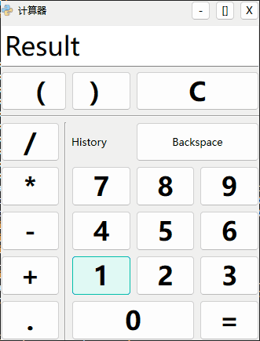

## 设置托盘图标（QSystemTrayIcon）

使用 QSystemTrayIcon 类来在系统托盘中添加一个图标。这个图标可以用来显示应用程序的状态，或者提供一些快捷的功能，比如显示菜单、显示消息等。

### 以下是一个简单的例子，展示了如何在 PySide6 应用程序中设置一个系统托盘图标。

```python
from PySide6.QtWidgets import (QApplication, QMainWindow,
                               QSystemTrayIcon, QMenu)
from PySide6.QtGui import QIcon, QAction

class MainWindow(QMainWindow):
    def __init__(self):
        super().__init__()
        # 添加托盘图标
        tray_icon = QSystemTrayIcon(QIcon('.\\assets\\appicon.ico'), parent=self)
        tray_icon.activated.connect(self.handleTrayIconActivation)
        # 为托盘图标添加菜单
        menu = QMenu()
        quit_action = QAction('退出', self)
        quit_action.triggered.connect(lambda: app.quit())
        menu.addAction(quit_action)
        tray_icon.setContextMenu(menu)

        tray_icon.show()

    # 单击托盘图标打开主窗口
    def handleTrayIconActivation(self, reason):
        if reason == QSystemTrayIcon.Trigger:
            self.showNormal()

    # 忽略主窗口关闭事件，仅隐藏主窗口
    def closeEvent(self, event):
        self.hide()
        event.ignore()

if __name__ == '__main__':
    app = QApplication([])
    main_window = MainWindow()
    main_window.show()
    app.exec()
```

运行效果如图：

> 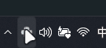

### 以下是一个简单的例子，展示了如何在 PySide6 应用程序中显示消息。

```python
from PySide6.QtWidgets import (QApplication, QMainWindow, 
                               QSystemTrayIcon, QMessageBox, QPushButton, QVBoxLayout, QWidget)
from PySide6.QtGui import QIcon

class MainWindow(QMainWindow):
    def __init__(self):
        super().__init__()
        self.init_tray_icon()
        self.init_buttons()
    
    def init_tray_icon(self):
        # 添加托盘图标
        self.tray_icon = QSystemTrayIcon(QIcon('.\\assets\\appicon.ico'), parent=self)
        self.tray_icon.messageClicked.connect(self.message_clicked)
        self.tray_icon.show()

    def init_buttons(self):
        # 创建按钮并设置其点击信号连接到槽函数
        self.info_button = QPushButton("显示信息消息")
        self.info_button.clicked.connect(self.show_info_message)
        
        self.warning_button = QPushButton("显示警告消息")
        self.warning_button.clicked.connect(self.show_warning_message)
        
        self.critical_button = QPushButton("显示严重错误消息")
        self.critical_button.clicked.connect(self.show_critical_message)
        
        self.custom_button = QPushButton("显示自定义图标消息")
        self.custom_button.clicked.connect(self.show_custom_message)
        
        # 垂直布局管理器
        layout = QVBoxLayout()
        
        # 添加按钮到布局
        layout.addWidget(self.info_button)
        layout.addWidget(self.warning_button)
        layout.addWidget(self.critical_button)
        layout.addWidget(self.custom_button)
        
        # 创建一个中心小部件并设置布局
        central_widget = QWidget()
        central_widget.setLayout(layout)
        
        # 设置中心小部件
        self.setCentralWidget(central_widget)

    def show_info_message(self):
        self.tray_icon.showMessage("信息", "这是一个信息内容", QSystemTrayIcon.MessageIcon.Information, 5000)

    def show_warning_message(self):
        self.tray_icon.showMessage("警告", "这是一个警告内容", QSystemTrayIcon.MessageIcon.Warning, 5000)

    def show_critical_message(self):
        self.tray_icon.showMessage("严重错误", "这是一个严重错误内容", QSystemTrayIcon.MessageIcon.Critical, 5000)

    def show_custom_message(self):
        self.tray_icon.showMessage("自定义图标", "这是一个自定义图标内容", QIcon('.\\assets\\appicon.ico'), 5000)

    def message_clicked(self):
        QMessageBox.information(
            self,
            "标题",
            "内容",
        )

if __name__ == '__main__':
    app = QApplication([])
    main_window = MainWindow()
    main_window.show()
    app.exec()
```


> 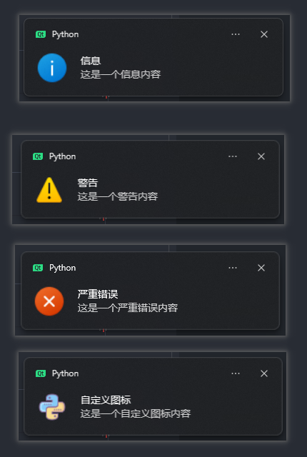
>


## 部件添加提示消息（setToolTip()）

添加提示消息，这样当用户将鼠标悬停在部件上时，会显示一条帮助性的文本。这个功能可以通过 `setToolTip()` 属性来实现。

以下是一个为按钮添加提示消息的示例。

```python
from PySide6.QtWidgets import QApplication, QPushButton, QWidget, QVBoxLayout
# 创建一个应用程序实例
app = QApplication([])
# 创建一个窗口
window = QWidget()
window.setWindowTitle('Set Tool Tip Example')
window.resize(300, 100)
# 创建一个垂直布局
layout = QVBoxLayout()
# 创建一个按钮，并设置其文本和提示消息
button = QPushButton('button')
button.setToolTip('This is a button tool tip!')
# 将按钮添加到布局中
layout.addWidget(button)
# 设置窗口的布局
window.setLayout(layout)
# 显示窗口
window.show()
# 运行应用程序的主循环
app.exec()
```

运行效果如图：

> 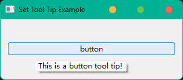

## 定时器（QTimer）

QTimer 是 Qt 框架中的一个核心类，用于在 PyQt6 或 PySide6 中实现定时器功能。QTimer 允许你以一定的时间间隔（毫秒为单位）发出信号，这个信号可以被用来触发各种操作，比如更新 GUI、处理数据、或者执行任何需要在一定时间后重复进行的任务。

### 限制重新发送验证码间隔时间

下面是使用QTimer限制重新发送验证码间隔时间的示例。

```python
from Ui_Registration import Ui_Registration as Ui
from PySide6.QtWidgets import QApplication, QWidget
from PySide6.QtCore import QTimer

class Registration(QWidget):
    def __init__(self):
        super().__init__()
        self.ui = Ui()
        self.ui.setupUi(self)

        self.count = 5  # 假设倒计时为5秒
        self.timer = QTimer(self)
        self.timer.timeout.connect(self.update_countdown)
        self.ui.pushButton_send_verify_code_in_registration.clicked.connect(self.send_verify_code)

    def send_verify_code(self):
        self.count = 5  # 重置倒计时
        self.ui.pushButton_send_verify_code_in_registration.setEnabled(False)
        # 如果定时器已经在运行，先停止它
        if self.timer.isActive():
            self.timer.stop()
        # 启动定时器
        self.timer.start(1000)

    def update_countdown(self):
        self.count -= 1
        self.ui.pushButton_send_verify_code_in_registration.setText(f"重新发送 ( {self.count}s )")
        if self.count <= 0:
            self.timer.stop()
            self.ui.pushButton_send_verify_code_in_registration.setEnabled(True)
            self.ui.pushButton_send_verify_code_in_registration.setText("发送验证码")

if __name__ == '__main__':
    app = QApplication([])
    window = Registration()
    window.show()
    app.exec()
```

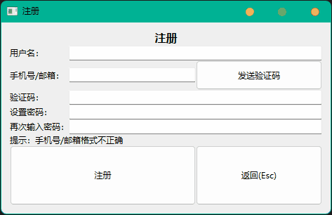

### 倒计时 时钟

```python
import sys
from PySide6.QtWidgets import QApplication, QWidget, QLabel, QVBoxLayout
from PySide6.QtCore import QTimer, QDateTime, Qt

class CountDownClock(QWidget):
    def __init__(self, end_date):
        super().__init__()
        self.end_date = end_date
        self.initUI()

    def initUI(self):
        # 设置窗口标题
        self.setWindowTitle('倒计时时钟')
        # 创建一个标签用于显示日期和时间
        self.label_current_time = QLabel('当前时间： YYYY年-MM月-DD日 hh:mm:ss')
        self.label_current_time.setAlignment(Qt.AlignCenter)
        self.label_current_time.setFont(self.font())
        # 创建一个标签用于显示倒计时
        self.label_remain_time = QLabel('剩余时间：DD 天 HH 时 MM 分 SS 秒')
        self.label_remain_time.setAlignment(Qt.AlignCenter)
        self.label_remain_time.setFont(self.font())
        # 设置窗口布局
        layout = QVBoxLayout()
        layout.addWidget(self.label_current_time)
        layout.addWidget(self.label_remain_time)
        self.setLayout(layout)
        # 创建一个 QTimer 对象
        self.timer = QTimer()
        self.timer.setInterval(1000)
        # 连接计时器的信号/槽
        self.timer.timeout.connect(self.updateTime)
        self.timer.timeout.connect(self.updateCountDown)
        # 启动计时器
        self.timer.start()

    def updateTime(self):
        # 获取当前时间
        current_time = QDateTime.currentDateTime()
        # 格式化时间为字符串，包括日期和时间
        time_str = current_time.toString('当前时间：yyyy年-MM月-dd日 hh:mm:ss')
        # 更新标签显示的日期和时间
        self.label_current_time.setText(time_str)

    def updateCountDown(self):
        # 获取当前时间
        current_time = QDateTime.currentDateTime()
        # 计算剩余时间
        remaining_time = self.end_date.toMSecsSinceEpoch() - current_time.toMSecsSinceEpoch()
        # 如果剩余时间小于等于0，停止计时器
        if remaining_time <= 0:
            self.timer.stop()
            self.label_remain_time.setText("已过期")
            return
        # 将毫秒转换为秒
        remaining_time /= 1000
        # 计算年月日时分秒
        days = remaining_time // (24 * 60 * 60)
        remaining_time %= (24 * 60 * 60)
        hours = remaining_time // (60 * 60)
        remaining_time %= (60 * 60)
        minutes = remaining_time // 60
        seconds = remaining_time % 60
        # 更新标签显示的倒计时
        self.label_remain_time.setText(f"剩余时间：{int(days)} 天 {int(hours):02} 时 {int(minutes):02} 分 {int(seconds):02} 秒")

if __name__ == '__main__':
    app = QApplication(sys.argv)
    # 假设到期时间为未来的某个日期
    end_date = QDateTime.fromString("2024-03-16T07:00:00", Qt.ISODate)
    clock = CountDownClock(end_date)
    clock.show()
    sys.exit(app.exec())
```

> 

## 优化 登录窗口

还记得我们在 **第二章**  建立的 **登录窗口** 吗？复制  `Run_MainWinLogin.py` 和 `MainWinLogin.ui` 到 `.\代码\3.PySide6核心API的使用\优化登录窗口\`  。现在我们利用所学知识，再次对它进行优化。

> 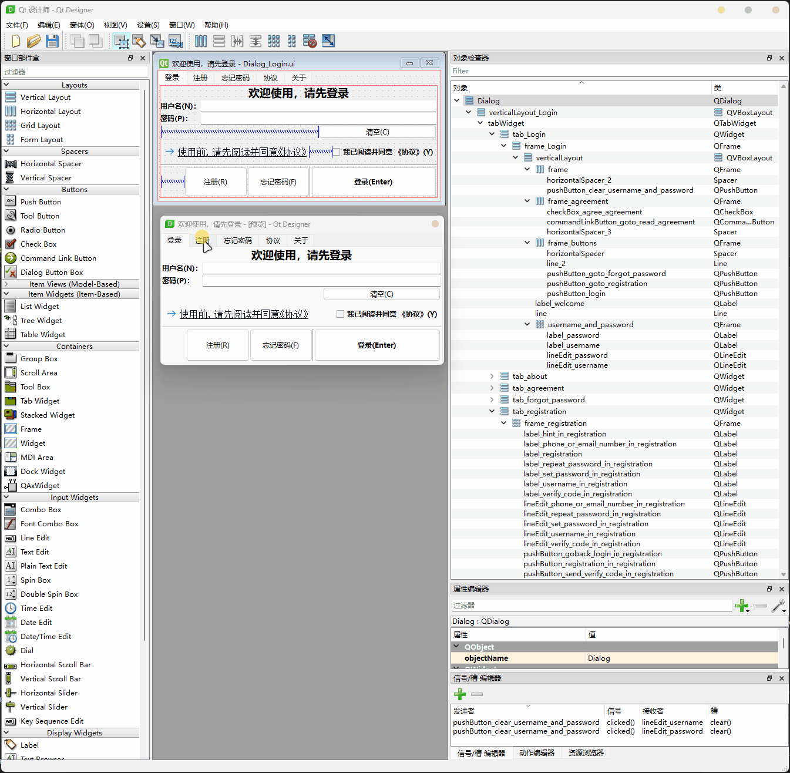

```python
from PySide6.QtWidgets import ( QApplication, QMainWindow, QDialog,
                                QSystemTrayIcon, QMenu, QMessageBox)
from PySide6.QtGui import QIcon, QAction, QGuiApplication, QMouseEvent
from PySide6.QtCore import Qt, QRect, Signal
from Ui_Dialog_Login import Ui_Dialog
from Ui_MainWindow import Ui_MainWindow

app = QApplication([])

def set_window_icon(window):
    window.setWindowIcon(QIcon('.\\assets\\appicon.ico'))

def move_window_to_screen_center(window):
    screen = QGuiApplication.primaryScreen().availableGeometry()
    size = window.geometry()
    window.move((screen.width() - size.width()) / 2, (screen.height() - size.height()) / 2)

def show_messagebox(icon, title, message):
    box = QMessageBox()
    box.setIcon(icon)
    box.setWindowTitle(title)
    box.setText(message)
    box.addButton(QMessageBox.Ok)
    box.setWindowFlags(box.windowFlags() | Qt.WindowStaysOnTopHint)
    box.exec()

class CustomMainWindow(QMainWindow):
    def __init__(self):
        super().__init__()
        self.ui = Ui_MainWindow()
        self.ui.setupUi(self)
        set_window_icon(self)
        move_window_to_screen_center(self)
        self.setup_tray_icon()

    def update_login_info(self, username, password):
        self.setWindowTitle(f"主窗口，用户（ {username} ）已登录")
        self.statusBar().showMessage(f"用户（ {username} ）已登录", 5000)

    def setup_tray_icon(self):
        tray_icon = QSystemTrayIcon(QIcon('.\\assets\\appicon.ico'), parent=self)
        tray_icon.activated.connect(self.show_window)
        menu = QMenu()
        quit_action = QAction('退出', self)
        quit_action.triggered.connect(app.quit)
        menu.addAction(quit_action)
        tray_icon.setContextMenu(menu)
        tray_icon.show()

    def show_window(self, reason):
        if reason == QSystemTrayIcon.Trigger:
            self.showNormal()

    def closeEvent(self, event):
            event.ignore()
            self.hide()

class CustomLoginDialog(QDialog):
    upadteMainWindowLoginInfoSignal = Signal(str, str)  # 自定义信号
    def __init__(self, parent=None):
        super().__init__()
        # 设置窗口标志
        self.setWindowFlags(
            self.windowFlags()
            | Qt.FramelessWindowHint  # 隐藏标题栏
            | Qt.Tool  # 隐藏Windows任务栏上的图标
            | Qt.WindowStaysOnTopHint  # 置顶
        )
        
        self.margin = 10  # 确定鼠标位置是否在边缘或角落
        self.mouse_pressed = False  # 鼠标按下标志
        self.draggable = False  # 窗口可拖动标志
        
        self.ui = Ui_Dialog()
        self.ui.setupUi(self)
        self.ui.tabWidget.tabBar().setVisible(False)  # 隐藏标签栏表头
        self.parent = parent
        set_window_icon(self)
        move_window_to_screen_center(self)
        self.setup_signals()

    def setup_signals(self):
        self.ui.pushButton_goback_login_in_registration.clicked.connect(self.goto_login_tab)
        self.ui.pushButton_goback_login_in_forgot_password.clicked.connect(self.goto_login_tab)
        self.ui.pushButton_goback_login_in_agreement_details.clicked.connect(self.goto_login_tab)
        self.ui.pushButton_goback_login_in_about.clicked.connect(self.goto_login_tab)
        self.ui.pushButton_goto_registration.clicked.connect(self.goto_registration_tab)
        self.ui.pushButton_goto_forgot_password.clicked.connect(self.goto_forgot_password_tab)
        self.ui.commandLinkButton_goto_read_agreement.clicked.connect(self.goto_agreement_details_tab)
        self.ui.checkBox_agree_agreement.stateChanged.connect(self.toggle_login_button)
        self.ui.pushButton_login.clicked.connect(self.process_login)
        self.ui.pushButton_login.setEnabled(False)

        # 注册和忘记密码功能，未完成
        self.ui.pushButton_send_verify_code_in_registration.setDisabled(True)
        self.ui.pushButton_registration_in_registration.setDisabled(True)
        self.ui.pushButton_send_verify_code_in_forgot_password.setDisabled(True)
        self.ui.pushButton_save_new_password_in_forgot_password.setDisabled(True)

        self.upadteMainWindowLoginInfoSignal.connect(self.parent.update_login_info)

    def goto_login_tab(self):
        self.ui.tabWidget.setCurrentIndex(0)

    def goto_registration_tab(self):
        self.ui.tabWidget.setCurrentIndex(1)

    def goto_forgot_password_tab(self):
        self.ui.tabWidget.setCurrentIndex(2)

    def goto_agreement_details_tab(self):
        self.ui.tabWidget.setCurrentIndex(3)

    def toggle_login_button(self, state):
        self.ui.pushButton_login.setEnabled(state == 2)

    def process_login(self):
        username = self.ui.lineEdit_username.text()
        password = self.ui.lineEdit_password.text()
        if username == "1" and password == "1":
            # self.parent.setWindowTitle(f"主窗口，用户（ {username} ）已登录")
            # self.parent.statusBar().showMessage(f"用户（ {username} ）已登录", 5000)
            self.upadteMainWindowLoginInfoSignal.emit(username, password)
            self.accept()
        else:
            show_messagebox(QMessageBox.Critical, "登录失败", "用户名或密码错误！")


    def keyPressEvent(self, event):
        # 忽略 Esc键 关闭窗口
        if event.key() == Qt.Key_Escape:
            event.ignore()
    
    # 重写鼠标按下事件，处理窗口拖动和边缘调整
    def mousePressEvent(self, event: QMouseEvent):
        if event.button() == Qt.LeftButton:
            self.mouse_pressed = True
            self.offset = event.globalPosition() - self.frameGeometry().topLeft()
            self.edge = self.get_resize_edge(event.position())
            if self.edge is not None:
                self.setCursor(self.get_resize_cursor(self.edge))
            else:
                self.draggable = True
                self.offset = event.position().toPoint()

    # 重写鼠标移动事件，处理窗口拖动或调整窗口大小
    def mouseMoveEvent(self, event: QMouseEvent):
        if self.draggable:
            self.move(event.globalPosition().toPoint() - self.offset)
        if self.mouse_pressed and self.edge is not None:
            self.resize_window(event)

    # 重写鼠标释放事件，处理拖动结束
    def mouseReleaseEvent(self, event: QMouseEvent):
        if event.button() == Qt.LeftButton:
            self.draggable = False
            self.mouse_pressed = False
            self.edge = None
            self.setCursor(Qt.ArrowCursor)

    # 获取鼠标位置对应的调整边缘
    def get_resize_edge(self, pos):
        width = self.frameGeometry().width()
        height = self.frameGeometry().height()

        if pos.x() < self.margin and pos.y() < self.margin:
            return 'top_left'
        elif pos.x() > width - self.margin and pos.y() < self.margin:
            return 'top_right'
        elif pos.x() < self.margin and pos.y() > height - self.margin:
            return 'bottom_left'
        elif pos.x() > width - self.margin and pos.y() > height - self.margin:
            return 'bottom_right'
        elif pos.x() < self.margin:
            return 'left'
        elif pos.x() > width - self.margin:
            return 'right'
        elif pos.y() < self.margin:
            return 'top'
        elif pos.y() > height - self.margin:
            return 'bottom'
        else:
            return None

    # 设置适当的鼠标光标
    def get_resize_cursor(self, edge):
        if edge in ('top', 'bottom'):
            return Qt.SizeVerCursor
        elif edge in ('left', 'right'):
            return Qt.SizeHorCursor
        elif edge in ('top_left', 'bottom_right'):
            return Qt.SizeFDiagCursor
        elif edge in ('top_right', 'bottom_left'):
            return Qt.SizeBDiagCursor
        else:
            return Qt.ArrowCursor

    def resize_window(self, event):
        if self.edge is not None:
            global_pos = event.globalPosition()  # 全局鼠标位置
            local_pos = event.position()  # 局部（窗口内）鼠标位置
            x, y, w, h = self.x(), self.y(), self.width(), self.height()  # 当前窗口的位置和尺寸
            # 根据不同的边缘调整窗口的尺寸
            if self.edge in ('top', 'top_left', 'top_right'):
                delta_y = local_pos.y() - self.offset.y()
                y += delta_y
                h -= delta_y
            if self.edge in ('bottom', 'bottom_left', 'bottom_right'):
                h = global_pos.y() - y
            if self.edge in ('left', 'top_left', 'bottom_left'):
                delta_x = local_pos.x() - self.offset.x()
                x += delta_x
                w -= delta_x
            if self.edge in ('right', 'top_right', 'bottom_right'):
                w = global_pos.x() - x
            # 设置窗口的新位置和尺寸
            self.setGeometry(x, y, w, h)


def show_login_dialog(main_window):
    dialog = CustomLoginDialog(main_window)
    dialog.exec()

def show_main_window():
    main_window = CustomMainWindow()
    main_window.show()
    show_login_dialog(main_window)
    app.exec()

if __name__ == '__main__':
    show_main_window()
    app.quit()
```

> 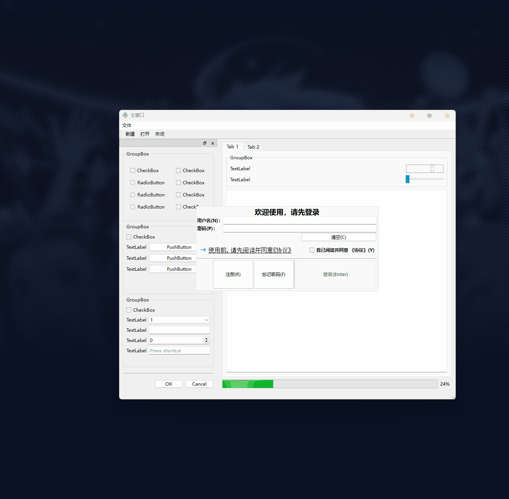
