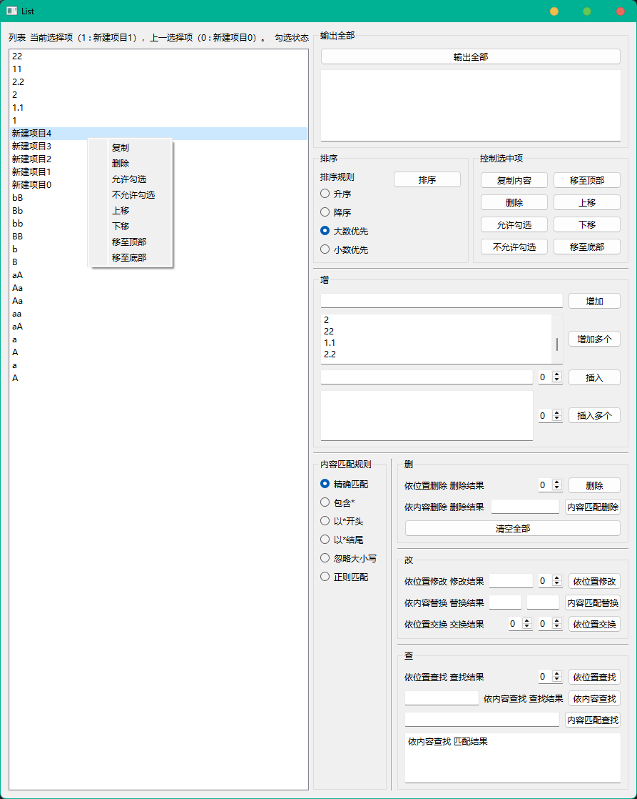

# PySide6 中常用部件 API 的使用

## 新建、打开、保存（QFileDialog）

### 示例代码

```python
from PySide6.QtWidgets import (QApplication, QMainWindow, QWidget,
                               QVBoxLayout, QPushButton, QFileDialog)

class MainWindow(QMainWindow):
    def __init__(self):
        super().__init__()
        self.setWindowTitle("文件对话框示例")
        
        # 创建按钮并连接到相应的槽函数
        new_file_button = QPushButton("新建文件", self)
        new_file_button.clicked.connect(self.new_file)
        
        open_file_button = QPushButton("打开文件", self)
        open_file_button.clicked.connect(self.open_file)
        
        save_file_button = QPushButton("保存文件", self)
        save_file_button.clicked.connect(self.save_file)
        
        # 创建一个垂直布局
        layout = QVBoxLayout()
        layout.addWidget(new_file_button)
        layout.addWidget(open_file_button)
        layout.addWidget(save_file_button)

        # 设置中心小部件
        central_widget = QWidget()
        central_widget.setLayout(layout)
        self.setCentralWidget(central_widget)

    def new_file(self):
        # 设置默认目录（可选）
        # self.file_name, _ = QFileDialog.getOpenFileName(self, "打开文件", "", "所有文件 (*);;文本文件 (*.txt)", options=options)
        options = QFileDialog.Options()
        self.file_name, _ = QFileDialog.getSaveFileName(self, "新建文件", "", "Text Files (*.txt);;All Files (*)", options=options)
        if self.file_name:
            print("新建文件:", self.file_name)
            with open(self.file_name, "w") as file:
                pass # 新建文件，不需要往文件中写入任何内容

    def open_file(self):
        options = QFileDialog.Options()
        # 设置默认目录（可选）
        # self.file_name, _ = QFileDialog.getOpenFileName(self, "打开文件", "", "所有文件 (*);;文本文件 (*.txt)", options=options)
        self.file_name, _ = QFileDialog.getOpenFileName(self, "打开文件", "", "所有文件 (*);;文本文件 (*.txt)")
        if self.file_name:
            print("打开文件：", self.file_name)
            with open(self.file_name, "r") as file:
                content = file.read()
            print("文件内容：", content)

    def save_file(self):
        options = QFileDialog.Options()
        # 设置默认文件名或目录（可选）
        # self.file_name, _ = QFileDialog.getSaveFileName(self, "保存文件", "", "所有文件 (*);;文本文件 (*.txt)", options=options)
        self.file_name, _ = QFileDialog.getSaveFileName(self, "保存文件", "", "所有文件 (*);;文本文件 (*.txt)")
        if self.file_name:
            print("保存文件：", self.file_name)
            with open(self.file_name, "w") as file:
                file.write("要保存的内容")

if __name__ == "__main__":
    app = QApplication([])
    window = MainWindow()
    window.show()
    app.exec()
```

### Base64编解码器


```python
from Ui_base64 import Ui_MainWindow_base64_encode_decode
from PySide6.QtWidgets import (QApplication, QMainWindow, QFileDialog)
import base64
import os

class MainWindow(QMainWindow):
    def __init__(self):
        super().__init__()
        self.ui = Ui_MainWindow_base64_encode_decode()
        self.ui.setupUi(self)

        self.file_name = None
        self.content = None
        self.setup_signals()

    def setup_signals(self):
        self.ui.pushButton_encode.clicked.connect(self.encode_file)
        self.ui.pushButton_decode.clicked.connect(self.decode_file)
        self.ui.action_new.triggered.connect(self.new_file)
        self.ui.action_open.triggered.connect(self.open_file)
        self.ui.action_save.triggered.connect(self.save_file)
        self.ui.action_save_as.triggered.connect(self.save_file_as)
        self.ui.action_close.triggered.connect(self.close_file)

    def encode_file(self):
        if self.ui.plainTextEdit.toPlainText():
            self.content = self.ui.plainTextEdit.toPlainText()
            try:
                content_encode = str(base64.b64encode(self.content.encode("utf-8")))[2:-1]
                self.ui.plainTextEdit_result.setPlainText(content_encode)
                print(f"{self.content} 编码结果：{content_encode}")
            except Exception as e:
                self.ui.plainTextEdit_result.setPlainText(str(e))
                print(f"编码失败：{e}")

    def decode_file(self):
        if self.ui.plainTextEdit.toPlainText():
            self.content = self.ui.plainTextEdit.toPlainText()
            try:
                content_decode = str(base64.b64decode(self.content).decode("utf-8"))
                self.ui.plainTextEdit_result.setPlainText(content_decode)
                print(f"{self.content} 解码结果：{content_decode}")
            except Exception as e:
                self.ui.plainTextEdit_result.setPlainText(str(e))
                print(f"解码失败：{e}")

    def new_file(self):
        # 设置默认目录（可选）
        # self.file_name, _ = QFileDialog.getOpenFileName(self, "打开文件", "", "所有文件 (*);;文本文件 (*.txt)", options=options)
        options = QFileDialog.Options()
        self.file_name, _ = QFileDialog.getSaveFileName(self, "新建文件", "", "Text Files (*.txt);;All Files (*)", options=options)
        if self.file_name:
            self.ui.tabWidget.setTabText(0, os.path.basename(self.file_name))
            print("新建文件:", self.file_name)
            with open(self.file_name, "w", encoding="utf-8") as file:
                pass # 新建文件，不需要往文件中写入任何内容

    def open_file(self):
        options = QFileDialog.Options()
        # 设置默认目录（可选）
        # self.file_name, _ = QFileDialog.getOpenFileName(self, "打开文件", "", "所有文件 (*);;文本文件 (*.txt)", options=options)
        self.file_name, _ = QFileDialog.getOpenFileName(self, "打开文件", "", "所有文件 (*);;文本文件 (*.txt)")
        if self.file_name:
            self.ui.tabWidget.setTabText(0, os.path.basename(self.file_name))
            print("打开文件：", self.file_name)
            with open(self.file_name, "r", encoding="utf-8") as file:
                self.content = file.read()
                self.ui.plainTextEdit.setPlainText(self.content)
            print("文件内容：", self.content)

    def save_file(self):
        if self.file_name:
            result_file_name = self.file_name+"__result.txt"
            print("保存文件：", result_file_name)
            with open(result_file_name, "w", encoding="utf-8") as file:
                file.write(self.ui.plainTextEdit_result.toPlainText())
        else:
            self.save_file_as()

    def save_file_as(self):
        options = QFileDialog.Options()
        # 设置默认文件名或目录（可选）
        # self.file_name, _ = QFileDialog.getSaveFileName(self, "保存文件", "", "所有文件 (*);;文本文件 (*.txt)", options=options)
        self.file_name, _ = QFileDialog.getSaveFileName(self, "另存为", "", "所有文件 (*);;文本文件 (*.txt)")
        if self.file_name:
            print("另存为：", self.file_name)
            with open(self.file_name, "w", encoding="utf-8") as file:
                file.write(self.ui.plainTextEdit_result.toPlainText())

    def close_file(self):
        self.file_name = None
        self.content = None
        self.ui.plainTextEdit.clear()
        self.ui.plainTextEdit_result.clear()
        self.ui.tabWidget.setTabText(0, os.path.basename("文件名"))

if __name__ == "__main__":
    app = QApplication([])
    window = MainWindow()
    window.show()
    app.exec()
```


### 文件夹

```python
from PySide6.QtWidgets import (QApplication, QMainWindow, QWidget,
                               QVBoxLayout, QPushButton, QFileDialog)
import os

class MainWindow(QMainWindow):
    def __init__(self):
        super().__init__()

        self.initUI()

    def initUI(self):
        self.setWindowTitle("文件夹对话框示例")
        create_folder_button = QPushButton("新建文件夹", self)
        create_folder_button.clicked.connect(self.create_folder)
        open_folder_button = QPushButton("打开文件夹", self)
        open_folder_button.clicked.connect(self.open_folder)

        # 创建一个垂直布局
        layout = QVBoxLayout()
        layout.addWidget(create_folder_button)
        layout.addWidget(open_folder_button)

        # 设置中心小部件
        central_widget = QWidget()
        central_widget.setLayout(layout)
        self.setCentralWidget(central_widget)

    def create_folder(self):
        folder_path, _ = QFileDialog.getSaveFileName(self, "新建文件夹")
        if folder_path:
            # Handle folder creation logic here
            os.makedirs(folder_path, exist_ok=True)
            print("新建文件夹:", folder_path)

    def open_folder(self):
        folder_path = QFileDialog.getExistingDirectory(self, "打开文件夹")
        if folder_path:
            # Handle folder opening logic here
            os.startfile(folder_path)
            print("打开文件夹:", folder_path)

if __name__ == "__main__":
    app = QApplication([])
    mainWindow = MainWindow()
    mainWindow.show()
    app.exec()
```

## 列表（QListWidget）

QListWidget 是 Qt 框架中提供的一个高级列表控件，它继承自 QListView，并提供了一套方便的 API 来管理列表项。下面详细介绍 QListWidget 中的增加、删除、修改和查询操作。

### 增加（Add）

要在 QListWidget 中添加新项，可以使用以下方法：

1. addItem(QString) - 添加一个带有文本的新项。
2. addItem(QListWidgetItem *) - 添加一个已经创建的 QListWidgetItem 对象。
3. insertItem(int, QString) - 在指定的索引位置插入一个带有文本的新项。
4. insertItem(int, QListWidgetItem *) - 在指定的索引位置插入一个已经创建的 QListWidgetItem 对象。
5. insertItems(int, QStringList) - 在指定的索引位置插入一个字符串列表中的所有项。

### 删除（Delete）

要从 QListWidget 中删除项，可以使用以下方法：

1. takeItem(int) - 删除指定索引位置的项，并返回该项的 QListWidgetItem 对象。
2. removeItemWidget(QListWidgetItem *) - 删除指定的 QListWidgetItem 对象，但不从列表中移除该项。
3. clear() - 删除列表中的所有项。

### 修改（Modify）

要修改 QListWidget 中的项，可以使用以下方法：

1. setItemText(int, QString) - 设置指定索引位置的项的文本。
2. setItemIcon(int, QIcon) - 设置指定索引位置的项的图标。
3. setItemData(int, QVariant, int) - 设置指定索引位置的项的用户数据。

### 查询（Query）

要查询 QListWidget 中的项，可以使用以下方法：

1. item(int) - 获取指定索引位置的 QListWidgetItem 对象。
2. itemAt(QPoint) - 获取指定位置的 QListWidgetItem 对象。
3. itemFromIndex(QModelIndex) - 获取与指定模型索引对应的 QListWidgetItem 对象。
4. itemWidget(QListWidgetItem *) - 获取指定 QListWidgetItem 的自定义控件。
5. items() - 获取列表中的所有 QListWidgetItem 对象的列表。
6. count() - 获取列表中的项数。

### 其他

#### 设置勾选状态

1. setItemChecked(int, bool) - 设置指定索引位置的项的勾选状态。
2. setItemSelected(int, bool) - 设置指定索引位置的项的选择状态，这通常与勾选状态不同，但可以选择项时显示不同的视觉反馈。
3. setCheckState(int, Qt.CheckState) - 设置指定索引位置的项的勾选状态，可以是 Qt.Unchecked、Qt.PartiallyChecked 或 Qt.Checked。

#### 获取勾选状态

1. isItemChecked(int) - 检查指定索引位置的项是否被勾选。
2. isItemSelected(int) - 检查指定索引位置的项是否被选中。
3. itemCheckState(int) - 获取指定索引位置的项的勾选状态。

#### 获取当前项

1. currentItem() - 获取当前被选中的项。如果没有项被选中，则返回 None。
2. currentRow() - 获取当前被选中项的行号。如果没有项被选中，则返回 -1。
3. currentIndex() - 获取当前被选中项的模型索引。

#### 设置当前项

1. setCurrentItem(QListWidgetItem *) - 设置当前项。
2. setCurrentRow(int) - 通过行号设置当前项。
3. setCurrentIndex(QModelIndex) - 通过模型索引设置当前项。

#### 排序方法

1. sortItems(Qt.SortOrder order = Qt.AscendingOrder) - 根据项的文本使用指定的排序顺序进行排序。
2. Qt.AscendingOrder 表示升序，
3. Qt.DescendingOrder 表示降序。

### 示例代码

```python
from Ui_List import Ui_Form_List

from PySide6.QtWidgets import ( QApplication, QWidget,
                                QListWidgetItem)
from PySide6.QtGui import QAction, QDesktopServices
from PySide6.QtCore import Qt, QUrl
import re

class MyWindow(QWidget):
    def __init__(self):
        super().__init__()
        self.ui = Ui_Form_List()
        self.ui.setupUi(self)
        self.setup_context_menu()
        self.setup_signals()

    # 设置上下文菜单
    def setup_context_menu(self):
        # 给窗体添加上下文菜单
        self.about = QAction('了解更多')
        self.setContextMenuPolicy(Qt.ContextMenuPolicy.ActionsContextMenu)
        self.addAction(self.about)
        self.about.triggered.connect(lambda: QDesktopServices.openUrl(QUrl("https://github.com/H1DDENADM1N/pyside6-python3-tutorial")))
        # 给控件添加上下文菜单
        # 复制
        self.copy_current_item = QAction('复制')
        self.ui.listWidget_List.setContextMenuPolicy(Qt.ContextMenuPolicy.ActionsContextMenu)
        self.ui.listWidget_List.addAction(self.copy_current_item)
        self.copy_current_item.triggered.connect(lambda: QApplication.clipboard().setText(self.ui.listWidget_List.currentItem().text()))
        # 删除
        self.delete_current_row = QAction('删除')
        self.ui.listWidget_List.addAction(self.delete_current_row)
        self.delete_current_row.triggered.connect(lambda: self.ui.listWidget_List.takeItem(self.ui.listWidget_List.currentRow()))
        # 允许勾选
        self.checkable_current_row = QAction('允许勾选')
        self.ui.listWidget_List.addAction(self.checkable_current_row)
        self.checkable_current_row.triggered.connect(self.checkable_current_row_function)
        # 不允许勾选
        self.uncheckable_current_row = QAction('不允许勾选')
        self.ui.listWidget_List.addAction(self.uncheckable_current_row)
        self.uncheckable_current_row.triggered.connect(self.uncheckable_current_row_function)
        # 上移
        self.moveUp_current_row = QAction('上移')
        self.ui.listWidget_List.addAction(self.moveUp_current_row)
        self.moveUp_current_row.triggered.connect(self.moveUp_current_row_function)
        # 下移
        self.moveDown_current_row = QAction('下移')
        self.ui.listWidget_List.addAction(self.moveDown_current_row)
        self.moveDown_current_row.triggered.connect(self.moveDown_current_row_function)
        # 移至顶部
        self.moveToTop_current_row = QAction('移至顶部')
        self.ui.listWidget_List.addAction(self.moveToTop_current_row)
        self.moveToTop_current_row.triggered.connect(self.moveToTop_current_row_function)
        # 移至顶部
        self.moveToBottom_current_row = QAction('移至底部')
        self.ui.listWidget_List.addAction(self.moveToBottom_current_row)
        self.moveToBottom_current_row.triggered.connect(self.moveToBottom_current_row_function)

    # 连接信号/槽
    def setup_signals(self):
        # 排序
        self.ui.pushButton_sort.clicked.connect(self.sort_list)
        # 输出
        self.ui.pushButton_print_all.clicked.connect(self.print_all)
        # 控制选中项
        # 复制
        self.ui.pushButton_copy_current_item.clicked.connect(lambda: QApplication.clipboard().setText(self.ui.listWidget_List.currentItem().text()))
        # 删除
        self.ui.pushButton_delete_current_row.clicked.connect(lambda: self.ui.listWidget_List.takeItem(self.ui.listWidget_List.currentRow()))
        # 允许勾选
        self.ui.pushButton_checkable_current_row.clicked.connect(self.checkable_current_row_function)
        # 不允许勾选
        self.ui.pushButton_uncheckable_current_row.clicked.connect(self.uncheckable_current_row_function)
        # 上移
        self.ui.pushButton_moveUp.clicked.connect(self.moveUp_current_row_function)
        # 下移
        self.ui.pushButton_moveDown.clicked.connect(self.moveDown_current_row_function)
        # 移至顶部
        self.ui.pushButton_moveToTop.clicked.connect(self.moveToTop_current_row_function)
        # 移至底部
        self.ui.pushButton_moveToBottom.clicked.connect(self.moveToBottom_current_row_function)
        # 增
        self.ui.pushButton_add.clicked.connect(self.add_item)
        self.ui.pushButton_add_s.clicked.connect(self.add_item_s)
        self.ui.pushButton_insert.clicked.connect(self.insert_item)
        self.ui.pushButton_insert_s.clicked.connect(self.insert_item_s)
        # 删
        self.ui.pushButton_remove_by_position.clicked.connect(self.remove_by_position)
        self.ui.pushButton_remove_by_content.clicked.connect(self.remove_by_content)
        self.ui.pushButton_clear.clicked.connect(self.clear_list)
        # 改
        self.ui.pushButton_modify.clicked.connect(self.modify_item)
        self.ui.pushButton_replace.clicked.connect(self.replace_item)
        self.ui.pushButton_change_position.clicked.connect(self.change_position)
        # 查
        self.ui.pushButton_find_by_position.clicked.connect(self.find_by_position)
        self.ui.pushButton_find_by_content.clicked.connect(self.find_by_content)
        self.ui.pushButton_find_match.clicked.connect(self.find_match)
        # 当前项
        self.ui.listWidget_List.currentItemChanged.connect(self.current_item_changed)
        # 勾选状态
        self.ui.listWidget_List.itemChanged.connect(self.item_changed)


    # 排序
    def sort_list(self):
        if self.ui.radioButton_ascending_order.isChecked():  # 升序
            self.ui.listWidget_List.sortItems(Qt.SortOrder.AscendingOrder)
        elif self.ui.radioButton_descending_order.isChecked():  # 降序
            self.ui.listWidget_List.sortItems(Qt.SortOrder.DescendingOrder)
        elif self.ui.radioButton_max_order.isChecked():  # 大数优先
            self.customSortOrderMax()
        elif self.ui.radioButton_min_order.isChecked():  # 小数优先
            self.customSortOrderMin()

    # 大数优先
    def customSortOrderMax(self):
        # 初始化三个列表，分别用于整数、小数和字符串
        int_list = []
        float_list = []
        string_list = []
        # 遍历 QListWidget 中的所有项
        for i in range(self.ui.listWidget_List.count()):
            # 获取每一项
            item = self.ui.listWidget_List.item(i)
            if item is not None:
                # 尝试将项的文本转换为整数
                try:
                    number = int(item.text())
                    # 如果成功，添加到整数列表
                    int_list.append(number)
                except ValueError:
                    # 如果转换失败，尝试将项的文本转换为小数
                    try:
                        number = float(item.text())
                        # 如果成功，添加到小数列表
                        float_list.append(number)
                    except ValueError:
                        # 如果转换失败，添加到字符串列表
                        string_list.append(item.text())
        # 对整数列表进行从大到小排序
        sorted_int_list = sorted(int_list, reverse=True)
        # 对小数列表进行从大到小排序
        sorted_float_list = sorted(float_list, reverse=True)
        # 合并排序后的整数列表和小数列表
        merged_number_list = sorted_int_list + sorted_float_list
        # 对合并后的列表进行从大到小排序
        sorted_merged_number_list = sorted(merged_number_list, reverse=True)
        # 对字符串列表进行排序
        sorted_string_list = sorted(string_list, reverse=True, key=lambda s: s.lower())
        # 将字符串列表添加到合并后的数字列表末尾
        merged_list = sorted_merged_number_list + sorted_string_list
        # 清空 QListWidget
        self.ui.listWidget_List.clear()
        # 将合并后的列表转换为字符串，并添加到 QListWidget 中
        [self.ui.listWidget_List.addItem(str(item)) for item in merged_list]

    # 小数优先
    def customSortOrderMin(self):
        # 初始化三个列表，分别用于整数、小数和字符串
        int_list = []
        float_list = []
        string_list = []
        # 遍历 QListWidget 中的所有项
        for i in range(self.ui.listWidget_List.count()):
            # 获取每一项
            item = self.ui.listWidget_List.item(i)
            if item is not None:
                # 尝试将项的文本转换为整数
                try:
                    number = int(item.text())
                    # 如果成功，添加到整数列表
                    int_list.append(number)
                except ValueError:
                    # 如果转换失败，尝试将项的文本转换为小数
                    try:
                        number = float(item.text())
                        # 如果成功，添加到小数列表
                        float_list.append(number)
                    except ValueError:
                        # 如果转换失败，添加到字符串列表
                        string_list.append(item.text())
        # 对整数列表进行从小到大排序
        sorted_int_list = sorted(int_list, reverse=False)
        # 对小数列表进行从小到大排序
        sorted_float_list = sorted(float_list, reverse=False)
        # 合并排序后的整数列表和小数列表
        merged_number_list = sorted_int_list + sorted_float_list
        # 对合并后的列表进行从小到大排序
        sorted_merged_number_list = sorted(merged_number_list, reverse=False)
        # 对字符串列表进行排序
        sorted_string_list = sorted(string_list, reverse=False, key=lambda s: s.lower())
        # 将字符串列表添加到合并后的数字列表末尾
        merged_list = sorted_merged_number_list + sorted_string_list
        # 清空 QListWidget
        self.ui.listWidget_List.clear()
        # 将合并后的列表转换为字符串，并添加到 QListWidget 中
        [self.ui.listWidget_List.addItem(str(item)) for item in merged_list]

    # 输出全部
    def print_all(self):
        self.ui.plainTextEdit_print_all.clear()
        for i in range(self.ui.listWidget_List.count()):
            self.ui.plainTextEdit_print_all.appendPlainText(f"{i} : {self.ui.listWidget_List.item(i).text()}")

    '''
    -----------------------------------------------------------------------------------------------------------------------------------
    增
    -----------------------------------------------------------------------------------------------------------------------------------
    '''

    # 增加一个元素
    def add_item(self):
        text = self.ui.lineEdit_add.text()
        item = QListWidgetItem(text)
        self.ui.listWidget_List.addItem(item)  # 增加一个元素

    # 增加多个元素
    def add_item_s(self):
        text = self.ui.plainTextEdit_add_s.toPlainText()
        items = text.split('\n')  # 分割文本为多个元素
        self.ui.listWidget_List.addItems(items)  # 增加多个元素

    # 插入一个元素
    def insert_item(self):
        text = self.ui.lineEdit_insert.text()
        item = QListWidgetItem(text)
        position = self.ui.spinBox_insert_position.value()
        if position >= 0 and position < self.ui.listWidget_List.count():
            self.ui.listWidget_List.insertItem(position, item)  # 插入一个元素
        elif position >= self.ui.listWidget_List.count():
            self.ui.listWidget_List.addItem(item)  # 添加一个元素
        else:
            self.ui.lineEdit_insert.setText("插入范围错误")

    # 插入多个元素
    def insert_item_s(self):
        text = self.ui.plainTextEdit_insert_s.toPlainText()
        items = text.split('\n')  # 分割文本为多个元素
        position = self.ui.spinBox_insert_s_position.value()
        if position >= 0 and position < self.ui.listWidget_List.count():
            self.ui.listWidget_List.insertItems(position, items)  # 插入多个元素
        elif position >= self.ui.listWidget_List.count():
            self.ui.listWidget_List.addItems(items)  # 添加多个元素
        else:
            self.ui.lineEdit_insert.setText("插入范围错误")

    '''
    -----------------------------------------------------------------------------------------------------------------------------------
    删
    -----------------------------------------------------------------------------------------------------------------------------------
    '''

    # 依位置删除
    def remove_by_position(self):
        position = self.ui.spinBox_remove_by_position.value()
        if position >= 0 and position < self.ui.listWidget_List.count():
            self.ui.listWidget_List.takeItem(position)  # 删除一个元素
            self.ui.label_remove_by_position_result.setText(f"删除第{position}项成功")
        else:
            self.ui.label_remove_by_position_result.setText("删除范围错误")

    # 依内容删除
    def remove_by_content(self):
        text = self.ui.lineEdit_remove_by_content.text()
        # 收集所有要删除的项的索引
        if self.ui.radioButton_equal.isChecked():  # 精确匹配
            targets = [i for i in range(self.ui.listWidget_List.count()) if self.ui.listWidget_List.item(i).text() == text]
            removed_list =[]
            # 从后向前删除，避免迭代时索引变化
            for i in reversed(targets):
                self.ui.listWidget_List.takeItem(i)  # 删除所有内容为 text 的元素
                removed_list.append(i)
            self.ui.label_remove_by_content_result.setText(f"删除内容为{text}的项成功，删除项索引为{removed_list}")
        elif self.ui.radioButton_include.isChecked():  # 模糊匹配 包含*
            targets = [i for i in range(self.ui.listWidget_List.count()) if text in self.ui.listWidget_List.item(i).text()]
            removed_list =[]
            # 从后向前删除，避免迭代时索引变化
            for i in reversed(targets):
                self.ui.listWidget_List.takeItem(i)  # 删除所有内容包含 text 的元素
                removed_list.append(i)
            self.ui.label_remove_by_content_result.setText(f"删除内容包含{text}的项成功，删除项索引为{removed_list}")
        elif self.ui.radioButton_start_with.isChecked():  # 模糊匹配 以*开头
            targets = [i for i in range(self.ui.listWidget_List.count()) if self.ui.listWidget_List.item(i).text().startswith(text)]
            removed_list =[]
            # 从后向前删除，避免迭代时索引变化
            for i in reversed(targets):
                self.ui.listWidget_List.takeItem(i)  # 删除所有内容以 text 开头
                removed_list.append(i)
            self.ui.label_remove_by_content_result.setText(f"删除内容以{text}开头的项成功，删除项索引为{removed_list}")
        elif self.ui.radioButton_end_with.isChecked():  # 模糊匹配 以*结尾
            targets = [i for i in range(self.ui.listWidget_List.count()) if self.ui.listWidget_List.item(i).text().endswith(text)]
            removed_list =[]
            # 从后向前删除，避免迭代时索引变化
            for i in reversed(targets):
                self.ui.listWidget_List.takeItem(i)  # 删除所有内容以 text 结尾
                removed_list.append(i)
            self.ui.label_remove_by_content_result.setText(f"删除内容以{text}结尾的项成功，删除项索引为{removed_list}")
        elif self.ui.radioButton_ignore_capltals.isChecked():  # 模糊匹配 忽略大小写
            targets = [i for i in range(self.ui.listWidget_List.count()) if self.ui.listWidget_List.item(i).text().lower() == text.lower()]
            removed_list =[]
            # 从后向前删除，避免迭代时索引变化
            for i in reversed(targets):
                self.ui.listWidget_List.takeItem(i)  # 删除所有内容为 text 的元素 忽略大小写
                removed_list.append(i)
            self.ui.label_remove_by_content_result.setText(f"删除内容为{text}的元素的项（忽略大小写）成功，删除项索引为{removed_list}")
        elif self.ui.radioButton_regular_expression.isChecked():  # 正则匹配
            try:
                # 尝试编译正则表达式来检查语法
                re.compile(text)
                # 如果编译成功，设置删除规则
                targets = [i for i in range(self.ui.listWidget_List.count()) if re.match(text, self.ui.listWidget_List.item(i).text())]
                removed_list =[]
                # 从后向前删除，避免迭代时索引变化
                for i in reversed(targets):
                    self.ui.listWidget_List.takeItem(i)  # 删除所有内容匹配正则表达式的元素
                    removed_list.append(i)
                if removed_list:
                    self.ui.label_remove_by_content_result.setText(f"删除内容匹配正则表达式{text}的元素成功，删除项索引为{removed_list}")
                else:
                    self.ui.label_remove_by_content_result.setText(f"没有删除项，因为列表中没有内容匹配正则表达式{text}")
            except re.error as e:
                # 如果编译失败，显示错误信息
                self.ui.label_remove_by_content_result.setText(f"正则表达式{text}语法错误{e}")
                return

    # 清空列表全部内容
    def clear_list(self):
        self.ui.listWidget_List.clear()

    '''
    -----------------------------------------------------------------------------------------------------------------------------------
    改
    -----------------------------------------------------------------------------------------------------------------------------------
    '''

    # 依位置修改
    def modify_item(self):
        text = self.ui.lineEdit_modify.text()
        position = self.ui.spinBox_modify_position.value()
        self.ui.listWidget_List.item(position).setText(text)
        self.ui.label_modify_by_position_result.setText(f"修改第{position}个元素为{text}成功")

    # 依内容替换
    def replace_item(self):
        text_old = self.ui.lineEdit_replace_old_content.text()
        text_new = self.ui.lineEdit_replace_new_content.text()
        if self.ui.radioButton_equal.isChecked():  # 精确匹配
            targets = [i for i in range(self.ui.listWidget_List.count()) if self.ui.listWidget_List.item(i).text() == text_old]
            replaced_list = []
            for i in targets:
                self.ui.listWidget_List.item(i).setText(text_new)
                replaced_list.append(i)
            if replaced_list:
                self.ui.label_replace_by_content_result.setText(f"成功将列表中所有内容为{text_old}的元素替换为{text_new}，替换项索引为{replaced_list}")
            else:
                self.ui.label_replace_by_content_result.setText(f"列表中没有内容为{text_old}的元素")
        elif self.ui.radioButton_include.isChecked():  # 模糊匹配
            targets = [i for i in range(self.ui.listWidget_List.count()) if text_old in self.ui.listWidget_List.item(i).text()]
            replaced_list = []
            for i in targets:
                self.ui.listWidget_List.item(i).setText(self.ui.listWidget_List.item(i).text().replace(text_old, text_new))
                replaced_list.append(i)
            if replaced_list:
                self.ui.label_replace_by_content_result.setText(f"成功将列表中所有包含{text_old}的元素替换为{text_new}，替换项索引为{replaced_list}")
            else:
                self.ui.label_replace_by_content_result.setText(f"列表中没有包含{text_old}的元素")
        elif self.ui.radioButton_start_with.isChecked():  # 模糊匹配 以*开头
            targets = [i for i in range(self.ui.listWidget_List.count()) if self.ui.listWidget_List.item(i).text().startswith(text_old)]
            replaced_list = []
            for i in targets:
                self.ui.listWidget_List.item(i).setText(self.ui.listWidget_List.item(i).text().replace(text_old, text_new, 1))
                replaced_list.append(i)
            if replaced_list:
                self.ui.label_replace_by_content_result.setText(f"成功将列表中所有以{text_old}开头的元素替换为以{text_new}开头，替换项索引为{replaced_list}")
            else:
                self.ui.label_replace_by_content_result.setText(f"列表中没有以{text_old}开头的元素")
        elif self.ui.radioButton_end_with.isChecked():  # 模糊匹配 以*结尾
            targets = [i for i in range(self.ui.listWidget_List.count()) if self.ui.listWidget_List.item(i).text().endswith(text_old)]
            replaced_list = []
            pattern = re.escape(text_old) + '$'
            for i in targets:
                self.ui.listWidget_List.item(i).setText(re.sub(pattern, text_new, self.ui.listWidget_List.item(i).text()))
                replaced_list.append(i)
            if replaced_list:
                self.ui.label_replace_by_content_result.setText(f"成功将列表中所有以{text_old}结尾的元素替换为以{text_new}结尾，替换项索引为{replaced_list}")
            else:
                self.ui.label_replace_by_content_result.setText(f"列表中没有以{text_old}结尾的元素")
        elif self.ui.radioButton_ignore_capltals.isChecked():  # 模糊匹配 忽略大小写
            targets = [i for i in range(self.ui.listWidget_List.count()) if self.ui.listWidget_List.item(i).text().lower() == text_old.lower()]
            replaced_list = []
            pattern = re.compile(re.escape(text_old), re.IGNORECASE)
            for i in targets:
                self.ui.listWidget_List.item(i).setText(pattern.sub(text_new, self.ui.listWidget_List.item(i).text()))
                replaced_list.append(i)
            if replaced_list:
                self.ui.label_replace_by_content_result.setText(f"成功将列表中所有内容为{text_old}（忽略大小写）替换为{text_new}，替换项索引为{replaced_list}")
            else:
                self.ui.label_replace_by_content_result.setText(f"列表中没有内容为{text_old}（忽略大小写）的元素")
        elif self.ui.radioButton_regular_expression.isChecked():  # 正则表达式匹配
            try:
                # 尝试编译正则表达式来检查语法
                re.compile(text_old)
                # 如果编译成功，设置替换规则
                targets = [i for i in range(self.ui.listWidget_List.count()) if re.search(text_old, self.ui.listWidget_List.item(i).text())]
                replaced_list = []
                for i in targets:
                    self.ui.listWidget_List.item(i).setText(re.sub(text_old, text_new, self.ui.listWidget_List.item(i).text()))
                    replaced_list.append(i)
                if replaced_list:
                    self.ui.label_replace_by_content_result.setText(f"成功将列表中所有匹配正则表达式{text_old}的元素替换为{text_new}，替换项索引为{replaced_list}")
                else:
                    self.ui.label_replace_by_content_result.setText(f"列表中没有匹配正则表达式{text_old}的元素")
            except re.error as e:
                # 如果编译失败，显示错误信息
                self.ui.label_replace_by_content_result.setText(f"正则表达式{text_old}语法错误{e}")
                return
    # 依位置交换
    def change_position(self):
        position_1 = self.ui.spinBox_change_position_1.value()
        position_2 = self.ui.spinBox_change_position_2.value()
        if position_1 == position_2:
            self.ui.label_change_position_result.setText("两个位置不能相同")
        else:
            # 确保两个位置都在列表的范围内
            if position_1 >= 0 and position_1 < self.ui.listWidget_List.count() and \
            position_2 >= 0 and position_2 < self.ui.listWidget_List.count():
                # 获取两个位置的项目
                item_1 = self.ui.listWidget_List.item(position_1)
                item_2 = self.ui.listWidget_List.item(position_2)
                temp_text = item_1.text()
                item_1.setText(item_2.text())
                item_2.setText(temp_text)
                self.ui.label_change_position_result.setText(f"（{position_1} : {item_2.text()}）与（{position_2} : {item_1.text()}）位置交换成功")
            else:
                self.ui.label_change_position_result.setText("位置超出列表范围")

    '''
    -----------------------------------------------------------------------------------------------------------------------------------
    查
    -----------------------------------------------------------------------------------------------------------------------------------
    '''

    # 依位置查找
    def find_by_position(self):
        position = self.ui.spinBox_find_result_position.value()
        if position >= 0 and position < self.ui.listWidget_List.count():
            text = self.ui.listWidget_List.item(position).text()
            self.ui.label_find_by_position_result.setText(f"依位置查找 查找结果（{position} : {text}）")
        else:
            self.ui.label_find_by_position_result.setText("查找范围错误")

    # 依内容查找
    def find_by_content(self):
        text = self.ui.lineEdit_find_by_content.text()
        items = self.ui.listWidget_List.findItems(text, Qt.MatchFlag.MatchExactly)
        position_list = [self.ui.listWidget_List.row(item) for item in items]
        if position_list:
            self.ui.label_find_by_content_result.setText(f"依内容查找 查找结果（{str(position_list)}）")
        else:
            self.ui.label_find_by_content_result.setText("未找到内容")

    # 依内容匹配
    def find_match(self):
        text = self.ui.lineEdit_find_match.text()
        if self.ui.radioButton_equal.isChecked():  # 精确匹配
            items = self.ui.listWidget_List.findItems(text, Qt.MatchFlag.MatchExactly)
        elif self.ui.radioButton_include.isChecked():  # 模糊匹配 包含*
            items = self.ui.listWidget_List.findItems(text, Qt.MatchFlag.MatchContains | Qt.MatchFlag.MatchCaseSensitive) # 大小写敏感
        elif self.ui.radioButton_start_with.isChecked():  # 模糊匹配 以*开头
            items = self.ui.listWidget_List.findItems(text, Qt.MatchFlag.MatchStartsWith)
        elif self.ui.radioButton_end_with.isChecked():  # 模糊匹配 以*结尾
            items = self.ui.listWidget_List.findItems(text, Qt.MatchFlag.MatchEndsWith)
        elif self.ui.radioButton_ignore_capltals.isChecked():  # 模糊匹配 忽略大小写
            items = self.ui.listWidget_List.findItems(text, Qt.MatchFlag.MatchContains)
        elif self.ui.radioButton_regular_expression.isChecked():  # 正则匹配
            items = self.ui.listWidget_List.findItems(text, Qt.MatchFlag.MatchRegularExpression)
            try:
                # 尝试编译正则表达式来检查语法
                re.compile(text)
                # 如果编译成功，继续
                pass
            except re.error as e:
                # 如果编译失败，显示错误信息
                self.ui.plainTextEdit_find_include.setPlainText(f"正则表达式{text}语法错误{e}")
                return
        position_list = [self.ui.listWidget_List.row(item) for item in items]
        if position_list:
            self.ui.plainTextEdit_find_include.setPlainText(str(position_list))
            for position in position_list:
                content = self.ui.listWidget_List.item(position).text()
                self.ui.plainTextEdit_find_include.appendPlainText(f"{position} : {content}")
        else:
            self.ui.plainTextEdit_find_include.setPlainText("未找到匹配项")

    '''
    -----------------------------------------------------------------------------------------------------------------------------------
    当前项
    -----------------------------------------------------------------------------------------------------------------------------------
    '''

    # 当前项 信息
    def current_item_changed(self, current_item, previous_item):
        if current_item and previous_item:
            current_item_index = self.ui.listWidget_List.currentIndex().row()
            previous_item_index = self.ui.listWidget_List.row(previous_item)
            self.ui.label_current_item.setText(f"当前选择项（{current_item_index} : {current_item.text()}），上一选择项（{previous_item_index} : {previous_item.text()}）。")

    # 勾选状态
    def item_changed(self, current_item):
        state = current_item.checkState()
        if state == Qt.CheckState.Unchecked:
            state = "未勾选"
        elif state == Qt.CheckState.PartiallyChecked:
            state = "部分勾选"
        else:
            state = "已勾选"
        self.ui.label_check_state.setText(f"勾选状态：{state}")

    # 使当前项 允许勾选
    def checkable_current_row_function(self):
        current_row = self.ui.listWidget_List.currentRow()
        current_item = self.ui.listWidget_List.item(current_row)
        current_flags = current_item.flags()
        # 设置勾选状态为未勾选
        current_item.setCheckState(Qt.CheckState.Unchecked)
        # 允许用户勾选
        new_flags = current_flags | Qt.ItemFlag.ItemIsUserCheckable
        current_item.setFlags(new_flags)
    
    # 使当前项 不允许勾选
    def uncheckable_current_row_function(self):
        current_row = self.ui.listWidget_List.currentRow()
        current_item = self.ui.listWidget_List.item(current_row)
        current_flags = current_item.flags()
        # 移除勾选状态
        current_item.setCheckState(Qt.CheckState.Unchecked)
        # 不允许用户勾选
        new_flags = current_flags & ~Qt.ItemFlag.ItemIsUserCheckable
        current_item.setFlags(new_flags)
        # 重新插入相同内容到相同位置，以完全移除勾选框
        text = current_item.text()
        position = self.ui.listWidget_List.currentRow()
        self.ui.listWidget_List.takeItem(position)
        self.ui.listWidget_List.insertItem(position, text)
        self.ui.listWidget_List.setCurrentRow(current_row)
        
    # 上移 当前项
    def moveUp_current_row_function(self):
        current_row = self.ui.listWidget_List.currentRow()
        if current_row > 0:
            current_item = self.ui.listWidget_List.takeItem(current_row)
            self.ui.listWidget_List.insertItem(current_row - 1, current_item)
            self.ui.listWidget_List.setCurrentRow(current_row - 1)

    # 下移当前项
    def moveDown_current_row_function(self):
        current_row = self.ui.listWidget_List.currentRow()
        if current_row < self.ui.listWidget_List.count() - 1:
            current_item = self.ui.listWidget_List.takeItem(current_row)
            self.ui.listWidget_List.insertItem(current_row + 1, current_item)
            self.ui.listWidget_List.setCurrentRow(current_row + 1)

    # 将当前项 移至顶部
    def moveToTop_current_row_function(self):
        current_row = self.ui.listWidget_List.currentRow()
        if current_row > 0:
            current_item = self.ui.listWidget_List.takeItem(current_row)
            self.ui.listWidget_List.insertItem(0, current_item)
            self.ui.listWidget_List.setCurrentRow(0)

    # 将当前项 移至底部
    def moveToBottom_current_row_function(self):
        current_row = self.ui.listWidget_List.currentRow()
        if current_row < self.ui.listWidget_List.count() - 1:
            current_item = self.ui.listWidget_List.takeItem(current_row)
            self.ui.listWidget_List.addItem(current_item)
            self.ui.listWidget_List.setCurrentRow(self.ui.listWidget_List.count() - 1)


if __name__ == '__main__':
    app = QApplication([])
    window = MyWindow()
    window.show()
    app.exec()
```

> 

## 表格（QTableWidget）

QTableWidget是Qt库中用于显示表格数据的一个控件，它提供了一种方便的方式来展示和编辑表格数据。以下是对QTableWidget进行增删改查操作的详细介绍。

### 增加（Add）

- 增加一个元素 `setItem(row, col, item)`

- 背景色 `setBackground(QColor(color))`

- 前景色 `setForeground(QColor(color))`

- 设置数据

- > ```python
  > self.data = [[col_letter + str(row_number) for col_letter in 'ABCDEFGHIJKLMNOPQRSTUVWXYZ'] for row_number in range(1, 27)]
  >     for rowIndex, row in enumerate(self.data):
  >     for colIndex, col in enumerate(row):
  >     if isinstance(col, str):
  >         self.ui.tableWidget.setItem(rowIndex, colIndex, QTableWidgetItem(col))
  > ```
  >
  > 

### 删除（Delete）

- 删除一个元素 `takeItem(row, col)`

### 修改（Modify）

- 同增加

### 查询（Query）

- 查找匹配项 `findItems(text, Qt.MatchFlag)`

### 其他

#### 行数

```python
self.ui.tableWidget.setRowCount(row)
```

#### 列数

```python
self.ui.tableWidget.setColumnCount(col)
```

#### 表头

```python
self.ui.tableWidget.setHorizontalHeaderLabels([letter for letter in 'ABCDEFGHIJKLMNOPQRSTUVWXYZ'])
```

#### 列宽

```python
self.ui.tableWidget.horizontalHeader().setSectionResizeMode(QHeaderView.Interactive)  # 手动调整列宽

self.ui.tableWidget.horizontalHeader().setSectionResizeMode(QHeaderView.Fixed)  # 固定值列宽
self.ui.tableWidget.horizontalHeader().resizeSection(col, resize_header_value)

self.ui.tableWidget.horizontalHeader().setSectionResizeMode(QHeaderView.Stretch)  # 自动调整列宽-伸展

self.ui.tableWidget.horizontalHeader().setSectionResizeMode(QHeaderView.ResizeToContents)  # 自动调整列宽-调整到内容大小
```

#### 可否排序

```python
self.ui.tableWidget.setSortingEnabled(True)
```

#### 合并单元格

```python
self.ui.tableWidget.setSpan(int(row), int(col), int(rowSpan), int(colSpan))  # 行、列、占几行、占几列
```

#### 当前项

```python
self.ui.tableWidget.cellClicked.connect(self.cell_clicked)  # 传递 row 和 col
self.ui.tableWidget.itemClicked.connect(self.item_clicked)  # 传递 item

    # 单元格呗点击
    def cell_clicked(self, row, col):
        try:
            text = self.ui.tableWidget.item(row, col).text()
        except Exception:
            text = ''
        self.ui.label_current_item.setText(f"当前项：第{row}行，第{col}列，内容为{text}")

    # 元素被点击
    def item_clicked(self, item):
        self.ui.label_current_item.setText(f"当前项：第{item.row()}行，第{item.column()}列，内容为{item.text()}")
```

#### 所选项

```python
selected_items = self.ui.tableWidget.selectedItems()
```

#### 分页

参考完整示例代码

### 示例代码

```python
from Ui_Table import Ui_Table

from PySide6.QtWidgets import ( QApplication, QWidget,
                                QTableWidgetItem, QHeaderView)
from PySide6.QtGui import QAction, QDesktopServices, QColor
from PySide6.QtCore import Qt, QUrl
import re
import math

class MyWindow(QWidget):
    def __init__(self):
        super().__init__()
        self.ui = Ui_Table()
        self.ui.setupUi(self)

        # 初始无查找结果高亮项
        self.highlighted_items = []
        # 默认不分页
        self.ui.pushButton_prev_page.setDisabled(True)
        self.ui.pushButton_next_page.setDisabled(True)
        self.ui.pushButton_split_page.setDisabled(True)
        self.ui.spinBox_every_page_row_number.setDisabled(True)
        self.current_page = 0
        self.total_page = 0
        self.page_size = int(self.ui.spinBox_every_page_row_number.text())
        self.data = []

        self.setup_context_menu()
        self.setup_signals()

    # 设置上下文菜单
    def setup_context_menu(self):
        # 给窗体添加上下文菜单
        self.about = QAction('了解更多')
        self.setContextMenuPolicy(Qt.ContextMenuPolicy.ActionsContextMenu)
        self.addAction(self.about)
        self.about.triggered.connect(lambda: QDesktopServices.openUrl(QUrl("https://github.com/H1DDENADM1N/pyside6-python3-tutorial")))
        # 给控件添加上下文菜单
        # 复制
        self.copy_current_item = QAction('复制')
        self.ui.tableWidget.setContextMenuPolicy(Qt.ContextMenuPolicy.ActionsContextMenu)
        self.ui.tableWidget.addAction(self.copy_current_item)
        self.copy_current_item.triggered.connect(self.copy_current_item_function)
        # 删除
        self.delete_current_item = QAction('删除')
        self.ui.tableWidget.addAction(self.delete_current_item)
        self.delete_current_item.triggered.connect(self.delete_current_item_function)
        

    # 连接信号/槽
    def setup_signals(self):
        # 设置表格
        self.ui.pushButton_set_row_count.clicked.connect(self.set_row_count)
        self.ui.pushButton_set_col_count.clicked.connect(self.set_col_count)
        self.ui.pushButton_set_header.clicked.connect(self.set_header)
        self.ui.pushButton_set_header_resize.clicked.connect(self.set_header_resize)
        self.ui.checkBox_sortable.stateChanged.connect(self.set_sortable)
        self.ui.pushButton_span.clicked.connect(self.set_span)

        # 增 & 改
        self.ui.pushButton_add_item.clicked.connect(self.add_item)
        self.ui.pushButton_background_color.clicked.connect(self.set_background_color)
        self.ui.pushButton_foreground_color.clicked.connect(self.set_foreground_color)
        self.ui.pushButton_add_A1_to_Z26.clicked.connect(self.add_A1_to_Z26)
        self.ui.pushButton_add_1_to_million.clicked.connect(self.add_1_to_million)
        # 删
        self.ui.pushButton_remove.clicked.connect(self.remove_item)
        # 查
        self.ui.pushButton_find_match.clicked.connect(self.find_match)
        # 当前项
        self.ui.tableWidget.cellClicked.connect(self.cell_clicked)  # 传递 row 和 col
        # self.ui.tableWidget.itemClicked.connect(self.item_clicked)  # 传递 item
        # 输出选中项
        self.ui.pushButton_print_selected.clicked.connect(self.print_selected)
        # 分页
        self.ui.checkBox_split_page.stateChanged.connect(self.set_split_page)
        self.ui.pushButton_prev_page.clicked.connect(self.prev_page)
        self.ui.pushButton_next_page.clicked.connect(self.next_page)
        self.ui.pushButton_next_page.clicked.connect(self.next_page)
        self.ui.pushButton_split_page.clicked.connect(self.set_split_page)


    '''
    -----------------------------------------------------------------------------------------------------------------------------------
    设置表格
    -----------------------------------------------------------------------------------------------------------------------------------
    '''

    # 行数
    def set_row_count(self):
        row = self.ui.spinBox_set_row_count.value()
        self.ui.tableWidget.setRowCount(row)

    # 列数
    def set_col_count(self):
        col = self.ui.spinBox_set_col_count.value()
        self.ui.tableWidget.setColumnCount(col)

    # 表头
    def set_header(self):
        text = self.ui.lineEdit_set_header.text()
        list = text.split(",")
        self.ui.tableWidget.setHorizontalHeaderLabels(list)

    # 列宽
    def set_header_resize(self):
        if self.ui.radioButton_interactive.isChecked():
            self.ui.tableWidget.horizontalHeader().setSectionResizeMode(QHeaderView.Interactive)  # 手动调整列宽
        elif self.ui.radioButton_fixed.isChecked():
            self.ui.tableWidget.horizontalHeader().setSectionResizeMode(QHeaderView.Fixed)  # 固定值列宽
            resize_header_value = self.ui.spinBox_resize_header_value.value()
            for col in range(self.ui.tableWidget.columnCount()):
                self.ui.tableWidget.horizontalHeader().resizeSection(col, resize_header_value)
        elif self.ui.radioButton_stretch.isChecked():
            self.ui.tableWidget.horizontalHeader().setSectionResizeMode(QHeaderView.Stretch)  # 自动调整列宽-伸展
        elif self.ui.radioButton_resize_to_contents.isChecked():
            self.ui.tableWidget.horizontalHeader().setSectionResizeMode(QHeaderView.ResizeToContents)  # 自动调整列宽-调整到内容大小

    # 可否排序
    def set_sortable(self):
        if self.ui.checkBox_sortable.isChecked():
            self.ui.tableWidget.setSortingEnabled(True)
        else:
            self.ui.tableWidget.setSortingEnabled(False)

    # 合并单元格
    def set_span(self):
        row = self.ui.spinBox_span_row.text()  # 行
        col = self.ui.spinBox_span_col.text()  # 列
        rowSpan = self.ui.spinBox_span_rowspan.text()  # 占几行
        colSpan = self.ui.spinBox_span_colspan.text()  # 占几列
        self.ui.tableWidget.setSpan(int(row), int(col), int(rowSpan), int(colSpan))  # 行、列、占几行、占几列

    # 分页
    def set_split_page(self):
        # 如果分页复选框被选中
        if self.ui.checkBox_split_page.isChecked():
            # 启用上一页和下一页的按钮
            self.ui.pushButton_prev_page.setDisabled(False)
            self.ui.pushButton_next_page.setDisabled(False)
            # 启用分页按钮
            self.ui.pushButton_split_page.setDisabled(False)
            # 启用每页行数的设置框
            self.ui.spinBox_every_page_row_number.setDisabled(False)
            # 获取用户设定的每页行数
            self.page_size = int(self.ui.spinBox_every_page_row_number.text())
            # 更新表格数据
            self.update_table()
            # 更新当前页码和总页码的显示
            self.ui.label_current_page.setText(f"{str(self.current_page + 1)} / {str(self.total_page)}")
        else:
            # 如果分页复选框未被选中，禁用分页功能相关控件
            self.ui.pushButton_prev_page.setDisabled(True)
            self.ui.pushButton_next_page.setDisabled(True)
            self.ui.pushButton_split_page.setDisabled(True)
            self.ui.spinBox_every_page_row_number.setDisabled(True)
            # 更新当前页码和总页码的显示
            self.ui.label_current_page.setText(f"分页已停用")
            # 恢复分页前表格
            self.restore_table()

    # 更新分页后表格
    def update_table(self):
        # 计算当前页数据在数据集中的起始和结束索引
        start = self.current_page * self.page_size
        end = start + self.page_size
        # 计算总页数，使用向上取整确保能显示所有数据
        self.total_page = math.ceil(len(self.data) / self.page_size)
        # 获取当前页需要显示的数据
        page_data = self.data[start:end]
        # 设置表格的行数为当前页数据的数量
        self.ui.tableWidget.setRowCount(len(page_data))
        # 设置数据
        for rowIndex, row in enumerate(page_data):
            for colIndex, col in enumerate(row):
                if isinstance(col, str):
                    # col 是字符串
                    self.ui.tableWidget.setItem(rowIndex, colIndex, QTableWidgetItem(col))
                else:
                    # col 不是字符串
                    self.ui.tableWidget.setItem(rowIndex, colIndex, QTableWidgetItem(str(col)))

    # 恢复分页前表格
    def restore_table(self):
        # 设置表格的行数为数据集的数量
        self.ui.tableWidget.setRowCount(len(self.data))
        # 设置数据
        for rowIndex, row in enumerate(self.data):
            for colIndex, col in enumerate(row):
                if isinstance(col, str):
                    # col 是字符串
                    self.ui.tableWidget.setItem(rowIndex, colIndex, QTableWidgetItem(col))
                else:
                    # col 不是字符串
                    self.ui.tableWidget.setItem(rowIndex, colIndex, QTableWidgetItem(str(col)))

    # 上一页
    def prev_page(self):
        # 如果当前页不是第一页，则减少当前页码
        if self.current_page > 0:
            self.current_page -= 1
            # 更新表格显示
            self.update_table()
        # 更新页码显示
        self.ui.label_current_page.setText(f"{str(self.current_page + 1)} / {str(self.total_page)}")

    # 下一页
    def next_page(self):
        # 如果当前页不是最后一页，则增加当前页码
        if self.current_page+1 < self.total_page:
            self.current_page += 1
            # 更新表格显示
            self.update_table()
        # 更新页码显示
        self.ui.label_current_page.setText(f"{str(self.current_page + 1)} / {str(self.total_page)}")


    '''
    -----------------------------------------------------------------------------------------------------------------------------------
    增
    -----------------------------------------------------------------------------------------------------------------------------------
    '''

    # 增加一个元素
    def add_item(self):
        row = self.ui.spinBox_add_item_row.value()
        col = self.ui.spinBox_add_item_col.value()
        text = self.ui.lineEdit_add_item_content.text()
        item = QTableWidgetItem(text)
        self.ui.tableWidget.setItem(row, col, item)
        # self.ui.tableWidget.item(row, col).setText(text)  # 方法 二

    # 背景色
    def set_background_color(self):
        row = self.ui.spinBox_add_item_row.value()
        col = self.ui.spinBox_add_item_col.value()
        color = self.ui.lineEdit_background_color.text()
        self.ui.tableWidget.item(row, col).setBackground(QColor(color))

    # 前景色
    def set_foreground_color(self):
        row = self.ui.spinBox_add_item_row.value()
        col = self.ui.spinBox_add_item_col.value()
        color = self.ui.lineEdit_foreground_color.text()
        self.ui.tableWidget.item(row, col).setForeground(QColor(color))

    # 为表格增加初始值 A1-Z26
    def add_A1_to_Z26(self):
        self.ui.tableWidget.clear()
        self.ui.tableWidget.setRowCount(26)
        self.ui.tableWidget.setColumnCount(26)
        # 设置数据
        self.data = [[col_letter + str(row_number) for col_letter in 'ABCDEFGHIJKLMNOPQRSTUVWXYZ'] for row_number in range(1, 27)]
        for rowIndex, row in enumerate(self.data):
            for colIndex, col in enumerate(row):
                if isinstance(col, str):
                    # col 是字符串
                    self.ui.tableWidget.setItem(rowIndex, colIndex, QTableWidgetItem(col))
                else:
                    # col 不是字符串
                    self.ui.tableWidget.setItem(rowIndex, colIndex, QTableWidgetItem(str(col)))
        # 设置表头
        self.ui.tableWidget.setHorizontalHeaderLabels([letter for letter in 'ABCDEFGHIJKLMNOPQRSTUVWXYZ'])
        # 重置搜索高亮列表
        self.highlight_list = []

    # # 为表格增加初始值 1-百万
    def add_1_to_million(self):
        self.ui.tableWidget.clear()
        # self.ui.tableWidget.setRowCount(20000)
        self.ui.tableWidget.setColumnCount(5)
        # 设置数据
        self.data = [list(range(1 + 5*i, 1 + 5*i + 5)) for i in range(1000000//5)]
        for rowIndex, row in enumerate(self.data):
            for colIndex, col in enumerate(row):
                if isinstance(col, str):
                    # col 是字符串
                    self.ui.tableWidget.setItem(rowIndex, colIndex, QTableWidgetItem(col))
                else:
                    # col 不是字符串
                    self.ui.tableWidget.setItem(rowIndex, colIndex, QTableWidgetItem(str(col)))
        # 启用分页
        self.ui.checkBox_split_page.setChecked(True)
        # 设置分页
        self.set_split_page()


    '''
    -----------------------------------------------------------------------------------------------------------------------------------
    删
    -----------------------------------------------------------------------------------------------------------------------------------
    '''

    # 删除一个元素
    def remove_item(self):
        row = self.ui.spinBox_remove_row.value()
        col = self.ui.spinBox_remove_col.value()
        self.ui.tableWidget.takeItem(row, col)


    '''
    -----------------------------------------------------------------------------------------------------------------------------------
    改
    -----------------------------------------------------------------------------------------------------------------------------------
    '''


    '''
    -----------------------------------------------------------------------------------------------------------------------------------
    查
    -----------------------------------------------------------------------------------------------------------------------------------
    '''

    # 查找匹配项
    def find_match(self):
        text = self.ui.lineEdit_find_match.text()
        if self.ui.radioButton_equal.isChecked():  # 精确匹配
            items = self.ui.tableWidget.findItems(text, Qt.MatchFlag.MatchExactly)
        elif self.ui.radioButton_include.isChecked():  # 模糊匹配 包含*
            items = self.ui.tableWidget.findItems(text, Qt.MatchFlag.MatchContains | Qt.MatchFlag.MatchCaseSensitive) # 大小写敏感
        elif self.ui.radioButton_start_with.isChecked():  # 模糊匹配 以*开头
            items = self.ui.tableWidget.findItems(text, Qt.MatchFlag.MatchStartsWith)
        elif self.ui.radioButton_end_with.isChecked():  # 模糊匹配 以*结尾
            items = self.ui.tableWidget.findItems(text, Qt.MatchFlag.MatchEndsWith)
        elif self.ui.radioButton_ignore_capltals.isChecked():  # 模糊匹配 忽略大小写
            items = self.ui.tableWidget.findItems(text, Qt.MatchFlag.MatchContains)
        elif self.ui.radioButton_regular_expression.isChecked():  # 正则匹配
            try:
                # 尝试编译正则表达式来检查语法
                re.compile(text)
                # 如果编译成功，设置索引规则
                items = self.ui.tableWidget.findItems(text, Qt.MatchFlag.MatchRegularExpression)
            except re.error as e:
                # 如果编译失败，显示错误信息
                self.ui.plainTextEdit_find_match.setPlainText(f"正则表达式{text}语法错误{e}")
                return
        result_list = [[index, item.column(), item.text()] for index, item in enumerate(items)]
        if result_list:
            self.ui.plainTextEdit_find_match.setPlainText('\n'.join(map(str, result_list)))
            # 高亮结果
            if self.ui.checkBox_highlight_find_result.isChecked():
                # 复原已高亮项
                if self.highlighted_items:
                    try:
                        for item in self.highlighted_items:
                            item.setBackground(QColor("#FFFFFF"))
                        self.highlighted_items = []
                    except Exception:
                        pass
                # 高亮查找结果
                for item in items:
                    item.setBackground(QColor("#FF0000"))
                self.highlighted_items = items
            else:
                # 复原已高亮项
                if self.highlighted_items:
                    try:
                        for item in self.highlighted_items:
                            item.setBackground(QColor("#FFFFFF"))
                        self.highlighted_items = []
                    except Exception:
                        pass
            # 跳转到结果
            if self.ui.checkBox_scroll_to_find_match.isChecked():
                self.ui.tableWidget.scrollToItem(items[0])  # 必须用信号触发

        else:
            self.ui.plainTextEdit_find_match.setPlainText('没有找到匹配项')


    '''
    -----------------------------------------------------------------------------------------------------------------------------------
    当前项
    -----------------------------------------------------------------------------------------------------------------------------------
    '''

    # 单元格呗点击
    def cell_clicked(self, row, col):
        try:
            text = self.ui.tableWidget.item(row, col).text()
        except Exception:
            text = ''
        self.ui.label_current_item.setText(f"当前项：第{row}行，第{col}列，内容为{text}")

    # 元素被点击
    def item_clicked(self, item):
        self.ui.label_current_item.setText(f"当前项：第{item.row()}行，第{item.column()}列，内容为{item.text()}")

    # 输出 所选项
    def print_selected(self):
        selected_data = [[item.row(), item.column(), item.text()] for item in self.ui.tableWidget.selectedItems()]
        self.ui.plainTextEdit_print_selected.setPlainText('\n'.join(map(str, selected_data)))

    def copy_current_item_function(self):
        # 获取选中的单元格
        selected_items = self.ui.tableWidget.selectedItems()
        # 获取选中区域的起始和结束行
        start_row = selected_items[0].row()
        end_row = selected_items[-1].row()
        # 使用列表推导式按行组织文本
        rows_data = []
        for row in range(start_row, end_row + 1):
            # 获取当前行的所有选中单元格
            row_items = [self.ui.tableWidget.item(row, col) for col in range(self.ui.tableWidget.columnCount()) if self.ui.tableWidget.item(row, col) and self.ui.tableWidget.item(row, col).isSelected()]
            # 将选中单元格的文本提取出来并连接成字符串
            row_text = ' '.join(item.text() for item in row_items)
            # 将当前行的文本添加到结果列表中
            rows_data.append(row_text)
        # 将最终的文本连接起来，并添加到剪贴板
        QApplication.clipboard().setText('\n'.join(rows_data))

    def delete_current_item_function(self):
        # 获取选中的单元格
        selected_items = self.ui.tableWidget.selectedItems()
        for item in selected_items:
            self.ui.tableWidget.takeItem(item.row(), item.column())

if __name__ == '__main__':
    app = QApplication([])
    window = MyWindow()
    window.show()
    app.exec()
```

> 

### 表格视图（QTableView）

#### MVC

Model/View/Controller（MVC）是一种设计模式，它将应用程序的数据（模型）、用户界面（视图）和用户交互（控制器）分离开来，以提高代码的可维护性和可扩展性。

以下是PySide6中MVC的详细介绍：

##### 模型（Model）

> - ​    模型负责管理数据和业务逻辑。在PySide6中，模型通常由QAbstractItemModel或其子类（如QStandardItemModel）实现。
> - ​    模型是中立的，它不关心数据如何显示。它通过信号和槽机制通知视图和控制器关于数据变化的信息。
> - ​    模型可以处理数据的增删改查操作，并提供接口供视图和控制器使用。

##### 视图（View）

> - ​    视图负责显示数据，并允许用户与之交互。在PySide6中，视图通常由QAbstractItemView或其子类（如QListView、QTableView、QTreeView）实现。
> - ​    视图从模型中获取数据，并决定如何显示。它可以响应用户的操作，如点击、拖放等，并通过控制器将操作传递给模型。
> - ​    视图可以根据需要自定义，以提供不同的展示方式和交互方式。

##### 控制器（Controller）

> - ​    控制器负责处理用户的输入，并根据输入更新模型和视图。在PySide6中，控制器通常由视图的小部件（如按钮、工具栏等）和事件处理器（如槽函数）实现。
> - ​    控制器接收用户的操作，如按钮点击、输入框文字变更等，然后调用模型的方法来更新数据，或者调用视图的方法来更新显示。
> - ​    控制器还负责协调模型和视图之间的交互，确保它们之间的数据同步。

##### 在PySide6中实现MVC模式的好处

> 1. 代码分离：将数据、界面和逻辑分离，使得代码更易于理解和维护。
> 2. 可扩展性：可以轻松地添加新的视图和控制器，以支持不同的展示和交互方式。
> 3. 数据一致性：由于模型是唯一的真相来源，因此可以确保所有视图显示的数据都是一致的。
> 4. 可复用性：模型可以在不同的应用程序中复用，只要它们遵循相同的数据接口。

总之，PySide6的MVC模式为创建复杂和可扩展的GUI应用程序提供了一个强大的框架。通过正确地实现模型、视图和控制器，您可以创建出既美观又易于维护的用户界面。

#### 设置模型

```python
self.model = QStandardItemModel()
self.model.setItem(row: int,column: int,item: QStandardItem)
self.sort_filter_proxy_model = QSortFilterProxyModel()  # 创建代理模型，保持源模型的纯净和可重用性
self.sort_filter_proxy_model.setSourceModel(self.model)  
self.sort_filter_proxy_model.setFilterKeyColumn(-1)     # 设置过滤的关键列，-1表示所有列都将被用于过滤检查
```

#### 设置视图

```python
# 指定模型，使用代理模型，保持源模型的纯净和可重用性
self.ui.tableView.setModel(self.sort_filter_proxy_model)
```

禁止编辑、选择整行、手动调整列宽、允许排序、单元格合并，参考完整示例代码。


#### 设置控制

即连接控件信号/槽，参考完整示例代码。

#### 示例代码

```python
from Ui_TableView import Ui_TableView

from PySide6.QtWidgets import ( QApplication, QWidget,
                                QTableView, QHeaderView)
from PySide6.QtGui import ( QAction, QDesktopServices,
                            QStandardItemModel, QStandardItem)
from PySide6.QtCore import (    Qt, QUrl,
                                QSortFilterProxyModel)
import re

class MyWindow(QWidget):
    def __init__(self):
        super().__init__()
        self.ui = Ui_TableView()
        self.ui.setupUi(self)
        # 设置模型
        self.setup_model()
        # 设置视图
        self.setup_view()
        # 设置控制
        self.setup_signals()
        self.setup_context_menu()

    '''
    -----------------------------------------------------------------------------------------------------------------------------------
    设置模型  Model
    -----------------------------------------------------------------------------------------------------------------------------------
    '''

    # 设置模型
    def setup_model(self):
        # 创建模型
        self.model = QStandardItemModel()
        # 设置数据 A1-Z26
        self.data = [[col_letter + str(row_number) for col_letter in 'ABCDEFGHIJKLMNOPQRSTUVWXYZ'] for row_number in range(1, 27)]
        for rowIndex, row in enumerate(self.data):
            for colIndex, col in enumerate(row):
                self.model.setItem(rowIndex, colIndex, QStandardItem(col))
        # 设置 原模型 表头
        # self.model.setHorizontalHeaderLabels([letter for letter in 'ABCDEFGHIJKLMNOPQRSTUVWXYZ'])
        self.setup_proxy_model()

    # 创建代理模型，保持源模型的纯净和可重用性
    def setup_proxy_model(self):
        self.sort_filter_proxy_model = QSortFilterProxyModel()
        self.sort_filter_proxy_model.setSourceModel(self.model)
        # 设置代理模型过滤检查范围
        self.sort_filter_proxy_model.setFilterKeyColumn(-1)     # 设置过滤的关键列，-1表示所有列都将被用于过滤检查
        # 设置 代理模型 表头
        for i, letter in enumerate('ABCDEFGHIJKLMNOPQRSTUVWXYZ'):
            self.sort_filter_proxy_model.setHeaderData(i, Qt.Horizontal, letter)

    '''
    -----------------------------------------------------------------------------------------------------------------------------------
    设置视图  View
    -----------------------------------------------------------------------------------------------------------------------------------
    '''

    # 设置视图
    def setup_view(self):
        # 指定模型，使用代理模型，保持源模型的纯净和可重用性
        self.ui.tableView.setModel(self.sort_filter_proxy_model)
        
        # 禁止编辑
        self.ui.tableView.setEditTriggers(QTableView.EditTrigger.NoEditTriggers)
        # 选择整行
        self.ui.tableView.setSelectionBehavior(QTableView.SelectionBehavior.SelectRows)
        # 手动调整列宽
        self.ui.tableView.horizontalHeader().setSectionResizeMode(QHeaderView.Interactive)
        # 允许排序
        self.ui.tableView.setSortingEnabled(True)
        # 单元格合并
        self.ui.tableView.setSpan(0, 0, 3, 2)


    '''
    -----------------------------------------------------------------------------------------------------------------------------------
    设置控制  Controller
    -----------------------------------------------------------------------------------------------------------------------------------
    '''

    # 连接信号/槽
    def setup_signals(self):
        self.ui.lineEdit_data_filter.textChanged.connect(self.use_filter)

    def use_filter(self):
        text = self.ui.lineEdit_data_filter.text()
        try:
            # 尝试编译正则表达式来检查语法
            re.compile(text)
            # 如果编译成功，设置代理模型的过滤规则，使用 正则表达式 进行搜索 过滤
            self.sort_filter_proxy_model.setFilterRegularExpression(text)
            self.ui.label_data_filter.setText("数据过滤")  # 清除错误信息
        except re.error as e:
            # 如果编译失败，显示错误信息
            self.ui.label_data_filter.setText(f"正则表达式错误: {e}")

    # 设置上下文菜单
    def setup_context_menu(self):
        # 给窗体添加上下文菜单
        self.about = QAction('了解更多')
        self.setContextMenuPolicy(Qt.ContextMenuPolicy.ActionsContextMenu)
        self.addAction(self.about)
        self.about.triggered.connect(lambda: QDesktopServices.openUrl(QUrl("https://github.com/H1DDENADM1N/pyside6-python3-tutorial")))
        # 给控件添加上下文菜单


if __name__ == '__main__':
    app = QApplication([])
    window = MyWindow()
    window.show()
    app.exec()
```

> 

### 数据库（QSqlTableModel）

#### 前期准备

##### 创建数据库

```powershell
pip install faker
pip install pandas
pip install pypinyin
```

##### 生成 test.db

用于连接

```python
import sqlite3
import pandas as pd
from faker import Faker
import os

# 切换到当前文件的目录
os.chdir(os.path.dirname(__file__))

# 创建一个Faker生成器，设置为中文区域
fake = Faker(locale='zh_CN')

# 生成包含50000条记录的假数据
# 每条记录包括姓名、地址和邮箱
data = pd.DataFrame([{'姓名': fake.name(), '地址': fake.address(), '邮箱': fake.email()} for _ in range(50000)])

# 连接到SQLite数据库，如果数据库不存在，会自动创建
connect = sqlite3.connect('test.db')

# 将数据写入SQLite数据库中的'user'表
# 如果表已经存在，则替换（删除并重新创建）
# 将DataFrame的索引作为数据库表的列
data.to_sql('user', connect, if_exists='replace', index=True)

# 关闭数据库连接
connect.close()
```

##### 生成 姓名拼音 列

用于排序

```python
import sqlite3
import pandas as pd
from pypinyin import lazy_pinyin
import os

# 切换到当前文件的目录
os.chdir(os.path.dirname(__file__))

# 连接到SQLite数据库，如果数据库不存在，会自动创建
connect = sqlite3.connect('test.db')
# 读取数据到 pandas DataFrame
data = pd.read_sql_query("SELECT * FROM user", connect)

# 为每个中文文本生成拼音
data['xingming'] = data['姓名'].apply(lambda x: ' '.join(lazy_pinyin(x)))

# 将处理后的数据存入新的表
data.to_sql('user_with_pinyin', connect, if_exists='replace', index=False)

# 关闭数据库连接
connect.close()
```

#### 连接数据库（QSqlDatabase）

```python
    def connect_db(self):
        db = QSqlDatabase.addDatabase("QSQLITE")
        db.setDatabaseName("./test.db")
        if not db.open():
            raise Exception("数据库打开失败")
```

#### 只读（QSqlQueryModel）

```python
self.model = QSqlQueryModel()
self.model.setQuery("select * from user")  # 从 user 表取全部数据
...
self.ui.tableView.setModel(self.model)
```

#### 可读写（QSqlTableModel）

```python
self.model = QSqlTableModel()
self.model.setTable("user")  # 指定 user 表
self.model.select()
...
self.ui.tableView.setModel(self.model)
```

#### 排序方法

允许排序（setSortingEnabled()）

```python
self.ui.tableView.setSortingEnabled(True)
```

##### 按拼音排序

方法一：自定义按拼音排序（QSortFilterProxyModel）

```python
# 自定义代理模型，按拼音排序，数据一多非常卡
class PinyinSortFilterProxyModel(QSortFilterProxyModel):
    def lessThan(self, left, right):
        left_data = self.sourceModel().data(left)
        right_data = self.sourceModel().data(right)

        # 获取拼音
        left_pinyin = ''.join(lazy_pinyin(left_data))
        right_pinyin = ''.join(lazy_pinyin(right_data))

        # 比较拼音
        return left_pinyin < right_pinyin

...

self.sort_filter_proxy_model = PinyinSortFilterProxyModel()
```

方法二：使用 add_PinYin_Col_for_test.db_.py 预处理数据库，生成 拼音 列

```python
import sqlite3
import pandas as pd
from pypinyin import lazy_pinyin
import os

# 切换到当前文件的目录
os.chdir(os.path.dirname(__file__))

# 连接到SQLite数据库，如果数据库不存在，会自动创建
connect = sqlite3.connect('test.db')
# 读取数据到 pandas DataFrame
data = pd.read_sql_query("SELECT * FROM user", connect)

# 为每个中文文本生成拼音
data['xingming'] = data['姓名'].apply(lambda x: ' '.join(lazy_pinyin(x)))

# 将处理后的数据存入新的表
data.to_sql('user_with_pinyin', connect, if_exists='replace', index=False)

# 关闭数据库连接
connect.close()
```

```python
# self.model.setTable("user")  # 指定 user 表
self.model.setTable("user_with_pinyin")  # 指定 user_with_pinyin 表

...

self.sort_filter_proxy_model = QSortFilterProxyModel()
# 设置默认按姓名拼音列排序
self.sort_filter_proxy_model.sort(4)
```

#### 示例代码

```python
from Ui_Sql import Ui_Sql

from PySide6.QtWidgets import ( QApplication, QWidget,
                                QTableView, QHeaderView)
from PySide6.QtGui import QAction, QDesktopServices
from PySide6.QtCore import (    Qt, QUrl,
                                QSortFilterProxyModel)
from PySide6.QtSql import ( QSqlDatabase,  # 连接数据库
                            QSqlQueryModel,  # 只读
                            QSqlTableModel)  # 可读写
from pypinyin import lazy_pinyin
import os

# 切换到当前文件的目录
os.chdir(os.path.dirname(__file__))

# 自定义代理模型，按拼音排序，数据一多非常卡
class PinyinSortFilterProxyModel(QSortFilterProxyModel):
    def lessThan(self, left, right):
        left_data = self.sourceModel().data(left)
        right_data = self.sourceModel().data(right)

        # 获取拼音
        left_pinyin = ''.join(lazy_pinyin(left_data))
        right_pinyin = ''.join(lazy_pinyin(right_data))

        # 比较拼音
        return left_pinyin < right_pinyin


class MyWindow(QWidget):
    def __init__(self):
        super().__init__()
        self.ui = Ui_Sql()
        self.ui.setupUi(self)
        self.connect_db()  # 连接数据库
        self.setup_model()  # 设置模型
        self.setup_view()  # 设置视图
        # 设置控制
        self.setup_signals()
        self.setup_context_menu()


    '''
    -----------------------------------------------------------------------------------------------------------------------------------
    设置模型  Model
    -----------------------------------------------------------------------------------------------------------------------------------
    '''

    # 连接数据库
    def connect_db(self):
        db = QSqlDatabase.addDatabase("QSQLITE")
        db.setDatabaseName("./test.db")
        if not db.open():
            raise Exception("数据库打开失败")

    # 设置模型
    def setup_model(self):

        # 只读
        # self.model = QSqlQueryModel()
        # self.model.setQuery("select * from user")  # 从 user 表取全部数据
        # self.model.setQuery("select * from user_with_pinyin")  # 从 user_with_pinyin 表取全部数据

        # 可读写
        self.model = QSqlTableModel()
        # self.model.setTable("user")  # 指定 user 表
        self.model.setTable("user_with_pinyin")  # 指定 user_with_pinyin 表
        self.model.select()

        self.setup_proxy_model()

    # 创建代理模型，保持源模型的纯净和可重用性
    def setup_proxy_model(self):

        # 使用默认代理模型，但使用 add_PinYin_Col_for_test.db_.py 预处理数据库，生成 拼音 列
        self.sort_filter_proxy_model = QSortFilterProxyModel()
        
        # 创建自定义代理模型，按拼音排序，数据一多非常卡
        # self.sort_filter_proxy_model = PinyinSortFilterProxyModel()

        self.sort_filter_proxy_model.setSourceModel(self.model)
        # 设置代理模型过滤检查范围
        self.sort_filter_proxy_model.setFilterKeyColumn(-1)     # 设置过滤的关键列，-1表示所有列都将被用于过滤检查
        
        # 设置 代理模型 表头
        # for i, letter in enumerate(['序号 index', '姓名 name', '地址 address', '邮箱 email']):
        
        for i, letter in enumerate(['序号 index', '姓名 name', '地址 address', '邮箱 email', '姓名拼音']):
            self.sort_filter_proxy_model.setHeaderData(i, Qt.Horizontal, letter)


    '''
    -----------------------------------------------------------------------------------------------------------------------------------
    设置视图  View
    -----------------------------------------------------------------------------------------------------------------------------------
    '''

    # 设置视图
    def setup_view(self):
        # 指定模型，使用代理模型，保持源模型的纯净和可重用性
        self.ui.tableView.setModel(self.sort_filter_proxy_model)
        
        # 禁止编辑
        # self.ui.tableView.setEditTriggers(QTableView.EditTrigger.NoEditTriggers)
        # 选择整行
        self.ui.tableView.setSelectionBehavior(QTableView.SelectionBehavior.SelectRows)
        # 手动调整列宽
        self.ui.tableView.horizontalHeader().setSectionResizeMode(QHeaderView.Interactive)
        # 允许排序
        self.ui.tableView.setSortingEnabled(True)


    '''
    -----------------------------------------------------------------------------------------------------------------------------------
    设置控制  Controller
    -----------------------------------------------------------------------------------------------------------------------------------
    '''

    # 连接信号/槽
    def setup_signals(self):
        pass

    # 设置上下文菜单
    def setup_context_menu(self):
        # 给窗体添加上下文菜单
        self.about = QAction('了解更多')
        self.setContextMenuPolicy(Qt.ContextMenuPolicy.ActionsContextMenu)
        self.addAction(self.about)
        self.about.triggered.connect(lambda: QDesktopServices.openUrl(QUrl("https://github.com/H1DDENADM1N/pyside6-python3-tutorial")))
        # 给控件添加上下文菜单


if __name__ == '__main__':
    app = QApplication([])
    window = MyWindow()
    window.show()
    app.exec()
```

